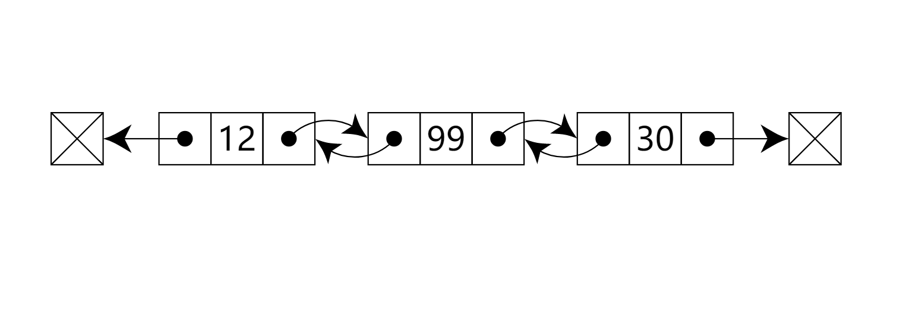

### 一、概念

在计算机科学中, 一个 双向链表(doubly linked list) 是由一组称为节点的顺序链接记录组成的链接数据结构。每个节点包含两个字段，称为链接，它们是对节点序列中上一个节点和下一个节点的引用。开始节点和结束节点的上一个链接和下一个链接分别指向某种终止节点，通常是前哨节点或null，以方便遍历列表。如果只有一个前哨节点，则列表通过前哨节点循环链接。它可以被概念化为两个由相同数据项组成的单链表，但顺序相反。



两个节点链接允许在任一方向上遍历列表。

在双向链表中进行添加或者删除节点时,需做的链接更改要比单向链表复杂得多。这种操作在单向链表中更简单高效,因为不需要关注一个节点（除第一个和最后一个节点以外的节点）的两个链接,而只需要关注一个链接即可。

### 二、实现

```
class DoublyNode {
    constructor(element, next = null, prev = null) {
        this.element = element; // 节点值
        this.next = next; // 指向列表中下一个节点项的指针
        this.prev = prev; // 指向列表中上一个节点项的指针
    }
}

// 双向链表
class DoublyLinkedList {
    constructor() {
        this.length = 0; // 链表长度
        this.head = null; // 头指针
        this.tail = null; // 尾指针
    }

    // 尾部添加
    append(element) {
        let node = new DoublyNode(element);
        if (!this.head) {
            this.head = node;
            this.tail = node;
        } else {
            this.tail.next = node;
            node.prev = this.tail;
            this.tail = node;
        }
        this.length++;
        return true;
    }

    // 检查越界
    checkPos(pos) {
        if (pos < 0 || pos > this.length) throw Error('Index error')
    }

    // 随机插入
    insert(element, pos) {
        this.checkPos(pos);
        let node = new DoublyNode(element);
        let current = this.head;
        let previous;
        let index = 0; // 位置索引

        if (pos === 0) {
            if (!this.head) { // 链表无数据的时候，将head和tail都指向新元素
                this.head = node;
                this.tail = node;
            } else { // 链表有数据的时候, head node current
                node.next = current;
                current.prev = node;
                this.head = node;
            }
        } else if (pos === this.length) {
            current = this.tail;
            current.next = node;
            node.prev = current;
            this.tail = node;
        } else {
            // 新链表的节点原型是：  previous <---> node <---> current
            while (index++ < pos) {
                previous = current;
                current = current.next;
            }
            node.next = current;
            previous.next = node;

            current.prev = node;
            node.prev = previous;
        }
        this.length++;
        return true;
    }

    // 在任意位置插入元素，在链表头，在链表尾，在链表前半段，在链表后半段
    insert_up(element, pos) {
        let node = new DoublyNode(element);
        let previous;
        let current = this.head;

        if (pos > -1 && pos <= this.length) {
            if (pos === 0) {
                if (!this.head) {
                    this.head = node;
                    this.tail = node;
                } else {
                    node.next = current;
                    current.prev = node;
                    this.head = node;
                }
            } else if (pos === this.length) {
                current = this.tail;
                current.next = node;
                node.prev = current;
                this.tail = node;
            } else if (pos < this.length / 2) {
                let index = 0;
                // 0 1 2 [] 3 4 5 
                while (index++ < pos) {
                    previous = current;
                    current = current.next;
                }
                previous.next = node;
                node.next = current;

                node.prev = previous;
                current.prev = node;
            } else {
                // 0 1 2 3 4 | 5 6 [] 7 8 9
                let index = this.length;
                current = this.tail;
                while (index-- > pos) {
                    previous = current.prev;
                    current = current;
                }
                previous.next = node;
                node.next = current;

                node.prev = previous;
                current.prev = node;
            }
            this.length++;
            return true;
        } else {
            // 如果超出范围，直接添加到链表末尾
            let current = this.tail;
            current.next = node;
            node.prev = current;
            this.tail = node;
            this.length++;
            return true;
        }
    }

    // 移除指定位置的节点元素
    removeAt(pos) {
        let current = this.head;
        let previous;
        let index = 0;
        // 越界检查
        if (pos > -1 && pos < this.length) {
            if (pos === 0) {
                this.head = current.next;
                // 如果是最后一项要删除，将tail置为null，此时head也为null
                // 如果非最后一项，则将this.head.prev置为null 
                if (this.length === 1) { // 只有一项的情况，更新tail
                    this.tail = null;
                } else {
                    this.head.prev = null; // 将首项的prev置空  或者 current.next.prev = null 
                }
            } else if (pos === this.length - 1) {
                current = this.tail;
                previous = current.prev;
                this.tail = previous;
                this.tail.next = null;
            } else if (pos <= this.length / 2) { // 索引在链表前半段,分开计算，提升性能
                while (index++ < pos) {
                    previous = current;
                    current = current.next;
                }
                // 将previous与current下一项连起来---跳过current
                previous.next = current.next;
                current.next.prev = previous;
            } else { // 索引在链表后半段
                index = this.length - 1;
                current = this.tail;
                while (index-- > pos) {
                    previous = current;
                    current = current.prev;
                }
                // 将previous与current的上一项连起来--跳过current
                previous.prev = current.prev;
                current.prev.next = previous;
            }
            this.length--;
            return current.element;
        } else {
            // 超出链表安全长度，链表有数据，则删除末尾元素
            if (typeof pos === 'number' && this.length > 0) {
                let current = this.tail;
                this.tail = current.prev;
                this.tail.next = null;
                this.length--;
                return current.element;
            } else {
                return null;
            }
        }

    }

    // 删除元素
    remove(element) {
        let index = this.indexOf(element);
        return this.removeAt(index);
    }

    // 返回元素在列表中的索引
    indexOf(element) {
        let current = this.head;
        let index = 0; // 计算位置数
        while (current) {
            if (element === current.element) {
                return index;
            }
            index++;
            current = current.next;
        }
        return -1;
    }

    // 判断是否为空链表
    isEmpty() {
        return this.size() === 0;
    }

    // 返回链表长度
    size() {
        return this.length;
    }

    // 获取链表的表头节点
    getHead() {
        return this.head;
    }

    // 获取链表的尾节点
    getTail() {
        return this.tail;
    }

    // 输出元素的值
    printString() {
        let current = this.head;
        let string = 'null';

        while (current) {
            string += " <---> " + current.element + (current.next ? '' : ' <---> null');
            current = current.next;
        }
        return string;
    }
}

let doublyll = new DoublyLinkedList();
console.log(doublyll.isEmpty());
console.log('size: ', doublyll.size());
doublyll.append('double');
doublyll.append('link');
doublyll.append('node');
console.log(doublyll.isEmpty());
console.log('size: ', doublyll.size());
console.log(doublyll.printString());
doublyll.insert('zero', 0);
doublyll.insert('first', 0);
console.log(doublyll.printString());
doublyll.insert('zero insert', 0);
doublyll.insert('any insert', 5);
doublyll.insert('first insert', 5);
console.log(doublyll.printString());
doublyll.removeAt(100);
console.log(doublyll.printString());
doublyll.removeAt(1);
console.log(doublyll.printString());
doublyll.remove('any insert');
console.log(doublyll.printString());
console.log(doublyll.getHead());
console.log(doublyll.getTail());
```
