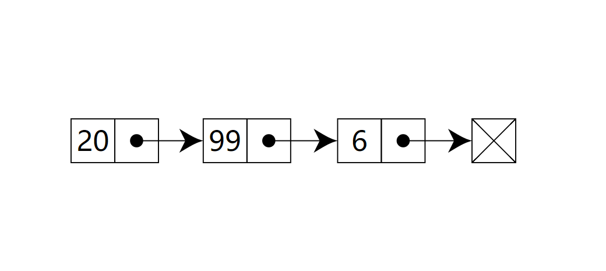

### 一、概念

在计算机科学中, 一个**链表**是数据元素的线性集合。元素的线性顺序不是由它们在内存中的物理位置给出的，相反, 每个元素指向下一个元素。它是由一组节点组成的数据结构,这些节点一起,表示序列。

在最简单的形式下，每个节点由数据和到序列中下一个节点的引用(换句话说，链接)组成。这种结构允许在迭代期间有效地从序列中的任何位置插入或删除元素。

举个例子: 在寻宝游戏中，你有一条线索，这条线索是指向寻找下一条线索的地点的指针。你顺着这条链接去下一个地点，得到另一条指向下一处的线索。得到列表中间的线索的唯一办法，就是从起点（第一条线索）顺着列表寻找。

链表结构可以充分利用计算机内存空间，实现灵活的内存动态管理。但是链表失去了数组随机读取的优点，访问时间是线性的(难以管道化)，同时链表由于增加了结点的指针域，空间开销比较大。



单向链表的特点:

- 用一组任意的内存空间去存储数据元素(这里的内存空间可以是连续的，也可以是不连续的)
- 每个节点(node)都由数据本身和一个指向后续节点的指针组成
- 整个链表的存取必须从头指针开始，头指针指向第一个节点
- 最后一个节点的指针指向空(null)

链表中的几个主要操作:

- 创建节点
- 插入节点
- 搜索/遍历节点
- 删除节点
- 合并

### 二、单向链表实现

```
class Node {
    constructor(element, next = null) {
        this.element = element; // 节点值
        this.next = next; // 指向列表中下一个节点项的指针
    }
}

class LinkedList {
    constructor() {
        this.length = 0; // 链表长度
        this.head = null; // 头部
    }

    // 尾部添加
    append(element) {
        let node = new Node(element);
        if (this.head === null) {
            this.head = node;
        } else {
            let current = this.head; // 将第一个节点的引用赋值给当前项
            // 循环列表，直到找到最后一项
            while (current.next) {
                current = current.next;
            }
            // 找到最后一项，将其next赋为node，建立链接
            current.next = node;
        }
        this.length++; // 更新链表的长度
    }

    // 检查越界
    checkPos(pos) {
        if (pos < 0 || pos > this.length) throw Error('Index error')
    }

    // 随机插入
    insert(element, pos) {
        let node = new Node(element);
        this.checkPos(pos);

        let current = this.head;
        let previous;
        let index = 0;

        if (pos === 0) {
            node.next = current;
            this.head = node;
        } else {
            // 将想要插入的元素放在previous节点和current节点之间
            while (index++ < pos) {
                previous = current;
                current = current.next;
            }
            node.next = current;
            previous.next = node;
        }
        this.length++;
        return true;
    }

    // 移除指定位置的节点元素,并返回移除的项
    removeAt(pos) {
        this.checkPos(pos);
        let current = this.head;
        let previous;
        let index = 0;

        // 移除第一项
        if (pos === 0) {
            this.head = current.next;
        } else {
            while (index++ < pos) {
                previous = current;
                current = current.next;
            }
            // 将previous 与 current 的下一项链接起来：跳过current，从而移除它
            // 当前元素会丢弃在计算机内存中，等待GC清除
            previous.next = current.next;
        }
        this.length--;
        return current.element;
    }

    // 删除元素
    remove(element) {
        let index = this.indexOf(element);
        return this.removeAt(index);
    }

    // 返回元素在列表中的索引
    indexOf(element) {
        let current = this.head;
        let index = 0;
        while (current) {
            if (element === current.element) {
                return index;
            }
            index++;
            current = current.next;
        }
        return -1;
    }

    // 判断是否为空链表
    isEmpty() {
        return this.size() === 0;
    }

    // 返回链表长度
    size() {
        return this.length;
    }

    //  获取链表的表头节点
    getHead() {
        return this.head;
    }

    // 输出元素的值
    printString() {
        let current = this.head;
        let string = '';
        while (current) {
            string += current.element + (current.next ? ' --> ' : '');
            current = current.next;
        }
        return string;
    }
}

// 示例
let llist = new LinkedList();
console.log(llist.isEmpty()); // true
console.log('size: ', llist.size()); // size: 0
llist.append(1);
llist.append(10);
llist.append(12);
console.log('size: ', llist.size()); // size: 3
console.log(llist.printString()); // 1 --> 10 --> 12
llist.insert(1, 1);
llist.insert('zero', 0);
llist.insert('link', 3);
llist.insert('node', 2);
console.log(llist.printString()); // zero --> 1 --> node --> 1 --> link --> 10 --> 12
llist.removeAt(1);
console.log(llist.printString()); // zero --> node --> 1 --> link --> 10 --> 12
llist.remove(10);
console.log(llist.printString()); // zero --> node --> 1 --> link --> 12
console.log(llist.getHead()); // { element: "zero", next: Node(element: "node", next: Node(new Node)) }
```

### 三、复杂度

#### 3.1 时间复杂度

访问 | 查找 | 插入 | 删除
---|---|---|---
O(n) | O(n) | O(1) | O(1)

#### 3.2 空间复杂度

O(n)
