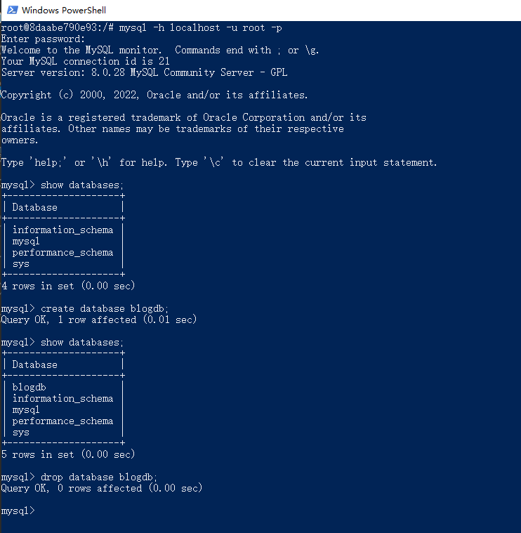

### 查看可用的 MySQL 版本

```
docker search mysql
```

### 拉取 MySQL 镜像

```
docker pull mysql:latest
```

### 查看本地镜像

```
docker images
```

### 运行容器

一般来说数据库容器不需要建立目录映射:

```
docker run -itd --name mysql-container -p 3306:3306 -e MYSQL_ROOT_PASSWORD=123456 mysql
```

- -p 3306:3306 ：映射容器服务的 3306 端口到宿主机的 3306 端口，外部主机可以直接通过 宿主机ip:3306 访问到 MySQL 的服务。
- MYSQL_ROOT_PASSWORD=123456：设置 MySQL 服务 root 用户的密码

如果要建立目录映射:
```
docker run -p 3306:3306 --name mysql \
-v /docker/mysql/conf:/etc/mysql/conf.d \
-v /docker/mysql/logs:/logs \
-v /docker/mysql/data:/var/lib/mysql \
-e MYSQL_ROOT_PASSWORD=123456 \
-d mysql:5.7
```

### MySQL查看及常用命令

通过``` docker ps ```命令查看是否安装成功

进入容器
```
docker exec -it <id> bash
```

然后可以通过 root 和密码 123456 访问 MySQL 服务。
```
mysql -h localhost -u root -p
```



#### 常用命令:

创建用户:
```
create user username identified by 'password';
```

授权:
```
grant all privileges on *.* to 'username'@'%' identified by 'password' with grant option;
```

查看 mysql 初始的密码策略:
```
SHOW VARIABLES LIKE 'validate_password%';
```

查看数据库:
```
show databases;
```

创建数据库并设置编码:
```
CREATE DATABASE `mydb` CHARACTER SET utf8 COLLATE utf8_general_ci;
```

查询用户：
```
select user,host from mysql.user;
```

*不建议在docker里运行MySQL数据库软件，仅当测试或数据重要性不高时使用。*

### 配置

MySQL(5.7.19)的默认配置文件是 /etc/mysql/my.cnf 文件。如果想要自定义配置，建议向 /etc/mysql/conf.d 目录中创建 .cnf 文件。新建的文件可以任意起名，只要保证后缀名是 cnf 即可。新建的文件中的配置项可以覆盖 /etc/mysql/my.cnf 中的配置项。

首先需要创建将要映射到容器中的目录以及.cnf文件，然后再创建容器
```
# pwd
/opt
# mkdir -p docker_v/mysql/conf
# cd docker_v/mysql/conf
# touch my.cnf
# docker run -p 3306:3306 --name mysql -v /opt/docker_v/mysql/conf:/etc/mysql/conf.d -e MYSQL_ROOT_PASSWORD=123456 -d imageID
```

- -p 3306:3306：将容器的3306端口映射到主机的3306端口
- -v /opt/docker_v/mysql/conf:/etc/mysql/conf.d：将主机/opt/docker_v/mysql/conf目录挂载到容器的/etc/mysql/conf.d
- -e MYSQL_ROOT_PASSWORD=123456：初始化root用户的密码
- -d: 后台运行容器，并返回容器ID
- imageID: mysql镜像ID

### ### Dockerfile文件

```
FROM mysql:8.0.22

ARG TZ=UTC
ENV TZ ${TZ}

RUN ln -snf /usr/share/zoneinfo/$TZ /etc/localtime && echo $TZ > /etc/timezone

EXPOSE 3306
```

### 其他

#### mysql 报错

Error: ER_NOT_SUPPORTED_AUTH_MODE: Client does not support authentication protocol requested by server; consider upgrading MySQL client

起因：mysql8.0以上加密方式，Node还不支持。

解决办法，

方法1：执行指令

```
mysql -u root -p

123456

use mysql;

alter user 'root'@'localhost' identified with mysql_native_password by '123456';

flush privileges;
```

方法2: 升级mysql包

使用Node MySQL 2
```
npm install --save mysql2
```

#### 连接提示

Ignoring invalid configuration option passed to Connection: poolMax. This is currently a warning, but in future versions of MySQL2, an error will be thrown if you pass an invalid configuration option to a Connection

解决方法：
you have to change the connection property root as user
