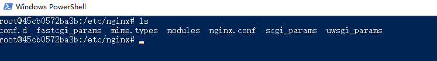

### 查看可用的 Nginx 版本

```
docker search nginx
```

### 取最新版的 Nginx 镜像

```
docker pull nginx:latest
```

### 查看本地镜像

```
docker images
```

### 运行容器

```
docker run --name my-nginx -p 8000:80 -d nginx
```

- --name my-nginx：容器名称
- -p 8000:80： 端口进行映射，将本地 8080 端口映射到容器内部的 80 端口
- -d nginx： 设置容器在在后台一直运行

最后我们可以通过浏览器可以直接访问 8000 端口的 nginx 服务: http://localhost:8000/

### 修改nginx的配置文件

#### 方式一：每次都进入到nginx容器内部修改

1. 执行```docker exec -it <id> /bin/bash```进入到nginx容器内部

2. 进入到nginx容器内部后，我们可以cd /etc/nginx，可以看到相关的nginx配置文件都在/etc/nginx目录下



3. 容器内编辑nginx.conf配置文件

启动后直接进入容器，nginx容器内默认没有vim编辑器，先安装vim:
```
apt-get update
apt-get install vim
```

#### 方式二：将nginx容器内部配置文件挂载到主机（推荐方式）

将nginx容器内部配置文件挂载到主机，之后就可以在主机对应目录修改即可。适合频繁修改，复杂使用的情况

1. 在主机 /docker 目录下执行 mkdir -p ./nginx/{conf,html,logs}创建挂载目录
2. 将容器内的nginx.conf与default.conf文件分别拷贝到主机/docker/nginx和/docker/nginx/conf下，分别执行

```
docker cp <id>:/etc/nginx/nginx.conf ./
dokcer cp <id>:/etc/nginx/conf.d/default.conf ./conf/
```
cp 命令代表复制

3. 执行```docker stop <id>```命令停止刚刚创建的nginx容器，然后执行```docker rm <id>```移除容器
4. 执行命令，重新创建nginx容器

```
docker run -d --name mynginx -p 80:80 -v /docker/nginx/nginx.conf:/etc/nginx/nginx.conf -v /docker/nginx/logs:/var/log/nginx -v /docker/nginx/html:/usr/share/nginx/html -v /docker/nginx/conf:/etc/nginx/conf.d --privileged=true 0839
```

-v 挂载目录，格式 -v: 表示将主机目录与容器目录之间进行共享,
--privileged=true 容器内部对挂载的目录拥有读写等特权

5. 这时候，会出现403，不要惊慌。我们的主机挂载 /docker/nginx/html目录还为空

在容器的挂载 /docker/nginx/html 目录下创建index.html，再次访问即可。

### Dockerfile文件

Dockerfile 是一个用来构建镜像的文本文件，文本内容包含了一条条构建镜像所需的指令和说明。

```
FROM nginx:latest

VOLUME /data

EXPOSE 8000
```

#### 指令

- FROM：定制的镜像都是基于 FROM 的镜像，这里的 nginx 就是定制需要的基础镜像。后续的操作都是基于 nginx。
- RUN：用于执行后面跟着的命令行命令，有两种：shell 格式和exec 格式。
  - Dockerfile 的指令每执行一次都会在 docker 上新建一层。所以过多无意义的层，会造成镜像膨胀过大。以 && 符号连接命令，这样执行后，只会创建 1 层镜像。
- COPY：复制指令，从上下文目录中复制文件或者目录到容器里指定路径。
- CMD：类似于 RUN 指令，用于运行程序。CMD 在docker run 时运行，RUN 是在 docker build。
- ENV：设置环境变量
- ARG：构建参数
- VOLUME：定义匿名数据卷，指定容器挂载点到宿主机自动生成的目录或其他容器。在启动容器 docker run 的时候，我们可以通过 -v 参数修改挂载点。
- EXPOSE：声明容器的服务端口（仅仅是声明）。
- WORKDIR：指定工作目录。

#### 开始构建镜像

```
docker build -t nginx:v1.1 .
```
