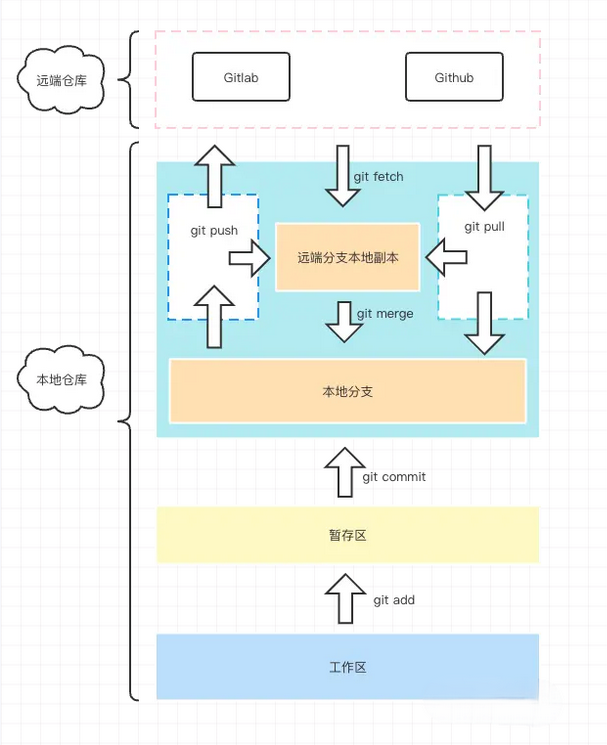

## Git体系介绍



### Git区域理解

- 远程仓库区：最终提交代码的地方
- 远端分支本地副本：储存远程仓库各分支数据在本地的一个副本，在Git 项目下的 .git 文件，里面有个 refs/remotes，主要存的就是远程仓库的分支信息，一般执行 push 或者 pull、fetch 都会往这里进行更新
- 本地分支：执行 commit 之后，本质上就是提交到了这个区域，可以在 .git 目录下的 refs/heads 目录查看信息
- 暂存区：执行 git add 之后会存到的区域
- 工作区：写代码的地方

**stash**

git 储存区，我们有的时候本地改了代码，但是突然有个人过来问你另一个分支的问题，同时这个时候你在实现某个功能，实现一半，又不想提交到 Git 仓库中，那么你就可以考虑使用``` git stash save ```"临时存一下"，这个时候它就会帮你存到这个储存区，你去其他分支做完事情回来，再``` git stash pop ```就好了

### Git 简单工作流

1. 来了一个新需求，我们会从 master checkout 一个新的 feature 分支出来进行开发。
2. 开发完某个功能点，我们会执行 git add 将代码提交到暂存区。
3. 执行 git commit 将代码提交到本地仓库
4. 执行 git push 将代码提交到远端分支
5. 当我们开发完所有需求之后，可能会设立一个专门的测试分支比如名叫 dev 的分支，那么我们就把代码合并到这个测试分支上，发布测试环境进行测试。
6. 测试完毕之后，我们就需要合代码了，这个时候，我们可以发起一个 merge request，将我们的代码走 CR 流程合并到 master 分支。
7. 在提交 MR 的过程中，我们一般需要先自己预先将 master 分支的代码合并到当前需要被合并的分支，提交并解决冲突。

## 命令解析

### git stash

临时存一下不想被提交的代码变更的储存区，仓库 .git 文件下的 refs/stash 文件可查看具体数据

```
git stash save 'xxx': 储存变更
git stash list: 查看储存区所有提交列表
git stash pop: 弹出并应用最近的一次储存区的代码提交
git stash drop stash@{n}: 删除某次储存记录
git stash clear: 清楚所有 stash 信息
```

### git clone

```
git clone xxx.git：把仓库代码拉到本地
git clone xxx.git -b branch1：拉取代码开启新分支
```

### git init

初始化一个 Git 仓库

### git remote

用于和远程仓库进行关系绑定处理等等操作

```
git remote add: 添加一个远程版本库关联
git remote rm: 删除某个远程版本库关联

如：
git remote add origin xxx.git
git push -u origin main
```

### git branch

查看当前仓库有哪些分支

```
git branch：查看本地所有分支信息
git branch -r：查看远程仓库所有分支
git branch -a：查看本地和远程仓库所有分支
```

### git checkout

切换分支
```
创建并切换到指定新分支：git checkout -b branch1
```

### git add

```
git add [file1] [file2]: 添加一个或多个文件到暂存区
git add .：把当前目录下得所有文件改动都添加到暂存区
git add -A：把当前仓库内所有文件改动都添加到暂存区
```

### git commit

```
git commit [file1] ... -m [message]：将暂存区的内容提交到本地 git 版本仓库中
```

### git rm

从 git 仓库中删掉文件，如 git rm .env， git rm -r dist

### git push

推送分支并建立关联关系：```git push --set-upstream origin branch1```

### git pull

拉取指定远端分支合并到本地当前分支：```git pull origin branch1```

### git fetch

把远端仓库对应分支的变更拉到本地，并不自动合并到我的工作区

fetch 完毕之后，我提交了自己当前工作去的变更到本地仓库，然后想合并一下远端分支的更改，这个时候执行一下 ```git merge origin/[当前分支名]```

### git merge

合并指定分支代码到当前分支

### git log

查看当前分支的提交记录信息

### git reset

```
git reset [--soft | --mixed | --hard] [HEAD]

HEAD 表示当前版本
HEAD^ 上一个版本
HEAD^^ 上上一个版本
HEAD^^^ 上上上一个版本
HEAD~n 回撤 n 个版本，这种也是更加方便的

--soft: 重置你最新一次提交版本，不会修改你的暂存区和工作区。
--mixed: 默认参数，用于重置暂存区的文件与上一次的提交(commit)保持一致，工作区文件内容保持不变。
--hard: 重置所有提交到上一个版本，并且修改你的工作区，会彻底回到上一个提交版本，在代码中看不到当前提交的代码，也就是你的工作区改动也被干掉了。
```

比如：

我改动了我的 README 文件，在我们的工作区就产生了一次改动，但是这个时候还没有提交到暂存区，在 vscode 里会显示为工作区修改的标记
接着我们执行 git add，这个时候你查看暂存区，会发现这次改动被提交进去了，同时被 vscode 标记为已被提交至暂存区
然后再执行 git commit，这个时候就完成了一次提交

接下来我们想撤回这次提交，以上三种参数所体现的表现会是这样的：

--soft：我们对 README 的更改状态现在变成已被提交至暂存区，也就是上面 2 的步骤。
--mixed： 我们对 README 的更改变成还未被提交至暂存区，也就是上面 1 的步骤。
--hard：我们对 README 的所有更改全没了，git log 中也找不到我们对 README 刚刚那次修改的痕迹。

默认情况下我们不加参数，就是 --mixed，也就是重置暂存区的文件到上一次提交的版本，文件内容不动。

### git reflog

查看所有的操作记录

### git revert

如果是针对 master 的操作，为了安全起见，一般还是建议使用 revert 命令，他也能实现和 reset 一样的效果，只不过区别来说，reset 是向后的，而 revert 是向前的，怎么理解呢？简单来说，把这个过程当做一次时光穿梭，reset 表示你犯了一个错，他会带你回到没有犯错之前，而 revert 会给你一个弥补方案，采用这个方案之后让你得到的结果和没犯错之前一样。
举个栗子：
假设你改了 README 的描述，新增了一行文字，提交上去了，过一会你觉得这个写了有问题，想要撤销一下，但是又不想之前那个提交消失在当前历史当中，那么你就可以选择使用 git revert [commitId]，那么它就会产生一次新的提交，提交的内容就是帮你删掉你上面新增的内容，相当于是一个互补的操作。

### git cherry-pick

git cherry-pick：将执行分支的指定提交合并到当前分支

比如我在 master 分支提交了某个需求的代码，同时还没提交到远程分支，那么你就可以先 git log 查看一下当前的提交，找到 master 分支正常提交之后的所有 commitId，然后复制出来，然后再切到你建好的开发分支，接着执行``` git cherry-pick master commitId1 commitId2 commitId4```。

### git tag

发布了某个版本，给当前版本打个标签。

```
轻量标签：git tag v1.0.0
附注标签：git tag -a v1.0.1 -m "发布正式版 1.0.1"
推送标签：git push origin tagName
查看标签：git tag
筛选标签：git tag -l v1.0.1
删除标签：git tag -d v1.0.1
删除远程标签：git push origin --delete v1.0.2
```

### git rebase

rebase:变基，即改变分支的根基。从某种程度上来说，rebase和merge可以完成类似的工作。
