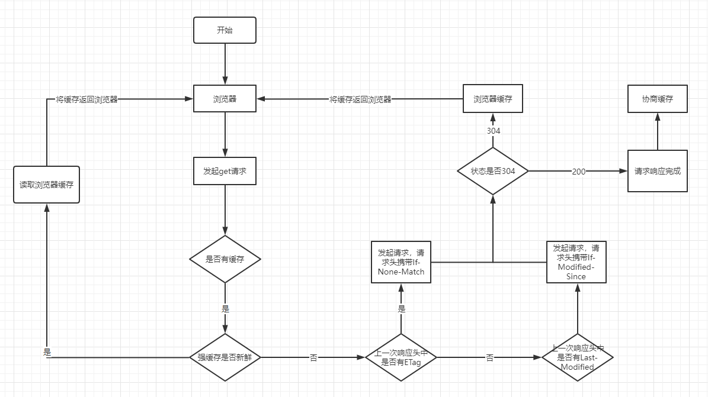

## web缓存

Web缓存主要指的是两部分: 浏览器缓存和http缓存，http缓存是web缓存的核心。

浏览器缓存：比如localStorage，sessionStorage，cookie等。这些功能主要用于缓存客户端数据，比如用户信息、本地配置等。

- localStorage可以跨页面通讯，sessionStorage不可以跨页面通讯
  - localStorage新开tab或窗口可以读取到信息
  - sessionStorage新开tab或窗口读取不到信息
- localStorage需要手动清除，sessionStorage会随着页面关闭而清除
- localStorage，sessionStorage的存储大小都是5M，只能存储字符串类型数据

## http缓存

缓存分为两种，强缓存和协商缓存。

### 强缓存

不会向服务器发送请求，直接从缓存中读取资源，在chrome控制台的Network选项中可以看到该请求返回200的状态码，并且size显示from disk cache或from memory cache两种。从内存读取的缓存更快。

### 协商缓存

向服务器发送请求，服务器会根据这个请求的request header的一些参数来判断是否命中协商缓存，如果命中，则返回304状态码并带上新的response header通知浏览器从缓存中读取资源

1. 浏览器第一次加载资源，服务器返回200，浏览器将资源文件从服务器上请求下载下来，并把response header及该请求的返回时间(要与Cache-Control和Expires对比)一并缓存；
2. 下一次加载资源时，先比较当前时间和上一次返回200时的时间差，如果没有超过Cache-Control设置的max-age，则没有过期，命中强缓存，不发请求直接从本地缓存读取该文件（如果浏览器不支持HTTP1.1，则用Expires判断是否过期）；
3. 如果时间过期，服务器则查看header里的If-None-Match和If-Modified-Since ；
4. 服务器优先根据Etag的值判断被请求的文件有没有做修改，Etag值一致则没有修改，命中协商缓存，返回304；如果不一致则有改动，直接返回新的资源文件带上新的Etag值并返回 200；
5. 如果服务器收到的请求没有Etag值，则将If-Modified-Since和被请求文件的最后修改时间做比对，一致则命中协商缓存，返回304；不一致则返回新的last-modified和文件并返回 200；

### 缓存的优缺点

优点

- 减少不必要的网络传输，节约带宽
- 更快的加载页面
- 减少服务器负载，避免服务器过载的情况出现

缺点

- 占内存（有些缓存会被存到内存中）

### 相关Header

#### 强缓存

- Cache-Control: 当值设为max-age=300时，则代表在这个请求正确返回时间（浏览器也会记录下来）的300秒内再次加载资源，就会命中强缓存。
- Expires ：response header里的过期时间，浏览器再次加载资源时，如果在这个过期时间内，则命中强缓存

*Expires 是http1.0的产物，Cache-Control是http1.1的产物。两者同时存在的话，Cache-Control优先级高于Expires*

Cache-control的属性:

- max-age决定客户端资源被缓存多久。
- s-maxage决定代理服务器缓存的时长。
- no-cache表示是强制进行协商缓存。
- no-store是表示禁止任何缓存策略。
- public表示资源即可以被浏览器缓存也可以被代理服务器缓存。
- private表示资源只能被浏览器缓存。

#### 协商缓存

**ETag和If-None-Match**

Etag是上一次加载资源时，服务器返回的response header，是对该资源的一种唯一标识。

只要资源有变化，Etag就会重新生成。

浏览器在下一次加载资源向服务器发送请求时，会将上一次返回的Etag值放到request header里的If-None-Match里。服务器接受到If-None-Match的值后，会拿来跟该资源文件的Etag值做比较，如果相同，则表示资源文件没有发生改变，命中协商缓存。

**Last-Modified和If-Modified-Since**

Last-Modified是该资源文件最后一次更改时间,服务器会在response header里返回，同时浏览器会将这个值保存起来，下一次发送请求时，放到request headr里的If-Modified-Since里。服务器在接收到后也会做对比，如果相同则命中协商缓存。

*在精确度上，Etag要优于Last-Modified，Last-Modified的时间单位是秒，如果某个文件在1秒内改变了多次，那么他们的Last-Modified其实并没有体现出来修改，但是Etag每次都会改变确保了精度
在性能上，Etag要逊于Last-Modified，毕竟Last-Modified只需要记录时间，而Etag需要服务器通过算法来计算出一个hash值。
在优先级上，服务器校验优先考虑Etag。*

## 如何设置缓存

**前端角度**

什么都不需要做，缓存是缓存在前端，但实际上代码是后端的同学来写的。如果需要实现前端缓存的话啊，通知后端的同学加响应头就好了。

**后端角度**

修改响应头信息

## 缓存文件

有哈希值的文件设置强缓存即可。没有哈希值的文件（比如index.html）设置协商缓存
