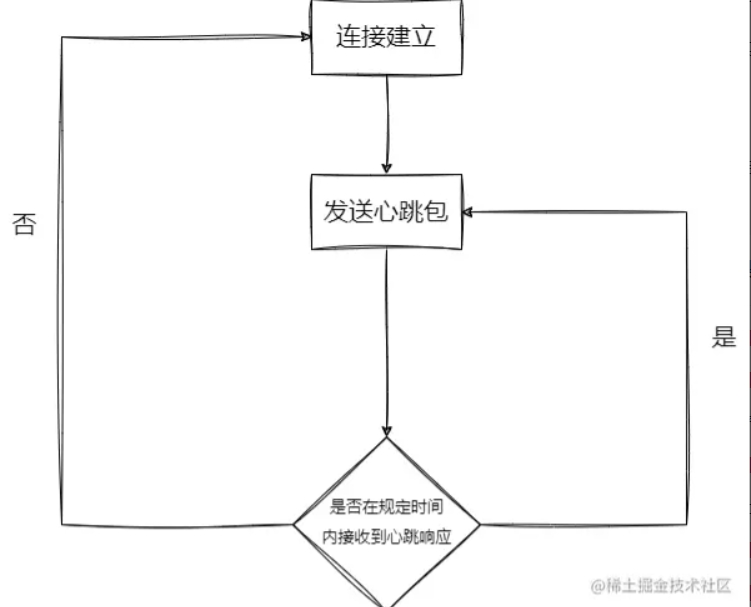

### 概述

有多种技术允许客户端从服务器接收有关异步更新的消息。它们可以分为两类：客户端拉取和服务器推送。

### 客户端拉取

在客户端拉取技术中，客户端会定期向服务器请求更新。服务器可以使用更新或尚未更新的特殊响应进行响应。有两种类型的客户端拉取：短轮询和长轮询。

#### 短轮询

客户端定期向服务器发送请求。如果服务器有更新，它会向客户端发送响应并关闭连接。如果服务器没有更新，它也会向客户端发送一个响应并关闭连接。

#### 长轮询

客户端向服务器发送请求。如果服务器有更新，它会向客户端发送响应并关闭连接。如果服务器没有更新，它会保持连接直到更新可用。当更新可用时，服务器向客户端发送响应并关闭连接。如果更新在某个超时时间内不可用，服务器会向客户端发送响应并关闭连接。

### 服务器推送

#### SSE（Server-Send Events）

SSE 是一种在基于浏览器的 Web 应用程序中仅从服务器向客户端发送文本消息的技术。SSE基于 HTTP 协议中的持久连接， 具有由 W3C 标准化的网络协议和 EventSource 客户端接口，作为 HTML5 标准套件的一部分。

[详见](../../Language/HTML/服务器发送事件SSE.md)

#### WebSocket

WebSocket 是一种在 Web 应用程序中实现同时、双向、实时通信的技术。WebSocket 基于 HTTP 以外的协议（TCP），因此可能需要额外设置网络基础设施（代理服务器、NAT、防火墙等）。

客户端通过Http协议请求，在握手阶段升级为WebSocket协议。

特点：

- 建立在 TCP 协议之上，服务器端的实现比较容易
- 与 HTTP 协议有着良好的兼容性。默认端口也是80和443，并且握手阶段采用 HTTP 协议，因此握手时不容易屏蔽，能通过各种 HTTP 代理服务器
- 数据格式比较轻量，性能开销小，通信高效
- 可以发送文本，也可以发送二进制数据（blob对象或Arraybuffer对象）
- 收到的数据类型 可以使用binaryType 指定， 显式指定收到的二进制数据类型
- 没有同源限制，客户端可以与任意服务器通信
- 协议标识符是ws（握手http）（如果加密，则为wss（tcp +TLS)），服务器网址就是 URL

**心跳检测**

websocket是一个 长连接，因此就必须要有 鉴活机制，来保证通信信道的健康


```
function setupWebSocket(url) {
    let ws = null;
    let timeout = 2000; // 重连间隔
    let interval = 1000; // 心跳间隔
    let reconnect = true; // 是否重连
 
    function startHeartbeat() {
        // 心跳检测
        setTimeout(function() {
            if(ws && ws.readyState === 1) {
                // 发送心跳
                ws.send('heartbeat');
                console.log('Heartbeat sent');
            } else {
                reconnect = true;
                ws = connect();
            }
            startHeartbeat();
        }, interval);
    }
 
    function connect() {
        ws = new WebSocket(url);
 
        ws.onopen = function(event) {
            console.log('WebSocket connected: ', event);
            startHeartbeat();
        };
 
        ws.onclose = function(event) {
            console.log('WebSocket closed: ', event);
            if(reconnect) {
                setTimeout(function() {
                    console.log('Attempting reconnection...');
                    connect();
                }, timeout);
            }
        };
 
        ws.onerror = function(error) {
            console.error('WebSocket error observed:', error);
        };
 
        return ws;
    }
 
    return connect();
}
 
// 使用方法
const ws = setupWebSocket('wss://your-websocket-url');
```

**消息处理**
在websocket的场景下，响应消息的格式 尤为重要，在进行前后端联调时，一定要规范好数据格式，这样才能为后续的交互铺好路
```
{
    type // 用于标识该消息是用来干啥的
    parmas // 请求携带的参数，通过响应返回过来，可用于一些业务操作
    response // 业务数据 
}
```

**websocket 鉴权**

```
// 创建WebSocket连接，将token作为查询参数附加到URL
const socket = new WebSocket('ws://example.com/socket?token=' + token);
```
