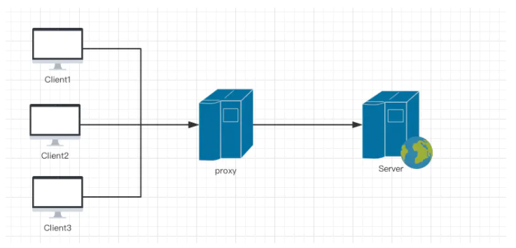
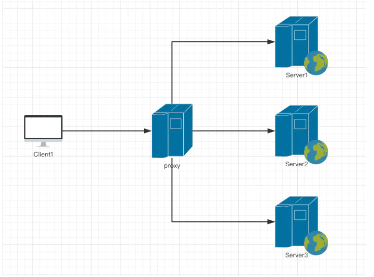

# 一、初识nginx

作为一个前端如果不会Nginx，都不敢跟别人说自己是大前端，所以我特意总结了一下nginx的相关知识，
```
"Nginx是一款轻量级的HTTP服务器，采用事件驱动的异步非阻塞处理方式框架，这让其具有极好的IO性能，时常用于服务端的反向代理和负载均衡。"
```


**nginx的安装可以看一下网上的教程。**
我们可以使用``` rpm -ql nginx ```来查看 Nginx 被安装到了什么地方，有哪些相关目录

# 二、Nginx基本配置

## nginx.conf文件解读

nginx.conf 文件是Nginx总配置文件，在我们搭建服务器时经常调整的文件。一般在etc/nginx目录下：
```
cd /etc/nginx
vim nginx.conf
```

下面是文件的注释内容:
```
#运行用户，默认即是nginx，可以不进行设置
user  nginx;
#Nginx进程，一般设置为和CPU核数一样
worker_processes  1;   
#错误日志存放目录
error_log  /var/log/nginx/error.log warn;
#进程pid存放位置
pid        /var/run/nginx.pid;


events {
    worker_connections  1024; # 单个后台进程的最大并发数
}


http {
    include       /etc/nginx/mime.types;   #文件扩展名与类型映射表
    default_type  application/octet-stream;  #默认文件类型
    #设置日志模式
    log_format  main  '$remote_addr - $remote_user [$time_local] "$request" '
                      '$status $body_bytes_sent "$http_referer" '
                      '"$http_user_agent" "$http_x_forwarded_for"';

    access_log  /var/log/nginx/access.log  main;   #nginx访问日志存放位置

    sendfile        on;   #开启高效传输模式
    #tcp_nopush     on;    #减少网络报文段的数量

    keepalive_timeout  65;  #保持连接的时间，也叫超时时间

    #gzip  on;  #开启gzip压缩

    include /etc/nginx/conf.d/*.conf; #包含的子配置项位置和文件
```

## default.conf 配置项

进入conf.d目录，然后使用vim default.conf进行查看
```
server {
    listen       80;   #配置监听端口
    server_name  localhost;  #配置域名

    #charset koi8-r;     
    #access_log  /var/log/nginx/host.access.log  main;

    location / {
        root   /usr/share/nginx/html;     #服务默认启动目录
        index  index.html index.htm;    #默认访问文件
    }

    #error_page  404              /404.html;   # 配置404页面

    # redirect server error pages to the static page /50x.html
    #
    error_page   500 502 503 504  /50x.html;   #错误状态码的显示页面，配置后需要重启
    location = /50x.html {
        root   /usr/share/nginx/html;
    }

    # proxy the PHP scripts to Apache listening on 127.0.0.1:80
    location ~ \.php$ {
        proxy_pass   http://127.0.0.1;
    }

    # pass the PHP scripts to FastCGI server listening on 127.0.0.1:9000
    location ~ \.php$ {
        root           html;
        fastcgi_pass   127.0.0.1:9000;
        fastcgi_index  index.php;
        fastcgi_param  SCRIPT_FILENAME  /scripts$fastcgi_script_name;
        include        fastcgi_params;
    }

    # deny access to .htaccess files, if Apache's document root
    # concurs with nginx's one
    #location ~ /\.ht {
    #    deny  all;
    #}
}
```

# 三、Nginx服务启动、停止、重启

## 启动

### nginx直接启动

在CentOS7.4版本里（低版本是不行的），是可以直接直接使用nginx启动服务的。
```
nginx
```

### 使用systemctl命令启动

```
systemctl start nginx.service
```

输入命令后，没有任何提示，那我们如何知道Nginx服务已经启动了哪？可以使用Linux的组合命令，进行查询服务的运行状况。
```
ps aux | grep nginx
```

## 停止Nginx服务的四种方法

- 立即停止服务: nginx  -s stop
- 从容停止服务: nginx -s quit
- killall 方法杀死进程: killall nginx
- systemctl 停止: systemctl stop nginx.service

## 重启nginx服务

```
systemctl restart nginx.service
```

## 重新载入配置文件

在重新编写或者修改Nginx的配置文件后，都需要作一下重新载入
```
nginx -s reload
```

## 查看端口号

在默认情况下，Nginx启动后会监听80端口，从而提供HTTP访问，如果80端口已经被占用则会启动失败。我么可以使用netstat -tlnp命令查看端口号的占用情况。

# 五、自定义错误页和访问设置

## 多错误指向一个页面

```
/etc/nginx/conf.d/default.conf

error_page   500 502 503 504  /50x.html;
```

## 单独为错误置顶处理方式
```
error_page 404  /404_error.html;
```

## 把错误码换成一个地址
```
error_page  404 http://www.abc.com;
```

## 简单实现访问控制
```
location / {
    deny   123.9.51.42; # 禁止访问
    allow  45.76.202.231; # 允许访问
}
```

# 六、Nginx访问权限

## 指令优先级

```
location / {
    allow  45.76.202.231;
    deny   all;
}
```
**在同一个块下的两个权限指令，先出现的设置会覆盖后出现的设置**

## 复杂访问控制权限匹配

```
location =/img{
    allow all;
}
location =/admin{
    deny all;
}

```
=号代表精确匹配，使用了=后是根据其后的模式进行精确匹配。

## 使用正则表达式设置访问权限
```
location ~\.php$ {
    deny all;
}
```

# 七、Nginx设置虚拟主机

虚拟主机是指在一台物理主机服务器上划分出多个磁盘空间，每个磁盘空间都是一个虚拟主机，每台虚拟主机都可以对外提供Web服务，并且互不干扰。在外界看来，虚拟主机就是一台独立的服务器主机，这意味着用户能够利用虚拟主机把多个不同域名的网站部署在同一台服务器上，而不必再为建立一个网站单独购买一台服务器，既解决了维护服务器技术的难题，同时又极大地节省了服务器硬件成本和相关的维护费用。

## 基于端口号配置虚拟主机

基于端口号来配置虚拟主机，算是Nginx中最简单的一种方式了。原理就是Nginx监听多个端口，根据不同的端口号，来区分不同的网站。

我们可以直接配置在主文件里etc/nginx/nginx.conf文件里， 也可以配置在子配置文件里etc/nginx/conf.d/default.conf。

```
server {
    listen 8001;
    server_name localhost;
    root /usr/share/nginx/html/html8001;
    index index.html;
}
server {
    listen 8002;
    server_name localhost;
    root /usr/share/nginx/html/html8002;
    index index.html;
}
```

## 基于IP的虚拟主机

基于IP和基于端口的配置几乎一样，只是把server_name选项，配置成IP就可以了。
```
server{
    listen 80;
    server_name 112.74.164.244;
    root /usr/share/nginx/html/html8001;
    index index.html;
}
```

# 八、Nginx使用域名设置虚拟主机

**先要对域名进行解析，这样域名才能正确定位到你需要的IP上**

配置以域名为划分的虚拟主机
```
server{
    listen 80;
    server_name https://www.abc.com;
    location / {
            root /usr/share/nginx/html/html8001;
            index index.html index.htm;
    }
}
```

# 九、Nginx反向代理的设置

**正向代理：**代理模式是这样定义的：给某个对象提供一个代理对象，并由代理对象控制原对象的引用。正向代理服务器位于客户端和服务器之间，为了向服务器获取数据，客户端要向代理服务器发送一个请求，并指定目标服务器，代理服务器将目标服务器返回的数据转交给客户端。


**反向代理：**客户端发送的请求，想要访问server服务器上的内容。发送的内容被发送到代理服务器上，这个代理服务器再把请求发送到自己设置好的内部服务器上，而用户真实想获得的内容就在这些设置好的服务器上。


简单点来讲，一般代理指代理的客户端，反向代理是代理的服务器。

反向代理的用途和好处：

- 安全性：正向代理的客户端能够在隐藏自身信息的同时访问任意网站，这个给网络安全代理了极大的威胁。
- 功能性：反向代理的主要用途是为多个服务器提供负债均衡、缓存等功能。

## 最简单的反向代理

现在我们要访问 http://a.abc.com 然后反向代理到 abc.com 这个网站。
```
server{
    listen 80;
    server_name a.abc.com;
    location / {
        proxy_pass http://abc.com;
    }
}
```

一般我们反向代理的都是一个IP。

## 其它反向代理指令

- proxy_set_header :在将客户端请求发送给后端服务器之前，更改来自客户端的请求头信息。
- proxy_connect_timeout:配置Nginx与后端代理服务器尝试建立连接的超时时间。
- proxy_read_timeout : 配置Nginx向后端服务器组发出read请求后，等待相应的超时时间。
- proxy_send_timeout：配置Nginx向后端服务器组发出write请求后，等待相应的超时时间。
- proxy_redirect :用于修改后端服务器返回的响应头中的Location和Refresh。

# 十、Nginx适配PC或移动设备

Nginx通过内置变量 $http_user_agent，可以获取到请求客户端的userAgent，就可以用户目前处于移动端还是PC端，进而展示不同的页面给用户。

```
server{
    listen 80;
    server_name a.abc.com;
    location / {
        root /usr/share/nginx/pc;
        if ($http_user_agent ~* '(Android|webOS|iPhone|iPod|BlackBerry)') {
            root /usr/share/nginx/mobile;
        }
        index index.html;
    }
}
```

# 十一、Nginx的Gzip压缩配置

Gzip是网页的一种网页压缩技术，经过gzip压缩后，页面大小可以变为原来的30%甚至更小。更小的网页会让用户浏览的体验更好，速度更快。gzip网页压缩的实现需要浏览器和服务器的支持。


从上图可以清楚的明白，gzip是需要服务器和浏览器同事支持的。当浏览器支持gzip压缩时，会在请求消息中包含Accept-Encoding:gzip,这样Nginx就会向浏览器发送听过gzip后的内容，同时在相应信息头中加入Content-Encoding:gzip，声明这是gzip后的内容，告知浏览器要先解压后才能解析输出。

```
http {
   .....
    gzip on;
    gzip_types text/plain application/javascript text/css;
   .....
}
```
