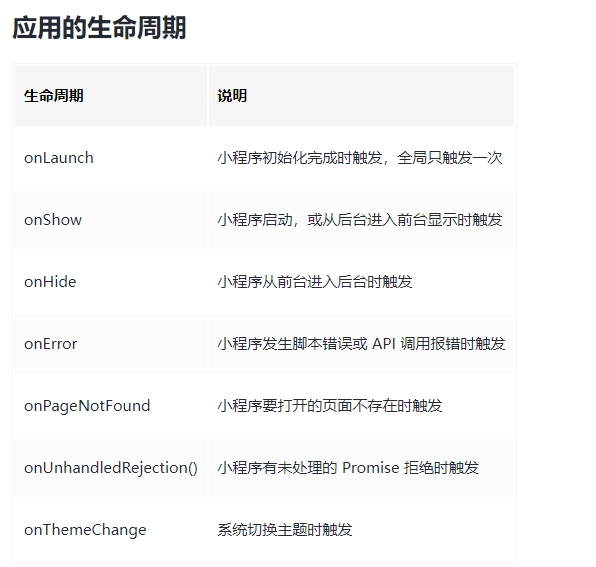
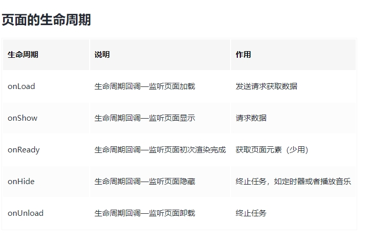
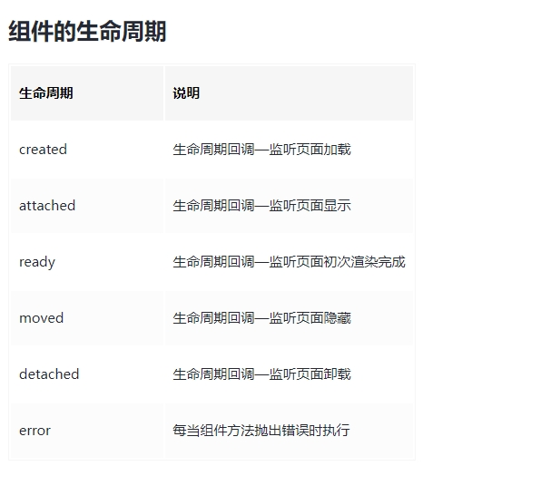
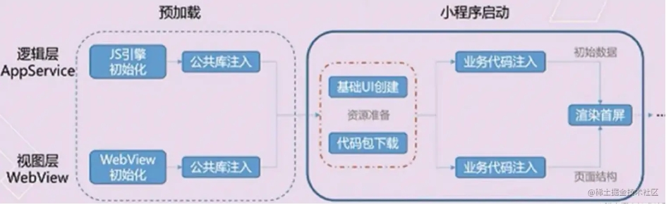
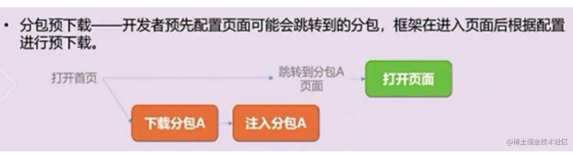
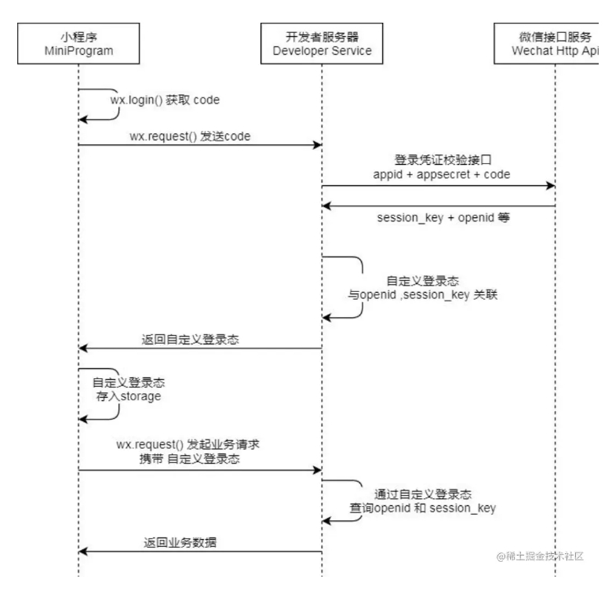
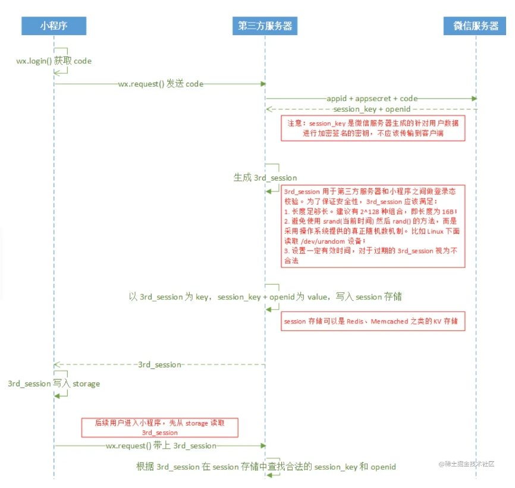

### 对微信小程序的理解？优缺点

小程序是一种不需要下载安装即可使用的应用，它实现了应用“触手可及”的梦想，用户扫一扫或者搜一下即可打开应用。也体现了“用完即走”的理念，用户不用关心是否安装太多应用的问题。应用将无处不在，随时可用，但又无需安装卸载。都是有针对性平台的应用程序。

相比H5，小程序与其的区别有如下：

- 运⾏环境：⼩程序基于浏览器内核重构的内置解析器
- 系统权限：⼩程序能获得更多的系统权限，如⽹络通信状态、数据缓存能⼒等
- 渲染机制：⼩程序的逻辑层和渲染层是分开的

优点：

- 随搜随用，用完即走
- 流量大，易接受
- 安全
- 开发门槛低
- 降低兼容性限制

缺点：

- 用户留存
- 体积限制(微信小程序只有2M的大小)
- 受控

### 生命周期

#### 应用的生命周期

是在app.js里面调用的，通过App(Object)函数用来注册一个小程序，指定其小程序的生命周期回调



#### 页面的生命周期

页面生命周期函数就是当你每进入/切换到一个新的页面的时候，就会调用的生命周期函数，同样通过App(Object)函数用来注册一个页面



#### 组件的生命周期

组件的生命周期，指的是组件自身的一些函数，这些函数在特殊的时间点或遇到一些特殊的框架事件时被自动触发，通过Component(Object)进行注册组件



### 路由跳转的方式

wx.navigateTo()用于保留当前页面、跳转到应用内的某个页面，使用 wx.navigateBack可以返回到原页面

wx.redirectTo(Object)用于关闭当前页面，跳转到应用内的某个页面。
重定向，当页面过多时，被保留页面会挤占微信分配给小程序的内存，或是达到微信所限制的 10 层页面栈的情况下，我们应该考虑选择 wx.redirectTo

wx.switchTab(Object)跳转到 tabBar 页面，并关闭其他所有非 tabBar 页面

wx.navigateBack(Object)用于关闭当前页面，并返回上一页面或多级页面，开发者可通过 getCurrentPages() 获取当前的页面栈，决定需要返回几层则设置对象的delta属性即可

wx.reLaunch(Object)关闭所有页面，打开到应用内的某个页面，返回的时候跳到首页

### 提高微信小程序的应用速度的手段

下载小程序代码包  加载小程序代码包  初始化小程序首页



#### 手段

**加载**

提升体验最直接的方法是控制小程序包的大小

- 代码包的体积压缩可以通过勾选开发者工具中“上传代码时，压缩代码”选项
- 及时清理无用的代码和资源文件
- 减少资源包中的图片等资源的数量和大小（理论上除了小icon，其他图片资源从网络下载），图片资源压缩率有限

并且可以采取分包加载的操作，将用户访问率高的页面放在主包里，将访问率低的页面放入子包里，按需加载

当用户点击到子包的目录时，还是有一个代码包下载的过程，这会感觉到明显的卡顿，所以子包也不建议拆的太大，当然我们可以采用子包预加载技术，并不需要等到用户点击到子包页面后在下载子包



**渲染**

- 请求可以在页面onLoad就加载，不需要等页面ready后在异步请求数据
- 尽量减少不必要的https请求，可使用 getStorageSync() 及 setStorageSync() 方法将数据存储在本地
- 可以在前置页面将一些有用的字段带到当前页，进行首次渲染（列表页的某些数据--> 详情页），没有数据的模块可以进行骨架屏占位

在微信小程序中，提高页面的多次渲染效率主要在于正确使用setData：

- 不要过于频繁调用setData，应考虑将多次setData合并成一次setData调用
- 数据通信的性能与数据量正相关，因而如果有一些数据字段不在界面中展示且数据结构比较复杂或包含长字符串，则不应使用setData来设置这些数据
- 与界面渲染无关的数据最好不要设置在data中，可以考虑设置在page对象的其他字段下

除此之外，对于一些独立的模块我们尽可能抽离出来，这是因为自定义组件的更新并不会影响页面上其他元素的更新

#### 总结

小程序启动加载性能：

控制代码包的大小
分包加载
首屏体验（预请求，利用缓存，避免白屏，及时反馈

小程序渲染性能：

避免不当的使用setData
使用自定义组件

### 登录流程

实现小程序用户体系主要涉及到openid和code的概念

调用wx.login()方法会生成code，将code作为参数传递给微信服务器指定接口，就可以获取用户的openid



- 通过  wx.login()  获取到用户的code判断用户是否授权读取用户信息，调用wx.getUserInfo 读取用户数据
- 由于小程序后台授权域名无法授权微信的域名，所以需要自身后端调用微信服务器获取用户信息
- 通过 wx.request() 方法请求业务方服务器，后端把 appid , appsecret  和 code 一起发送到微信服务器。 appid 和 appsecret 都是微信提供的，可以在管理员后台找到
- 微信服务器返回了 openid 及本次登录的会话密钥 session_key
- 后端从数据库中查找 openid ，如果没有查到记录，说明该用户没有注册，如果有记录，则继续往下走
- session_key 是对用户数据进行加密签名的密钥。为了自身应用安全，session_key 不应该在网络上传输
- 然后生成 session并返回给小程序
- 小程序把 session 存到  storage 里面
- 下次请求时，先从 storage 里面读取，然后带给服务端
- 服务端对比 session 对应的记录，然后校验有效期



**登录状态是否过期**

通常的做法是在登录态（临时令牌）中保存有效期数据，该有效期数据应该在服务端校验登录态时和约定的时间（如服务端本地的系统时间或时间服务器上的标准时间）做对比

另一种方式可以通过调用wx.checkSession检查微信登陆态是否过期

**静默登录**

很多开发者会把 wx.login 和 wx.getUserInfo 捆绑调用当成登录使用，其实 wx.login 已经可以完成登录，wx.getUserInfo 只是获取额外的用户信息。

在 wx.login 获取到 code 后，会发送到开发者后端，开发者后端通过接口去微信后端换取到 openid 和 sessionKey（现在会将 unionid 也一并返回）后，把自定义登录态 3rd_session(本业务命名为auth-token) 返回给前端，就已经完成登录行为了。

wx.login 行为是静默，不必授权的，用户不会察觉。

wx.getUserInfo 只是为了提供更优质的服务而存在，比如获取用户的手机号注册会员，或者展示头像昵称，判断性别，开发者可通过 unionId 和其他公众号上已有的用户画像结合来提供历史数据。因此开发者不必在用户刚刚进入小程序的时候就强制要求授权。

```
  private async silentLogin(): Promise<void> {
    try {
      this.status.silentLogin.ing();

      // 获取临时登录凭证code
      const code = await getWxLoginCode();
      // 将code发送给服务端
      const res = await API.login(code);
      // 保存登录信息，如auth-token
      storage.setSync(constant.STORAGE_SESSION_KEY, res.data);

      this.status.silentLogin.success();
    } catch (error) {
      logger.error('静默登录失败', error);
      this.status.silentLogin.fail(error);
      throw error;
    }
  }
```

- 小程序端调用 wx.login() 获取 临时登录凭证code ，并回传到开发者服务器。
- 服务器端调用 auth.code2Session 接口，换取 用户唯一标识 OpenID 和 会话密钥 session_key。
- 开发者服务器可以根据用户标识来生成自定义登录态(例如：auth-token)，用于后续业务逻辑中前后端交互时识别用户身份。

### 发布流程

上传代码  提交审核  发布版本

### 支付流程

- 打开某小程序，点击直接下单
- wx.login获取用户临时登录凭证code，发送到后端服务器换取openId
- 在下单时，小程序需要将购买的商品Id，商品数量，以及用户的openId传送到服务器
- 服务器在接收到商品Id、商品数量、openId后，生成服务期订单数据，同时经过一定的签名算法，向微信支付发送请求，获取预付单信息(prepay_id)，同时将获取的数据再次进行相应规则的签名，向小程序端响应必要的信息
- 小程序端在获取对应的参数后，调用wx.requestPayment()发起微信支付，唤醒支付工作台，进行支付
- 接下来的一些列操作都是由用户来操作的包括了微信支付密码，指纹等验证，确认支付之后执行鉴权调起支付
- 鉴权调起支付：在微信后台进行鉴权，微信后台直接返回给前端支付的结果，前端收到返回数据后对支付结果进行展示
- 推送支付结果：微信后台在给前端返回支付的结果后，也会向后台也返回一个支付结果，后台通过这个支付结果来更新订单的状态

其中后端响应数据必要的信息则是wx.requestPayment方法所需要的参数，大致如下
```
wx.requestPayment({
  // 时间戳
  timeStamp: '',
  // 随机字符串
  nonceStr: '',
  // 统一下单接口返回的 prepay_id 参数值
  package: '',
  // 签名类型
  signType: '',
  // 签名
  paySign: '',
  // 调用成功回调
  success () {},
  // 失败回调
  fail () {},
  // 接口调用结束回调
  complete () {}
})
```

### 微信小程序的实现原理

网页开发，渲染线程和脚本是互斥的，这也是为什么长时间的脚本运行可能会导致页面失去响应的原因，本质就是我们常说的 JS 是单线程的

在小程序中，选择了 Hybrid 的渲染方式，将视图层和逻辑层是分开的，双线程同时运行，视图层的界面使用 WebView 进行渲染，逻辑层运行在 JSCore 中

渲染层：界面渲染相关的任务全都在 WebView 线程里执行。一个小程序存在多个界面，所以渲染层存在多个 WebView 线程

逻辑层：采用 JsCore 线程运行 JS 脚本，在这个环境下执行的都是有关小程序业务逻辑的代码

小程序在渲染层，宿主环境会把wxml转化成对应的JS对象

在逻辑层发生数据变更的时候，通过宿主环境提供的setData方法把数据从逻辑层传递到渲染层，再经过对比前后差异，把差异应用在原来的Dom树上，渲染出正确的视图

对于事件的分发处理，微信进行了特殊的处理，将所有的事件拦截后，丢到逻辑层交给JavaScript进行处理
