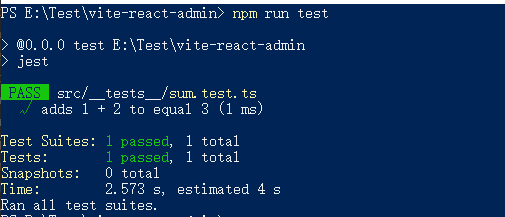

单元测试（Unit Tesing）是针对程序的最小部件，检查代码是否会按照预期工作的一种测试手段。在过程式编程中最小就是一个函数，在面向对象编程中最小部件就是对象方法。

## 为什么选择jest

Jest 是用来创建、执行和构建测试用例的 JavaScript 测试库，自身包含了 驱动、断言库、mock 、代码覆盖率等多种功能，配置使用相当简单

## 安装与配置

```
npm install --save-dev jest @types/jest ts-jest
```

- Jest: JavaScript 测试运行器，它允许你使用 jsdom 操作 DOM
- @types/jest: 用于测试框架的类型推断
- ts-jest: 预处理器，

package.json
```
{
  "scripts": {
    "test": "jest --colors",
    "test:watch": "yarn test  --coverage --collectCoverage=false --watch"
  }
}
```

- --coverage 可以生成测试覆盖率报告
- --colors 根据覆盖率生成不同颜色的报告（<50%红色，50%~80%黄色， ≥80%绿色）
执行npm run test命令可在终端运行查看测试运行结果。

### 生成配置文件

根目录下的 jest.config.js 文件可以自定义 jest 的详细配置，也可配置在package.json

```
npx ts-jest config:init
```

jest.config.js
```
/** @type {import('@ts-jest/dist/types').InitialOptionsTsJest} */
module.exports = {
  preset: 'ts-jest',
  testEnvironment: 'node',
};
```

补充完整如下：
```
module.exports = {
  roots: ['<rootDir>/src'],
  transform: {
    '^.+\\.tsx$': 'ts-jest',
    '^.+\\.ts$': 'ts-jest',
  },
  // testMatch: [ // glob 格式
  //   "**/__tests__/**/*.[jt]s?(x)",
  //   "**/?(*.)+(spec|test).[jt]s?(x)"
  // ],
  // 正则表达式格式，与 testMatch 互斥，不能同时声明
  testRegex: '(/__tests__/.*.(test|spec)).(jsx?|tsx?)$',
  moduleFileExtensions: ['ts', 'tsx', 'js', 'jsx', 'json', 'node'],
  collectCoverage: false, // 配置测试覆盖率是否开启
  collectCoverageFrom: ['<rootDir>/src/**/*.{ts,tsx}'], // 配置收集测试覆盖率文件范围
  coverageDirectory: '<rootDir>/coverage/', // 测试覆盖率输出形式目录
  coveragePathIgnorePatterns: ['(tests/.*.mock).(jsx?|tsx?)$', '(.*).d.ts$'],
  moduleNameMapper: {
    '.+\\.(css|styl|less|sass|scss|png|jpg|ttf|woff|woff2|svg)$': 'identity-obj-proxy',
  },
  verbose: true,
  testTimeout: 30000,
}
```

## React项目单元测试

```
npm install --save-dev @testing-library/react @testing-library/jest-dom
```

### 修改eslint

.eslintrc.json
```
module.exports = {
  env: {
    browser: true,
    node: true,
    es6: true,
    jest: true
  },
}
```

### 新建测试文件

src/__tests__/sum.test.ts
```
import sum from '../tests/sum'

test('adds 1 + 2 to equal 3', () => {
  expect(sum(1, 2)).toBe(3)
})
```

src/utils/sum.ts
```
export default function sum(a: number, b: number): number {
  return a + b
}
```
在测试用例中使用 expect(x).toBe(y) 的方式表达 x 与 y 相同，类似 Node.js 提供的 assert(x, y) 断言，相对而言 jest 提供的语法有更好的语义性和可读性

### 执行测试命令

```
npm test
```



jest 会自动运行 sum.test.ts 文件，其默认匹配规则:
1. 匹配 __test__ 文件夹下的 .ts 文件（.jsx .ts .tsx 也可以）
2. 匹配所有后缀为 .test.ts 或 .spec.ts 的文件（.jsx .ts .tsx 也可以）

## 术语解析

- describe 描述, decribe会形成一个作用域
- it 断言
- expect 期望
- test 测试，类似it

## 断言函数

jest 提供了 BDD 风格的断言支持，用来验证结果是否正确，下面列出几个常用的:

### 相等

.toBe() 来测试两个值精准相等
```
expect(2 + 2).toBe(4)
```

如果测试对象可以使用 toEqual() ，递归检查数组或对象的每个字段
```
const data = {one: 1}
data['two'] = 2
expect(data).toEqual({one: 1, two: 2})
```

添加 not 可以表达相反匹配
```
expect(a + b).not.toBe(0)
```

### 真值

- toBeNull 只匹配 null
- toBeUndefined 只匹配 undefined
- toBeDefined 与 toBeUndefined 相反
- toBeTruthy 匹配任何 if 语句为真
- toBeFalsy 匹配任何 if 语句为假

```
test('zero', () => {
  const z = 0
  expect(z).not.toBeNull()
  expect(z).toBeDefined()
  expect(z).not.toBeUndefined()
  expect(z).not.toBeTruthy()
  expect(z).toBeFalsy()
})
```

### 数字

```
test('two plus two', () => {
  const value = 2 + 2
  expect(value).toBeGreaterThan(3)
  expect(value).toBeGreaterThanOrEqual(3.5)
  expect(value).toBeLessThan(5)
  expect(value).toBeLessThanOrEqual(4.5)
})
```

对于比较浮点数相等，使用 toBeCloseTo 而不是 toEqual
```
test('两个浮点数字相加', () => {
  const value = 0.1 + 0.2
  expect(value).toBe(0.3) // 这句会报错，因为浮点数有舍入误差
  expect(value).toBeCloseTo(0.3) // 这句可以运行
})
```

### 包含

可以通过 toContain来检查一个数组或可迭代对象是否包含某个特定项
```
expect(shoppingList).toContain('beer')
```

### async/await

async/await 测试比较简单，只要外层方法声明为 async 即可
```
test('async/await data is peanut butter', async () => {
  const data = await aa()
  expect(data).toBe('peanut butter')
})
```

### mock

#### mock 函数

使用 jest.fn() 就可以 mock 一个函数，mock 函数有 .mock 属性，标识函数被调用及返回值信息
```
const mockFn = jest.fn()
mockFn
  .mockReturnValueOnce(10)
  .mockReturnValueOnce('x')
  .mockReturnValue(true)

console.log(myMock(), myMock(), myMock(), myMock())
```

#### mock 模块

使用 jest.mock(模块名) 可以 mock 一个模块，比如某些功能依赖了 axios 发异步请求，在实际测试的时候我们希望直接返回既定结果，不用发请求，就可以 mock axios
```
// src/user.js
const axios = require('axios');

class Users {
  static all() {
    return axios.get('/users.json').then(resp => resp.data)
  }
}

module.exports = Users


// src/user.test.js
const axios = require('axios')
const Users = require('../src/user')

jest.mock('axios') // mock axios

test('should fetch users', () => {
  const users = [{ name: 'Bob' }]
  const resp = { data: users }

  // 修改其 axios.get 方法，直接返回结果，避免发请求
  axios.get.mockResolvedValue(resp)

  // 也可以模拟其实现
  // axios.get.mockImplementation(() => Promise.resolve(resp))

  return Users.all().then(data => expect(data).toEqual(users))
})
```

## 分组函数

```
describe("关于每个功能或某个组件的单元测试",()=>{
    // 不同用例的单元测试
})
```
