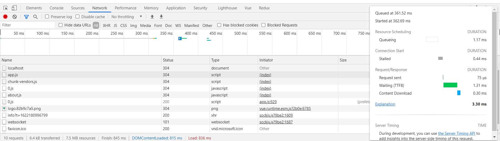
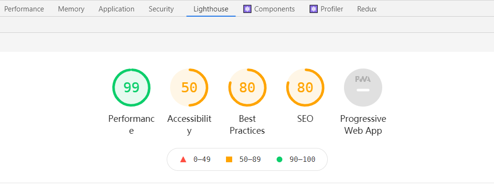
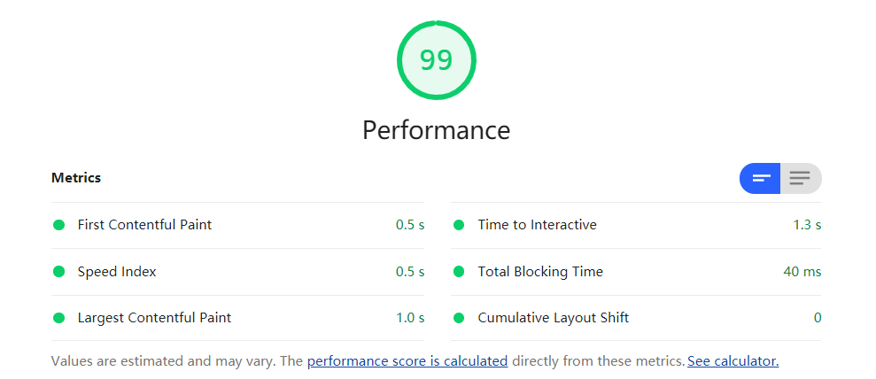
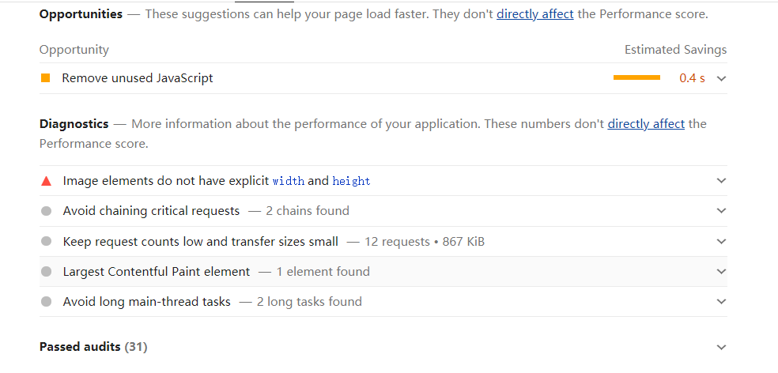
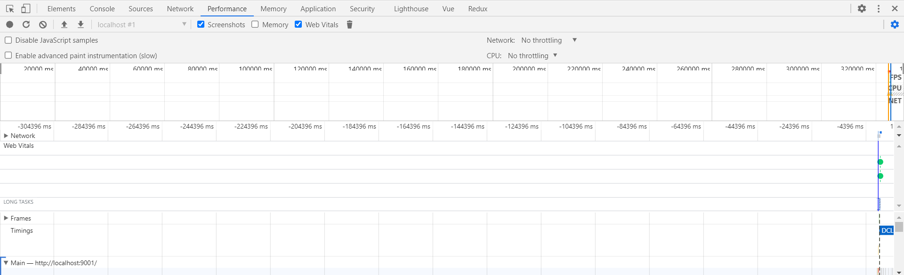
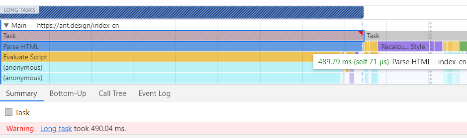
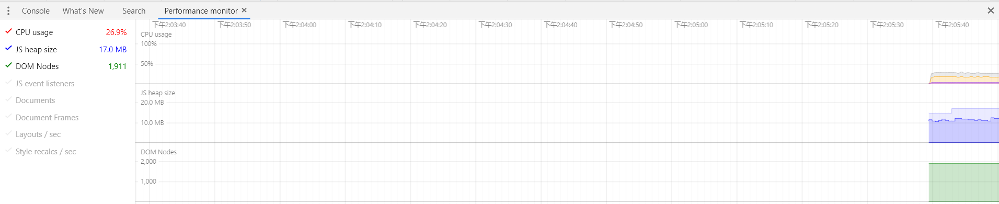

# 调试工具

## Network面板

Network面板记录了与服务器交互的具体细节。



在这里我们可以看到发起的请求数量，传输体积以及解压缩后的体积，同时还可以知道哪些资源是命中了强缓存，哪些资源命中的协商缓存。

查看某一个请求的瀑布流可以让我们清晰的看到一个资源从服务器到达我们的电脑所花的时间。

Network面板可以让我们初步评估网站性能，对网站整体的体积，网络的影响带来一个整体的认知，同时提供一些辅助功能，如禁用缓存，block某些资源。

## lighthouse面板




lighthouse是对网站整体的评估，通过几个不同的指标给网站进行打分。

- First Contentful Paint: 首屏渲染时间，Chrome会取第一个渲染出来的元素作为时间参考。
- Time to Interactive: 可交互时间，从能看到能摸的时间点。
- Speed Index: 速度指数，页面的填充速度。
- Total Blocking Time: 从能看到能摸之间超过50ms的任务总和。
- Largest Contentful Paint: 页面中最大的那块渲染的时间点。
- Cumulative Layout Shift: 元素移动所累积的时间点，比如有一个absolute的元素突然从左边移到了右边。

同时针对网站的信息，lighthouse还会给出一些完善建议，可以帮助我们在接下来的优化中提供一个大致的方向。



## performance面板

performance面板会给我们提供一个具体的执行过程，从HTML文档下载，解析HTML，到解析CSS，计算样式，执行JS。



## 火焰图



从火焰图我们可以找到长任务，分析长任务，或者找到某些无关紧要的任务把他们拆分，延后，优化使他们达到一个理想状态。

## performance monitor面板



performance monitor让我们监控内存和CPU的占用，它给出的是整体的占用数据，可以用来观察某一段代码某一个特效会不会造成性能影响。

## webpack-bundle-analyze

如果你用到了webpack打包，可以用它来分析打包后的文件，做成具体策略。


```
// vue.config.js

const BundleAnalyzerPlugin = require('webpack-bundle-analyzer').BundleAnalyzerPlugin;

module.exports = {
  configureWebpack: {
    plugins: [
      new BundleAnalyzerPlugin({
        analyzerMode: 'disabled',
        generateStatsFile: true,
        statsFilename: '../analyzer/stats.json', // 相对于捆绑输出目录
        statsOptions: { source: false },
      }),
    ],
  },
};


// package.json

  "scripts": {
    "bundle-report": "webpack-bundle-analyzer --port 8888 analyzer/stats.json"
  },
```

# 优化

## 代码层面优化

- v-if 和 v-show 区分使用场景
- computed 和 watch 区分使用场景
- v-for 遍历必须为 item 添加 key，且避免同时使用 v-if
- 长列表性能优化
- 事件的销毁
- 图片资源懒加载
- 路由懒加载
- 第三方插件的按需引入
- 优化无限列表性能
- 服务端渲染 SSR or 预渲染

## Webpack 层面的优化

### 解决打包后vendors.js 很大

vue-cli npm run build命令默认把dependencies中的依赖统一打包，导致vendors.js文件过大，出现首屏加载过于缓慢的问题。

解决方案：使用externals引用第三方资源，防止资源被打包到自己项目中。

### 打包后的css文件

可以利用 webpack 中的 dll (DLL 就是个另类缓存) 做一部分的分割，比如第三方等的公用 css 文件。

*但是，webpack 4 有着比 dll 更好的打包性能。*

然后再者可以利用 mini-css-extract-plugin 这个插件做各自模块的 css 文件提取。

### 图片压缩

推荐网站：http://www.bejson.com/ui/compress_img/，我们也可以使用webpack里的插件对打包的图片进行压缩。

在vue项目中可以使用url-loader设置limit大小来对图片处理，对于小于limit的图片转化为base64格式，其余的不做操作。对于有些较大的图片资源，我们可以使用image-webpack-loader来压缩图片。

```
npm install --save-dev image-webpack-loader
```

```
module.exports = {
  chainWebpack: config => {
    if (process.env.NODE_ENV === 'production') {
      config.module
        .rule('images')
        .use('image-webpack-loader')
        .loader('image-webpack-loader')
        .options({
          mozjpeg: { progressive: true, quality: 65 },
          optipng: { enabled: false },
          pngquant: { quality: [0.65, 0.9], speed: 4 },
          gifsicle: { interlaced: false }
          // webp: { quality: 75 }
        })
        .end();
    }
  },
}
```

### 公共代码抽离

#### 第三方模块抽离

页面中有时会引入第三方模块，比如import * as echarts from 'echarts';
page1中需要引用，page2中也需要引用，这时候就可以用vendor把echarts抽离出来，

#### 公共模块抽离

项目中分别有a.js, b.js, page1.js, page2.js这四个JS文件， page1.js 和
page2.js中同时都引用了a.js, b.js， 这时候想把a.js, b.js抽离出来合并成一个公共的js，然后在page1,page2中自动引入这个公共的js，怎么配置呢？

```
module.export = {
  configureWebpack: {
    optimization: {
      // 公共代码抽离
      splitChunks: {
        cacheGroups: {
          vendor: {
            // 第三方库抽离
            chunks: 'all',
            test: /node_modules/,
            // name: 'vendor',
            name: 'chunk-vendor', // 改名chunk-vendor验证
            minChunks: 1, // 在分割之前，这个代码块最小应该被引用的次数
            maxInitialRequests: 5, // 入口点的最大并行请求数
            minSize: 300000, // 依赖包超过300000bit将被单独打包
            priority: 100, // 权重
          },
          common: {
            // 公用模块抽离
            chunks: 'all',
            test: /[\\/]src[\\/]js[\\/]/,
            name: 'common',
            minChunks: 2, // 在分割之前，这个代码块最小应该被引用的次数
            maxInitialRequests: 5,
            minSize: 300000, // 依赖包超过300000bit将被单独打包
            priority: 60, // 默认组的优先级为负，以允许自定义组获得更高的优先级（自定义组的默认值为 0 ）
          },
          styles: {
            // 样式抽离
            name: 'styles',
            test: /\.(sa|sc|c|le)ss$/,
            chunks: 'all',
            enforce: true,
          },
          antDesignVue: {
            name: 'chunk-ant-design-vue',
            test: /[\\/]node_modules[\\/]ant-design-vue[\\/]/,
            chunks: 'all',
            priority: 200, // 值越大，权重越高
            reuseExistingChunk: true,
            enforce: true, // 忽略 splitChunks.minSize, minChunks, maxAsyncRequests, maxInitialRequests，总是为这个缓存组创建 chunks
          },
          runtimeChunk: {
            name: 'manifest',
          },
        },
      },
    }
  }
};
```

## Web 技术优化

### 开启 gzip 压缩

#### 方案一

webpack打包压缩：

安装compression-webpack-plugin，可能存在版本问题，可锁定@6.0.0
```
npm install --save-dev compression-webpack-plugin
```

vue.config.js配置:
```
const CompressionPlugin = require('compression-webpack-plugin');

module.exports = {
  configureWebpack: {
    resolve: {},
    optimization: {},
    plugins: [
      new BundleAnalyzerPlugin({
        analyzerMode: 'disabled',
        generateStatsFile: true,
        statsFilename: '../analyzer/stats.json', // 相对于捆绑输出目录
        statsOptions: { source: false },
      }),
      new CompressionPlugin({
        filename: '[path][base].gz',
        algorithm: 'gzip',
        test: /\.(js|css|html|svg)$/,
        threshold: 10240, // 只有大小大于该值的资源会被处理。单位是 bytes。默认值是 0。
        minRatio: 0.8, // 只有压缩率小于这个值的资源才会被处理。默认值是 0.8。
      }),
    ],
  },
};
```

在nginx.conf文件中加上gzip_static on;

```
http {
    include       mime.types;
    default_type  application/octet-stream;
    sendfile        on;
    #tcp_nopush     on;

    #keepalive_timeout  0;
    keepalive_timeout  65;

    gzip_static on;

    server {
        listen       8462;
        server_name  localhost;

        location / {
            root   dist;
            index  index.html index.htm;
        }
        error_page   500 502 503 504  /50x.html;
        location = /50x.html {
            root   html;
        }
    }

}
```

运行vue打包命令后，dist文件夹会出现gz文件。

gzip压缩比率在5-6倍，nginx配置了静态gz加载后，浏览器也返回的是gz文件，这样就会请求小文件而不会导致请求卡线程。

并且，因为保留了源文件，所以当我们删除gz后，浏览器会自动去请求原始文件，而不会导致界面出现任何问题。

看到请求头的Accept-Encoding:gzip和响应头的Content-Encoding:gzip则说明使用gzip压缩成功。

#### 方案二

服务器在线gzip压缩：

nginx开启gzip，首先是开启gzip，设置缓冲区大小，压缩的等级，需要压缩的文件等：
```
http {
    include       mime.types;
    default_type  application/octet-stream;

    sendfile        on;
    #tcp_nopush     on;

    #keepalive_timeout  0;
    keepalive_timeout  65;

    # 开启gzip
    gzip  on;
    
    # 启用gzip压缩的最小文件，小于设置值的文件将不会压缩
    gzip_min_length 1k;

    # 设置压缩所需要的缓冲区大小
    gzip_buffers 4 16k;
    
    # gzip 压缩级别，1-9，数字越大压缩的越好，也越占用CPU时间，官网建议是6
    gzip_comp_level 6;
 
    # 压缩的类型
    gzip_types text/plain application/javascript text/css application/xml text/javascript application/x-httpd-php;


    server {
        listen       8462;
        server_name  localhost;

        location / {
            root   dist;
            index  index.html index.htm;
        }

        error_page   500 502 503 504  /50x.html;
        location = /50x.html {
            root   html;
        }
    }
}
```

观察网络面板里面的 response header，如果看到 ``` content-encoding: gzip ``` 字段则表明 gzip 开启成功。

**两种方案的优缺点：**

- webpack打包，然后直接使用静态的gz，缺点就是打包后文件体积太大，但是不耗服务器性能；
- 使用nginx在线gzip，缺点就是耗性能，需要实时压缩，但是vue打包后的文件体积小。

如果我想在有gz文件的时候进行静态压缩，不存在gz文件的时候进行在线压缩而不是加载源文件，要怎么做呢？
```
gzip on;
gzip_static on;
gzip_min_length 1k;
gzip_buffers 4 16k;
gzip_comp_level 2;
gzip_types text/plain text/html text/css application/x-javascript text/xml application/xml application/xml+rss text/javascript;
```

首先，gzip_static的优先级高，会先加载静态gz文件，当同目录下不存在此文件的时候，会执行在线压缩的命令。

既然都开启的情况下，我们怎么区分使用了静态加载还是在线压缩呢？

响应头的Content-Encoding:gzip表示gzip压缩已经生效，而ETag中只有简单字符表示静态资源加载，而前面带 W/ 表示启动了在线压缩。

### 浏览器缓存

对静态资源进行缓存，分为协商缓存和强制缓存

在nginx.conf的http模块中写入一下内容:
```
# 设置缓存路径并且使用一块最大100M的共享内存，用于硬盘上的文件索引，包括文件名和请求次数，每个文件在1天内若不活跃（无请求）则从硬盘上淘汰，硬盘缓存最大10G，满了则根据LRU算法自动清除缓存。

proxy_cache_path /var/cache/nginx/cache levels=1:2 keys_zone=imgcache:100m inactive=1d max_size=10g;
```

然后在nginx.conf的serve模块中写入一下内容，保存配置，nginx -s reload重启服务即可看到效果

```
location ~* ^.+\.(css|js|ico|gif|jpg|jpeg|png)$ {
  log_not_found off;
  # 关闭日志
  access_log off;
  # 缓存时间7天
  expires 7d;
  # 源服务器
  proxy_pass http://localhost:8888;
  # 指定上面设置的缓存区域
  proxy_cache imgcache;
  # 缓存过期管理
  proxy_cache_valid 200 302 1d;
  proxy_cache_valid 404 10m;
  proxy_cache_valid any 1h;
  proxy_cache_use_stale error timeout invalid_header updating http_500 http_502 http_503 http_504;
}
```

### CDN 的使用

大部分服务器的带宽有限，如果超过限制，网页就半天反应不过来。CDN 可以通过不同的域名来加载文件，从而使下载文件的并发连接数大大增加，且CDN 具有更好的可用性，更低的网络延迟和丢包率 。

### http2

nginx开启http2非常简单,在nginx.conf中只需在原来监听的端口后面加上http2就可以了,前提是你的nginx版本不能低于1.95，并且已经开启了https
```
listen 443 ssl http2;
```
在network中通过protocol可以查看到当前的资源是通过哪个版本的http协议传输的。
