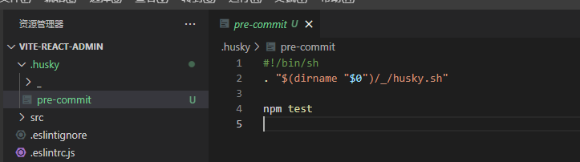

## 搭建Vite项目

```
# npm 6.x
npm init @vitejs/app vite-react-admin --template react-ts

# npm 7+, 需要额外的双横线：
npm init @vitejs/app vite-react-admin -- --template react-ts
```

## git commit规范

### ESLint+Prettier规范

ESLint关注代码质量, Prettier关注代码风格

```
npm install --save-dev @typescript-eslint/eslint-plugin @typescript-eslint/parser eslint eslint-config-prettier eslint-plugin-prettier eslint-plugin-react eslint-plugin-react-hooks  eslint-plugin-simple-import-sort
```

.eslintrc.js
```
module.exports = {
    root: true,
	parser: '@typescript-eslint/parser',
    parserOptions: {
		// 指定ESLint可以解析JSX语法
		ecmaVersion: 2020,
		sourceType: 'module',
		ecmaFeatures: {
			jsx: true
		}
	},
	extends: [
        'eslint:recommended',
		'plugin:react/recommended',
		'plugin:prettier/recommended' // Make sure this is always the last element in the array.
	],
	plugins: ['simple-import-sort', 'prettier', '@typescript-eslint', 'react', 'react-hooks'],
	env: {
		browser: true,
		node: true,
		es6: true
	},
	globals: {
		NodeJS: true,
		require: true,
		process: true,
		$request: true,
		$message: true
	},
	settings: {
		// 自动发现React的版本，从而进行规范react代码
		react: {
			pragma: 'React',
			version: 'detect'
		}
	},
	rules: {
		'prettier/prettier': ['error', {}, { usePrettierrc: true }],
        'react/prop-types': 'off',
        'simple-import-sort/imports': 'error',
        'simple-import-sort/exports': 'error',
        '@typescript-eslint/explicit-function-return-type': 'off',
	}
}
```

.eslintignore
```
node_modules
build
dist
**/*.d.ts
src/assets
```

```
npm install --save-dev prettier
```

.prettierignore
```
node_modules
.DS_Store
dist
dist-ssr
src/assets
commitlint.config.js
*.local
**/*.d.ts
**/*.svg
package.json
.eslintignore
.gitignore
.history
.huskyrc
.prettierignore
yarn-error.log
```

.prettierrc
```
{
  "printWidth": 120,
  "tabWidth": 2,
  "singleQuote": true,
  "semi": false,
  "proseWrap": "always",
  "arrowParens": "avoid",
  "bracketSpacing": true,
  "endOfLine": "lf"
}
```

### 使用 husky lint-staged 来控制 git 提交之前的校验

```
npm install --save-dev husky lint-staged @commitlint/cli @commitlint/config-conventional
```

commitlint.config.js
```
module.exports = {
  extends: ['@commitlint/config-conventional'],
  rules: {
    'type-enum': [
      2,
      'always',
      ['build', 'ci', 'chore', 'docs', 'feat', 'fix', 'perf', 'refactor', 'revert', 'style', 'test'],
    ],
    'type-case': [0],
    'type-empty': [0],
    'scope-empty': [0],
    'scope-case': [0],
    'subject-full-stop': [0, 'never'],
    'subject-case': [0, 'never'],
    'header-max-length': [0, 'always', 72],
  },
}
```

.huskyrc
```
{
  "hooks": {
    "pre-commit": "lint-staged",
    "commit-msg": "commitlint -E HUSKY_GIT_PARAMS"
  }
}
```

package.json
```
"lint-staged": {
    "src/**/*.{ts,tsx,js,jsx}": [
      "npm run lint"
    ]
}
```

*husky无法工作原因：*

安装低版本即可: npm install --save-dev husky@4.3.8

*husky 7 版本：*

https://typicode.github.io/husky/#/?id=usage

1. npx husky-init

运行完成之后，我们可以看到项目根目录多了一个 .husky 的文件夹，里面自动创建了一个 pre-commit 的钩子，如下图：



package.json
```
  "scripts": {
    "prepare": "husky install"
  },
```

2. 配置钩子

在 package.json 内，配置 lint-staged：

```
  "lint-staged": {
    "src/**/*.{ts,tsx,js,jsx}": [
      "npm run lint"
    ]
  },
```

在 .husky/pre-commit 内配置好要执行的命令：
https://typicode.github.io/husky/#/?id=husky_git_params-ie-commitlint-

```
#!/bin/sh
. "$(dirname "$0")/_/husky.sh"

npx lint-staged
```

在 .husky 文件夹下新建 commit-msg 文件，填入如下信息
```
#!/bin/sh
. "$(dirname "$0")/_/husky.sh"

npx --no-install commitlint --edit $1
```

3. 清理 package.json 中 husky 字段内容
```
  // "husky": {
  //   "hooks": {
  //     "pre-commit": "lint-staged",
  //     "commit-msg": "commitlint --config .commitlintrc.js -E HUSKY_GIT_PARAMS"
  //   }
  // },
```

4. 测试钩子

### CHANGELOG

```
npm install --save-dev conventional-changelog-cli
```

在package.json中新增:
```
"changelog": "conventional-changelog -p angular -i CHANGELOG.md -s"
```

生成日志: npm run changelog ,
conventional-changelog-cli不会覆盖任何以前的变更日志。 新增的日志基于自上一个commit的。

如果这是您第一次使用此工具，并且想要生成所有以前的变更日志，则可以执行：
```
onventional-changelog -p angular -i CHANGELOG.md -s -r 0
```
