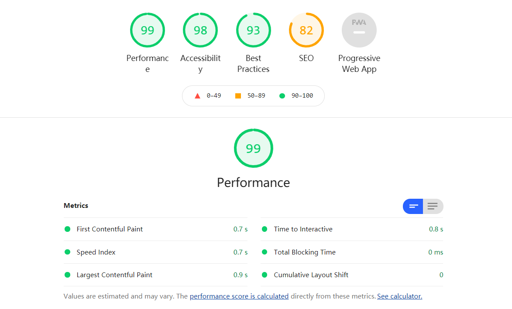
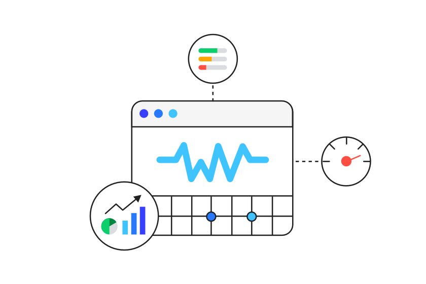
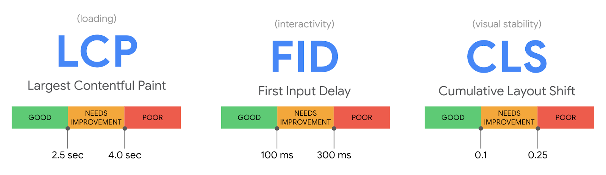
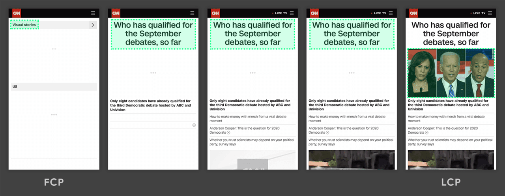
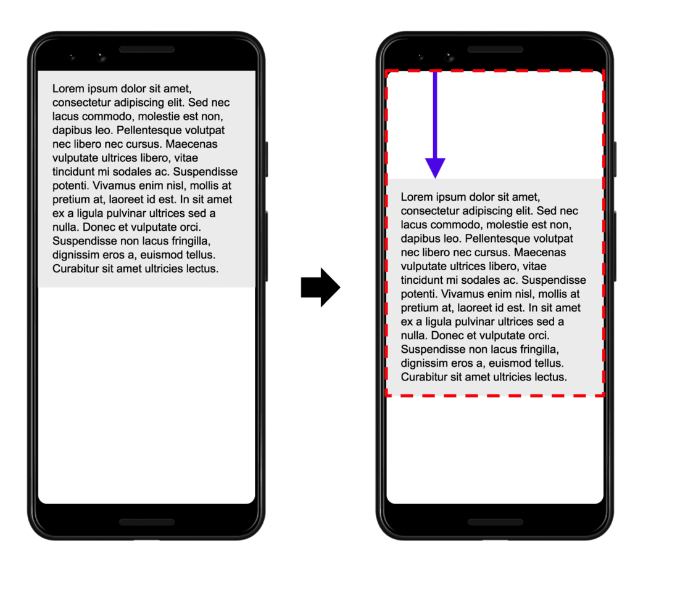

使用者体验好或不好一直是前端领域中，常常被拿出来讲的话题，因为涉及设计、艺术和美感等难以量化的成份，所以难有一个统一衡量标准，而 Google 试著解答这个难题，从一开始提供 GA 服务上报操作信息，发表自己的浏览器支持最新 W3C Web 技术，然后推出 PWA ＆ AMP 设计开发标准、RAIL 指标、衡量网站体验的工具 Audit 和 Lighthouse ，并基于上百万位站主合作经验上不断修正标准，尝试抓出这个标准，在 2020 年推出了 Web Vitals。

## Web Vitals ？

什么是 [Web Vitals](https://blog.chromium.org/2020/05/introducing-web-vitals-essential-metrics.html) ?

Google 给的定义是一个良好网站的基本指标 (Essential metrics for a healthy site)，为什么还要再定义一个新的指标集，原因是过去要衡量一个好的网站，需要使用的指标太多，推出 Web Vitals 是简化这个学习的曲线，站主只要观注 Web Vitals 指标表现即可。

而在 Web Vitals 指标中，Core Web Vitals 是其中最重要的核心，目前包含三个指标：

- LCP 显示最大内容元素所需时间 (衡量网站初次载入速度)
- FID 首次输入延迟时间 (衡量网站互动顺畅程度)
- CLS 累计版面配置移转 (衡量网页元件视觉稳定性)

指标标准如下图:



## 技术实践

### 衡量网站初次载入速度

WICG 上则孵化了一个新的指标 LCP ，简单清楚地以网页 Viewport 最大 Element 载入为基准点，衡量标准如下图所示，在 **2.5 秒**内载完最大 Element 为良好的网页载入速度。


其最大指的是实际 Element 长宽大小，Margin / Padding / Border 等 CSS 大小效果不计入。包含的种类 为 ```, <image>, url(…), <video> ```及包含文字节点的 Block 或 Inline Element，未来可能会再加入 ```<svg> ```。

*页面上最大的元素即绘制面积最大的元素，所谓绘制面积可以理解为每个元素在屏幕上的 “占地面积”，如果元素延伸到屏幕外，或者元素被裁切了一部分，被裁切的部分不算入在内，只有真正显示在屏幕里的才算数。*

因为网页上的 Element 可能持续加载，最大的 Element 也可能持续改变 (如文字载入完，然后载入图片) ，所以当每一个当下最大的 Element 载完，浏览器会发出一个 PerformanceEntry Metric，直到使用者可以进行 Keydown / Scrolling / Tapping 等操作，Browser才会停止发送 Entry，故只要抓到最后一次 Entry ，即能判断 LCP 的持续时间。


LCP 其实能比前两个指标更能体现一个页面的性能好坏程度，因为这个指标会持续更新。举个例子：当页面出现骨架屏或者 Loading 动画时 FCP 其实已经被记录下来了，但是此时用户希望看到的内容其实并未呈现，我们更想知道的是页面主要的内容是何时呈现出来的。

开发者可透过 PerformanceObserver 及设定 Type 'largest-contentful-paint' 拿到 LCP 的时间，如下所示。
```
export const getLCP = (onReport: ReportHandler, reportAllChanges?: boolean) => {
  const firstHidden = getFirstHidden();
  let metric = initMetric('LCP');
  let report: ReturnType<typeof bindReporter>;

  const entryHandler = (entry: PerformanceEntry) => {
    // The startTime attribute returns the value of the renderTime if it is not 0,
    // and the value of the loadTime otherwise.
    const value = entry.startTime;

    // If the page was hidden prior to paint time of the entry,
    // ignore it and mark the metric as final, otherwise add the entry.
    if (value < firstHidden.timeStamp) {
      metric.value = value;
      metric.entries.push(entry);
    }

    report();
  };

  const po = observe('largest-contentful-paint', entryHandler);

  if (po) {
    report = bindReporter(onReport, metric, reportAllChanges);

    const stopListening = () => {
      if (!finalMetrics.has(metric)) {
        po.takeRecords().map(entryHandler as PerformanceEntryHandler);
        po.disconnect();
        finalMetrics.add(metric);
        report();
      }
    }

    // Stop listening after input. Note: while scrolling is an input that
    // stop LCP observation, it's unreliable since it can be programmatically
    // generated. See: https://github.com/GoogleChrome/web-vitals/issues/75
    ['keydown', 'click'].forEach((type) => {
      addEventListener(type, stopListening, {once: true, capture: true});
    });

    onHidden(stopListening, true);

    onBFCacheRestore((event) => {
      metric = initMetric('LCP');
      report = bindReporter(onReport, metric, reportAllChanges);
      requestAnimationFrame(() => {
        requestAnimationFrame(() => {
          metric.value = performance.now() - event.timeStamp;
          finalMetrics.add(metric);
          report();
        });
      });
    });
  }
};
```

### 衡量网站互动顺畅程度

如何衡量网站操作的顺畅程度，Google 采用 FID 指标，其定义为在 TTI 的时间内第一个互动事件的开始时间与浏览器回应事件的时间差，其互动事件为单次事件如 Clicks / Taps / Key Presses 等，其他连续性事件 Scrolling / Zooming 则不计。


为什么要取在 TTI 发生的第一次的操作事件，Google 给的理由有以下三点:

- 使用者的第一次互动体验印象相当重要
- 当今网页最大的互动性问题通常发生在一开始载入时
- 页面载入完后的第二次操作事件延迟，有其他专门的改善解决建议


但是 FID 的计算有其明显的问题，如当使用者在 Main Thread 闲置时操作，那 FID 可能就短，若不操作则 FID 则无法计算。这对开发者来说，很难去衡量网站的 FID 符合良好的标准，所以 Google 给的建议是透过降低 [TBT](https://web.dev/tbt/) 的时间来降低 FID 的值，当 TBT 越短，其 FID 就越好。

开发者可透过 PerformanceObserver 及设定 Type 'first-input' 拿到 FID 的时间，如下所示。
```
export const getFID = (onReport: ReportHandler, reportAllChanges?: boolean) => {
  const firstHidden = getFirstHidden();
  let metric = initMetric('FID');
  let report: ReturnType<typeof bindReporter>;

  const entryHandler = (entry: PerformanceEventTiming) => {
    // Only report if the page wasn't hidden prior to the first input.
    if (entry.startTime < firstHidden.timeStamp) {
      metric.value = entry.processingStart - entry.startTime;
      metric.entries.push(entry);
      finalMetrics.add(metric);
      report();
    }
  };

  const po = observe('first-input', entryHandler as PerformanceEntryHandler);
  report = bindReporter(onReport, metric, reportAllChanges);

  if (po) {
    onHidden(() => {
      po.takeRecords().map(entryHandler as PerformanceEntryHandler);
      po.disconnect();
    }, true);
  }

  if (self.__WEB_VITALS_POLYFILL__) {
    // Prefer the native implementation if available,
    if (!po) {
      window.webVitals.firstInputPolyfill(entryHandler as FirstInputPolyfillCallback)
    }
    onBFCacheRestore(() => {
      metric = initMetric('FID');
      report = bindReporter(onReport, metric, reportAllChanges);
      window.webVitals.resetFirstInputPolyfill();
      window.webVitals.firstInputPolyfill(entryHandler as FirstInputPolyfillCallback);
    });
  } else {
    // Only monitor bfcache restores if the browser supports FID natively.
    if (po) {
      onBFCacheRestore(() => {
        metric = initMetric('FID');
        report = bindReporter(onReport, metric, reportAllChanges);
        resetFirstInputPolyfill();
        firstInputPolyfill(entryHandler as FirstInputPolyfillCallback);
      });
    }
  }
};
```

避免在初始网页加载时使用运行时间较长的脚步：

- 拆分代码
- 延迟加载
- 移除未使用的代码
- 审核第三方脚本使用情况

### 衡量网页元件视觉稳定性

累计位移偏移，CLS（Cumulative Layout Shift），代表的是每个 Element 非預期位移的累积，而每个位移的算法如下: 位移影响的面积(Impact Fraction) * 位移距离(Distance Fraction)。

相信大家在操作网页时，常常发生以下误点的情况，让人对此 Web 的印象相当不好。



以上图为例，文本移动了 25% 的屏幕高度距离（位移距离），位移前后影响了 75% 的屏幕高度面积（位移影响的面积），那么 CLS 为 0.25 * 0.75 = 0.1875。


## 获取 Core Web Vitals

### web-vitals

Google 提供了一个 npm 包：web-vitals，这个库提供了非常简单的 API，测量每个指标就像调用一个普通函数一样简单。

每个测量函数都接收一个 report 回调函数作为参数，回调函数将在测量完成后触发，另外，对于像 LCP 和 CLS 这样的指标是不断变化的，所以它们的回调函数可能会多次触发，如果你想获取在这期间获取每次变化的数值，你可以指定第二个参数 reportAllChanges，否则回调函数只有在最终测量完成后触发一次。

```
import {getCLS, getFID, getLCP} from 'web-vitals';

getCLS(console.log, true);
getFID(console.log); // Does not take a `reportAllChanges` param.
getLCP(console.log, true);
```

这些变化的指标如果触发多次的话可能会多次发送到你的服务器，所以回调函数中提供了下面三个参数：

- name：指标名称
- id：本地分析的id
- delta：当前值和上次获取值的差值

### 使用 Chrome 插件

Google 提供了一个新的插件 web-vitals-extension 来帮助我们获取这些指标。

## 优化指标

### 资源优化

该项措施可以帮助我们优化 FP、FCP、LCP 指标。

- 压缩文件、使用 Tree-shaking 删除无用代码
- 服务端配置 Gzip 进一步再压缩文件体积
- 资源按需加载
- 通过 Chrome DevTools 分析首屏不需要使用的 CSS 文件，以此来精简 CSS
- 内联关键的 CSS 代码
- 使用 CDN 加载资源及 dns-prefetch 预解析 DNS 的 IP 地址
- 对资源使用 preconnect，以便预先进行 IP 解析、TCP 握手、TLS 握手
- 缓存文件，对首屏数据做离线缓存
- 图片优化，包括：用 CSS 代替蹄片、裁剪适配屏幕的图片大小、小图使用 base64 或者 PNG 格式、支持 WebP 就尽量使用 WebP、渐进式加载图片

### 网络优化

该项措施可以帮助我们优化 FP、FCP、LCP 指标。

这块内容大多可以让后端或者运维帮你去配置，升级至最新的网络协议通常能让你网站加载的更快。

比如说使用 HTTP2.0 协议、TLS 1.3 协议或者直接拥抱 QUIC 协议~

### 优化耗时任务

该项措施可以帮助我们优化 TTI、FID、TBT 指标。

- 使用 Web Worker 将耗时任务丢到子线程中，这样能让主线程在不卡顿的情况下处理 JS 任务
- 调度任务 + 时间切片，这块技术在 React 16 中有使用到。简单来说就是给不同的任务分配优先级，然后将一段长任务切片，这样能尽量保证任务只在浏览器的空闲时间中执行而不卡顿主线程

### 不要动态插入内容

该项措施可以帮助我们优化 CLS 指标。

- 使用骨架屏给用户一个预期的内容框架，突兀的显示内容体验不会很好
- 图片切勿不设置长宽，而是使用占位图给用户一个图片位置的预期
- 不要在现有的内容中间插入内容，起码给出一个预留位置

## 参考

- https://blog.chromium.org/2020/05/introducing-web-vitals-essential-metrics.html
- https://web.dev/lcp/
- https://web.dev/fid/
- https://web.dev/cls/
- https://web.dev/tbt/
- https://mp.weixin.qq.com/s/xv7mWi3ApCfETqC6Kl-B9A