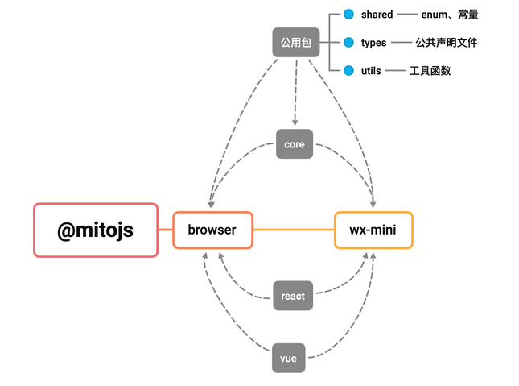
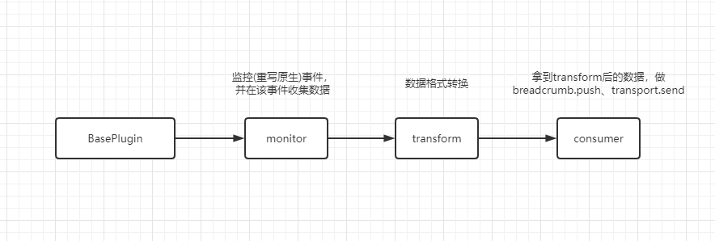
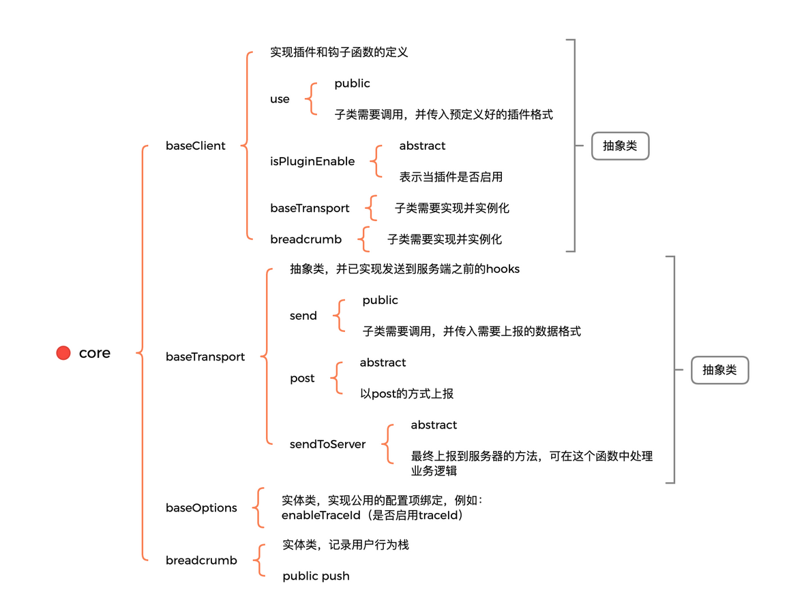
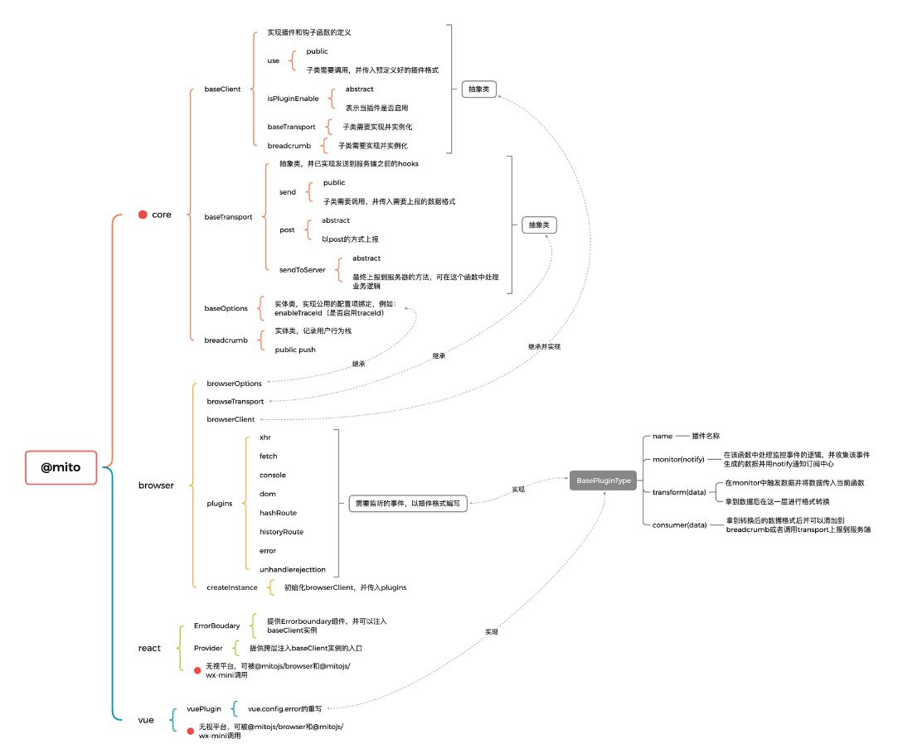
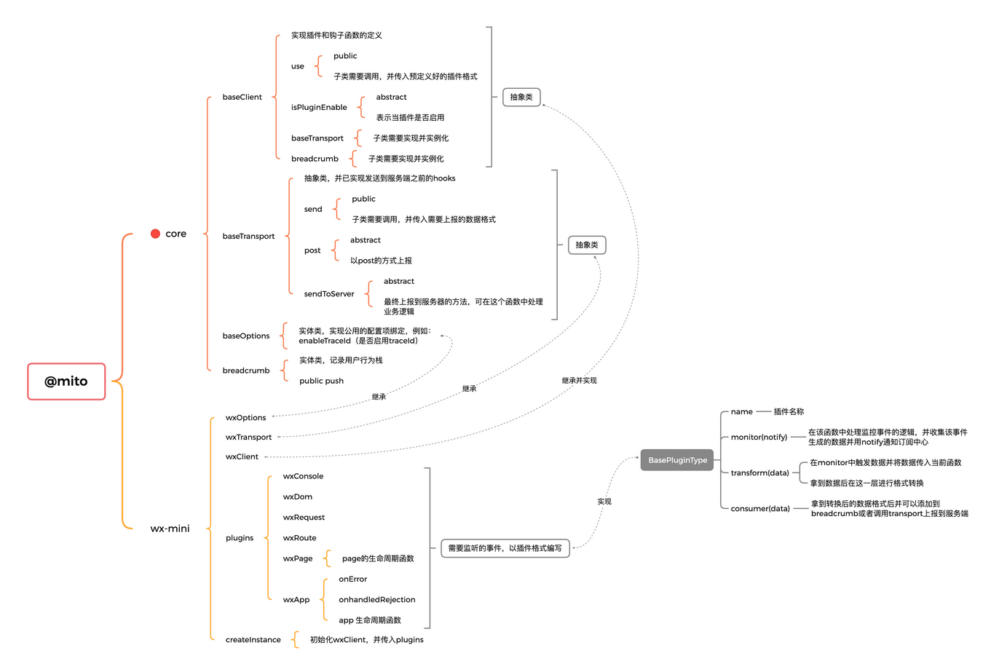

## 背景

前端监控平台: 它能够收集数据、处理数据、存储数据、查询数据，无论是对业务理解、需求探讨，还是对问题排障、体验优化，对我们都提供了极大的方便。

## 概要设计: 怎么设计一个监控

SDK: 为了实现前端监控，第一要素是要收集客户端数据，为了方便客户端集成监控系统、我们需要首先开发封装一个统一的SDK、去帮助我们收集数据。

服务端: 接收错误信息，处理数据并做持久化，而后根据告警规则通知对应的开发人员。

可视化平台：从数据存储引擎拿出相关错误信息进行渲染，用于快速定位问题。


## SDK的架构与迭代

### monorepo

借鉴了sentry和vue-next的代码目录结构，它的优势：

1. 分模块打包、分模块热更新、分包发布（提高开发体验）
2. 抽离抽象类、工具类到某个包，代码结构清晰（降低耦合性，提高代码可读性）

#### 包与包之间的关系



#### 多包打包与发布

可以使用lerna，也可以用js脚步编写根据命令行的入参来调用rollup的api和npm的api来打包和发布。

### 可插拔的插件思路

*该思路是从[rollup](https://rollupjs.org/guide/en/#plugins-overview)和监控开源库[dora](https://github.com/dora-projects/dora)中借鉴*

我们需要监控:

- xhr
- fetch
- hashroute
- historyroute
- error

...等等

#### 传统模式

- 重写xhr
- 在重写的过程中拿到想要的数据
- 通过发布订阅回传
- 在订阅中心中拿到数据，并处理

如果没有规范的约束，每个重写的过程都会变的杂乱无章，回传数据和处理数据可能到处都是。

#### 插件模式



```
interface BasePluginType<T extends EventTypes = EventTypes, C extends BaseClientType = BaseClientType> {
  // 事件枚举
  name: T
  // 监控事件，并在该事件中用notify通知订阅中心
  monitor: (this: C, notify: (eventName: T, data: any) => void) => void
  // 在monitor中触发数据并将数据传入当前函数，拿到数据做数据格式转换
  transform?: (this: C, collectedData: any) => any
  // 拿到转换后的数据进行breadcrumb、report等等操作
  consumer?: (this: C, transformedData: any) => void
}
```

#### 举个🌰：监听unhandlerejection的插件

```
const name = BrowserEventTypes.UNHANDLEDREJECTION
const unhandlerejectionPlugin: BasePluginType<BrowserEventTypes, BrowserClient> = {
  name,
  monitor(notify) {
    on(_global, name, function (ev: PromiseRejectionEvent) {
      // ev.preventDefault() 阻止默认行为后，控制台就不会再报红色错误
      notify(name, ev)
    })
  },
  transform(collectedData: PromiseRejectionEvent) {
    console.log('collectedData', collectedData)
    let data: ReportDataType = {
      type: ErrorTypes.PROMISE,
      message: unknownToString(collectedData.reason),
      url: getLocationHref(),
      name: collectedData.type,
      time: getTimestamp(),
      level: Severity.Low
    }
    if (isError(collectedData.reason)) {
      data = {
        ...data,
        ...extractErrorStack(collectedData.reason, Severity.Low)
      }
    }
    return data
  },
  consumer(transformedData: HttpTransformedType) {
    const breadcrumbStack = addBreadcrumbInBrowser.call(this, transformedData, BrowserBreadcrumbTypes.UNHANDLEDREJECTION, Severity.Error)
    this.transport.send(transformedData, breadcrumbStack)
  }
}

export default unhandlerejectionPlugin
```

#### 插件实际在代码中的使用

```
function createBrowserInstance(options: BrowserOptionsFieldsTypes = {}, plugins: BasePluginType[] = []) {
  const browserClient = new BrowserClient(options)
  const browserPlugins = [
    fetchPlugin,
    xhrPlugin,
    domPlugin,
    errorPlugin,
    hashRoutePlugin,
    historyRoutePlugin,
    consolePlugin,
    unhandlerejectionPlugin
  ]
  browserClient.use([...browserPlugins, ...plugins])
  return browserClient
}
```

### @mitojs/core

由于需要支持多个端，每个端需要监听的事件、上报方式、可配置项的是不同的，所以需要抽离多个抽象类，方便扩展。



### 浏览器



### 微信小程序



该架构的思想可适用于任何SDK，不同SDK中对应插件的个数和作用不同。总而言之，把一个大功能分隔成几个小功能区域，在指定的区域写指定功能的代码，让代码逻辑有规律可循。

## 参考

- https://juejin.cn/post/7016897995031445511
- https://github.com/mitojs/mitojs
- https://github.com/dora-projects/dora