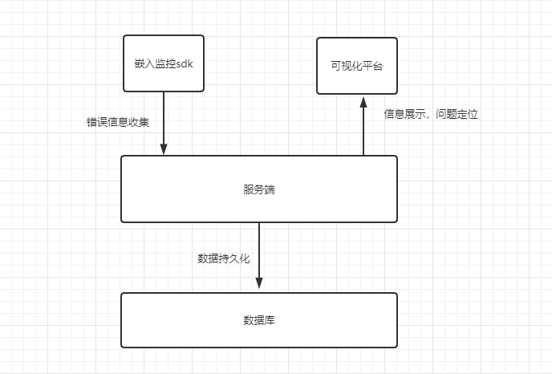
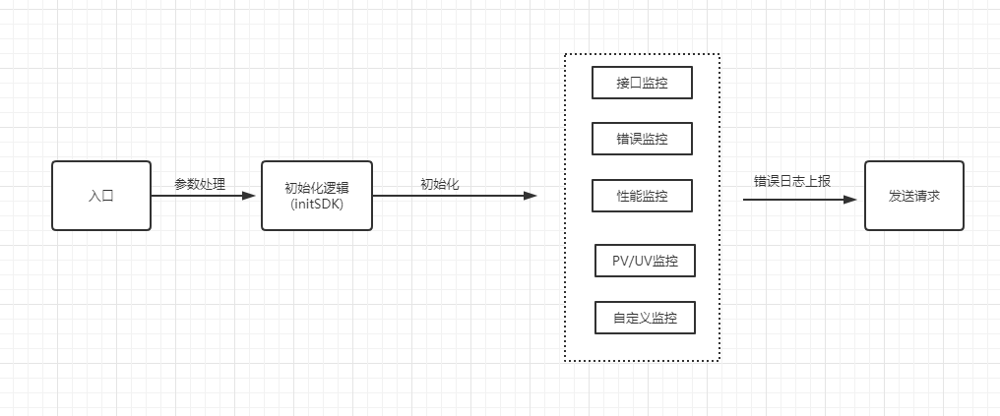

## 需求背景: 为什么需要做前端监控

客户端经常会出现以下问题：

- 白屏
- 无响应
- 卡顿
- 服务异常
- bug无法复现
- ...

为了解决这些问题，我们需要先知道客户端发生了什么。如果我们有一个前端监控平台，它能够收集数据、处理数据、存储数据、查询数据，无论是对业务理解、需求探讨，还是对问题排障、体验优化，对我们都提供了极大的方便。

## 需求分析: 前端需要监控什么

| 需求 | 监控项 |
| ---- | ---- |
| 用户使用数据 | 页面 PV、自定义上报 |
| 接口请求和报错数据 | 接口请求、页面报错 |
| 页面的性能数据 | 页面性能、资源加载 |

## 概要设计: 怎么设计一个监控

SDK: 为了实现前端监控，第一要素是要收集客户端数据，为了方便客户端集成监控系统、我们需要首先开发封装一个统一的SDK、去帮助我们收集数据。

服务端: 接收错误信息，处理数据并做持久化，而后根据告警规则通知对应的开发人员。

可视化平台：从数据存储引擎拿出相关错误信息进行渲染，用于快速定位问题。



## 详细设计

### 实现监控SDK

#### 定义使用方式

```
<script src="xxxx/jssdk.js?key=xxx&v=1.0" async></script>
```

#### SDK 整体拆分



#### SDK初始化

SDK 执行时会有个 main 入口，它其实就是一个自执行函数。它只负责提取 SDK 初始化的参数，然后去调用初始化的函数。

```
(function() {
  // 获取 script src 里的 query 参数
  const params = getScriptQuery();
  initSDK(params);
})();
```

```
function initSDK(opt: SdkConfig) {
  // 内置默认参数
  const config: SdkConfig = assign({
    sendPV: true, // 是否上报页面 PV
    sendApi: true, // 是否上报 API 接口请求
    sendResource: true, // 是否上报资源请求
    sendError: true, // 是否上报 js error
    sendPerf: true, // 是否上报页面性能
  }, opt, window.$watchDogConfig);

  window.$watchDogConfig = config;

  // 执行各监控模块
  config.sendPV && watchPV(config);
  config.sendApi && watchApi(config);
  config.sendResource && watchResource(config);
  config.sendError && watchError(config);
  config.sendPerf && watchPerf();
  watchCustom(); // 内置支持自定义日志上报
}
```

initSDK 也比较简单，就是把初始化的参数处理一下，将内置默认参数、脚本 src 里的 query 参数、以及全局变量中的参数合并起来，并重新写到全局变量中。然后依次去执行各监控模块的初始化函数。

#### 监控项实现原理

### 服务端

在服务端，使用node+EggJs，node适合i/o密集型场景，符合前端技术栈。服务端收集到数据并进行一些处理之后，我们需要存储到我们的数据库之中。在数据库方面，使用mongo做持久化存储，mongo文档模型数据库，数据扩展方便，类json结构方便和node配合使用，天生适合日志系统。使用redis做数据缓存，redis简单易用的高性能key-value数据库。

### 可视化平台

从数据存储引擎拿出相关错误信息进行渲染，用于快速定位问题。
