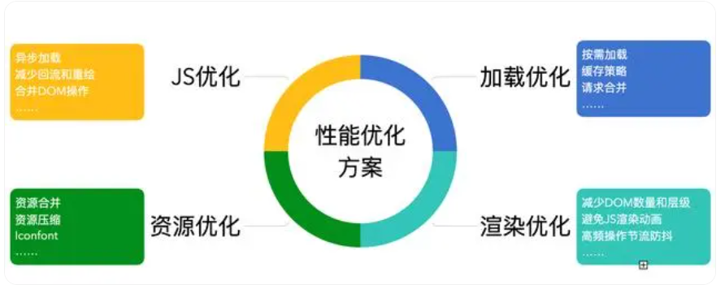

### 1. 减少http请求次数

使用雪碧图、图片压缩等方法，减少静态资源的 HTTP 请求次数。

### 2. 使用浏览器缓存

在合适的情况下，使用浏览器缓存可以显著减少请求时间，提高页面加载速度。

### 3. 使用 CDN 加速

使用 CDN 加速可以将静态资源分发到多个节点，减少请求延迟，提高页面加载速度。

### 4. 延迟加载组件

对于一些比较耗时的组件，可以使用懒加载的方式，等到用户需要使用的时候再加载，避免在页面加载时一次性请求过多资源导致页面卡顿。

### 5. 使用 Webpack 进行打包和压缩

Webpack 可以将多个 JS、CSS 文件打包成一个文件，减少 HTTP 请求次数；同时还可以进行代码压缩，减少文件大小，提高页面加载速度。

### 6. 使用 Web Workers

对于一些计算密集型任务，可以使用 Web Workers 将任务分发到多个线程中，提高运算效率，避免页面卡顿。

### 7. 优化 JavaScript 代码

优化 JavaScript 代码可以减少页面的运行时间，提高页面性能。一些常见的优化方案包括：避免使用全局变量，减少 DOM 操作，避免不必要的循环等。

### 8. 使用响应式布局

使用响应式布局可以使页面适应不同大小的设备屏幕，提高用户体验，避免出现滚动条等不必要的元素。

### 9. 使用 CSS3 动画

使用 CSS3 动画可以减少对 JavaScript 的依赖，提高动画效果的性能。

### 10. 使用服务端渲染

服务端渲染可以将页面的渲染工作在服务端完成，减少客户端的渲染时间，提高页面性能。
