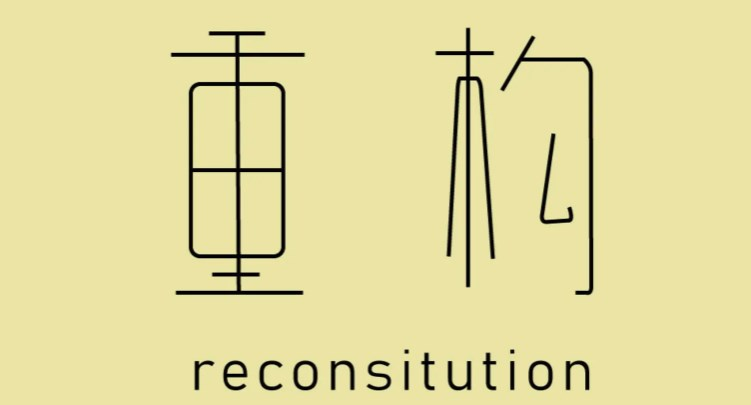
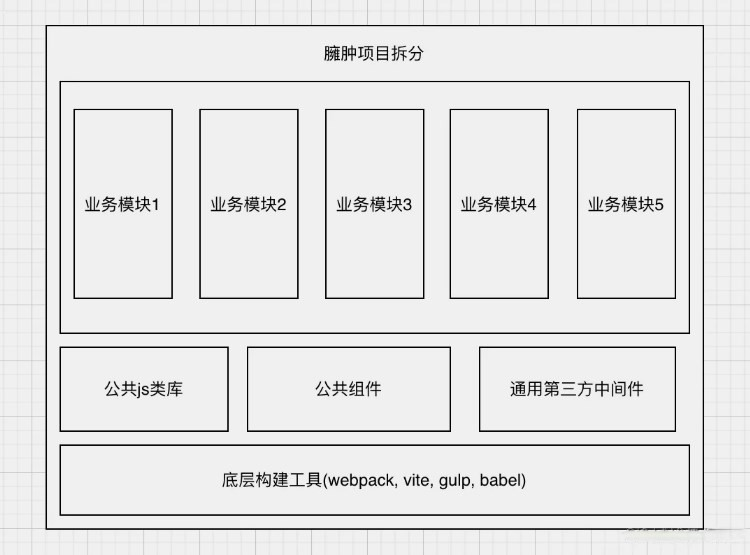
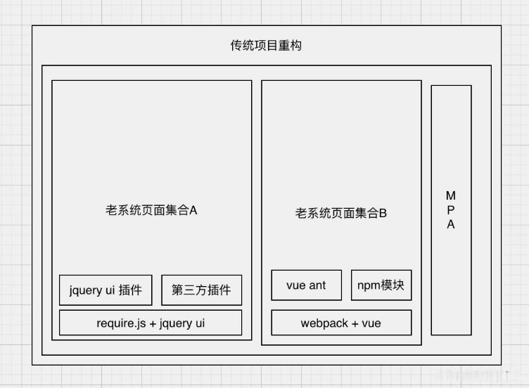
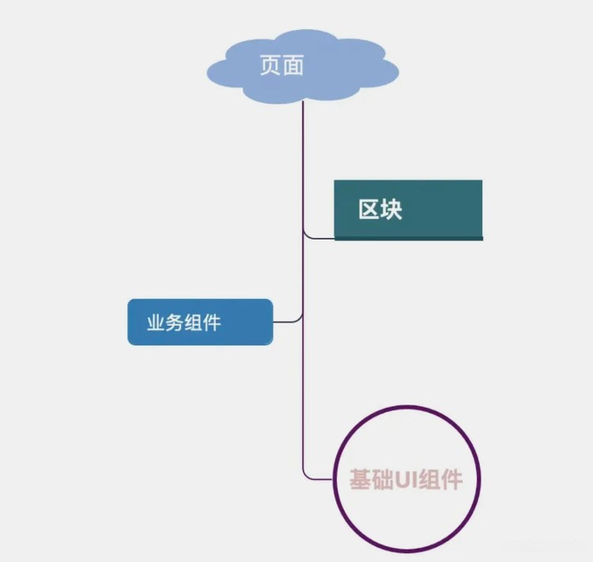
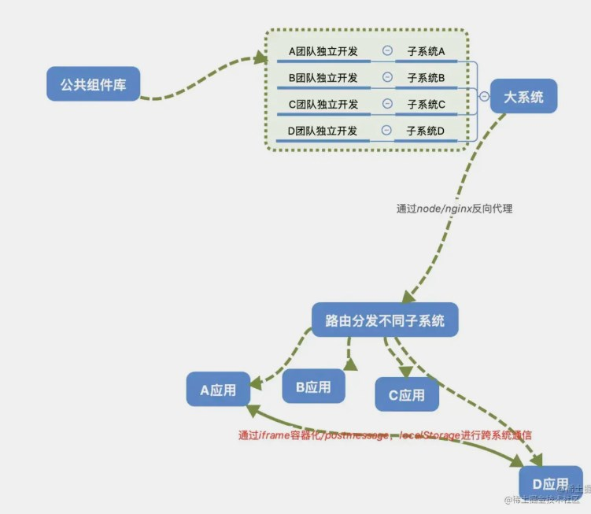

## 一、背景介绍

### 1.1 为什么要进行重构

项目重构是每一家稳定发展的互联企业的必经之路, 就像一个产品的诞生, 会经历产品试错和产品迭代 一样, 随着业务或新技术的不断发展, 已有架构已无法满足更多业务扩展的需求, 所以只有通过重构来让产品“进化”, 才能跟上飞速发展的时代浪潮.


#### 1.1.1 技术因素

技术因素主要有如下几个方面:

- 早期技术团队在技术选型上的误判(常发生于MVP类型的产品快速上线导致的技术调研不够充分)
- 新老技术框架的更替(比如从 jquery 迁移到 vue/react)
- 技术团队交接出现的断层(老技术团队的架构设计更不上新技术团队的发展, 出现架构上的“平替”)
- 技术架构升级(比如随着业务发展, 由传统的MPA应用转为基于微前端模式的SPA应用)
- 安全,性能,代码质量等原因导致的技术重构

#### 1.1.2 产品因素

- 产品形态调整(比如由纯PC应用转为响应式应用, 或者从H5到支持跨端)
- 产品业务调整(非常常见的重构理由之一)
- 产品指标调整(如兼容性, 性能指标等导致的代码重构)

上面是一些比较典型的重构场景, 也是我们未来在设计产品技术架构之前需要考虑的方面. 为了提高自己设计的架构稳定性, 我们需要提前和产品沟通明确, 以降低后期重构和维护成本.

最后总结几条架构设计的经验:

- 能做规范的一定要严格做好规范
- 在设计架构之前, 一定要充分理解业务场景, 明确产品的技术交付指标
- 架构设计以可溯源 为基本要求
- 不要盲目追求最好的方案, 以局部最优解为工程设计理念

### 1.2 做项目重构之前, 需要有哪些准备

当然做项目重构也是有技术门槛的,不是所有程序员都能做好重构工作, 建议大家具备如下几种技术能力:

- 对项目所使用的框架语言有相对深入的理解和掌握
- 有一定的前端工程化经验(如webpack, vite, gulp, nodejs, babel, AST等有一定的研究)
- 熟悉常用的web性能优化方案
- 熟悉常见的设计模式和前端编码规范
- 熟悉前端主流的技术框架的设计原理和工程设计思想

## 二、不同类型项目重构的方法论

### 2.1 业务系统自身的重构

业务系统自身的重构一般可以包含如下几个方面:

#### 2.1.1 业务代码优化

业务代码优化主要是针对一些核心业务代码, 进行流程上, 逻辑上的重构, 让它更具可读性和维护性, 同时保证业务操作的兼容性, 具体方案如下:

- 复杂业务逻辑需要编写注释
- 代码中访问性属性提供兼容逻辑(常见的比如访问对象属性, a.b.c, 如果a,b为非对象则整段代码将报错)
- 代码结构优化(比如冗长的if else 或者“回调地狱” 可以采用适配器模式或者es6+语法来优化)
- 方法参数调优(一个函数有多个参数, 可以使用参数对象来提高可读性,降低使用偏差)
- 业务代码性能优化(复杂后台系统比如低代码类产品, 前端需要处理很多数据和逻辑, 此时可以用合适的数据结构和算法优化js计算)
- 函数式编程思想优化业务函数(可选)
- 业务代码进行单元测试, 提高代码质量(可选)

#### 2.1.2 代码规范

代码规范化的一个目标就是降低代码理解成本, 保证项目代码在阅读时就像同一个写出来的, 这样对后期逻辑复用, 组件解耦, 问题定位以及业务代码维护将非常有帮助.

常用的措施有:

- 代码格式规范(如eslint)
- 逻辑语法类型约束(如typescript)
- 代码规范(如css命名规范OOCSS, BEM等, 文件命名规范, js变量命名复规范等)
- git 提交规范(常见的是在git hooks的提交阶段对提交格式等进行校验)

#### 2.1.3 工程化优化

工程化优化主要有以下几个场景:

- 由于业务不断增加, 系统的复杂性加大导致的本地运行和打包速度越来越慢
- 由于项目代码量的增加导致页面臃肿, 需要进行合理的拆分
- 基于已有的工程经验沉淀, 需要对工程化配置做进一步升级, 优化
- 老旧脚手架无法适应当前的项目生产效率

**1. 由于业务不断增加, 系统的复杂性加大导致的本地运行和打包速度越来越慢**

针对这种情况, 我们可以借助 speed-measure-webpack-plugin 插件，它可以分析 webpack 的总打包耗时以及每个 plugin 和 loader 的打包耗时，从而让我们对打包时间较长的部分进行针对性优化。

同时默认情况react, react-dom, react-router 等公共模块在每次构建都会参与打包, 这些实际上是没有必要的, 我们可以将其传到 cdn上, 从而减少webpack 的打包”工作量“.

我们可以安装 html-webpack-externals-plugin 来实现将指定模块从打包列表中排除, 具体用法如下:

```
const HtmlWebpackExternalsPlugin = require('html-webpack-externals-plugin');

module.exports = {
  // ...其他配置代码
  plugins: [
    new HtmlWebpackExternalsPlugin({
      externals: [
        {
          module: 'react',
          entry: 'https://cdn.dooring.cn/umd/react.production.min.js',
          global: 'React',
        },
        {
          module: 'react-dom',
          entry:
            'https://cdn.dooring.cn/umd/react-dom.production.min.js',
          global: 'ReactDOM',
        },
      ],
    }),
  ],
};
```

为了追求更惊一步的打包效率, 我们可以使用并行的方式构建, 同样 webpack 生态也提供了对应的模块 parallel-webpack. 具体用法大家可以看文档, 非常简单方便.

其他还有很多优化的方案, 这里我列一下, 大家可以根据实际情况使用:

- 配置并行压缩(terser-webpack-plugin, css-minimizer-webpack-plugin, html-minimizer-webpack-plugin 等都支持parallel参数)
- 预编译资源模块(可以利用webpack.DllPlugin来提前将公共模块打包以便后续直接复用)
- 使用构建缓存(webpack5 内置的 cache 模块, 或者cache-loader)
- 对打包体积进行分析, 以便有针对性的优化(如webpack-bundle-analyzer)

当然除了对已有构建工具的优化, 我们可以评估一下重构成本, 将构建内核替换vite等更高效的构建工具.

**2. 由于项目代码量的增加导致页面臃肿, 需要进行合理的拆分**

针对项目代码量的增加导致页面臃肿, 我们可以从项目本身的角度, 对项目进行拆解, 将公共模块抽离为公用业务类库或者组件库:



除了对项目进行可复用性拆分之外, 我们还需要根据系统复杂量级, 近一步拆分项目, 比如将一个巨石工程拆分为多个子工程, 单独运行维护, 或者采用之前热点讨论的微前端的模式, 比如使用 qainkun, single-spa, Micro App, EMP, Garfish, Bit 这些优秀的微前端框架.

综上, 我们可以根据项目复杂度, 做如下优化:

- 模块 & 组件化
- 拆分子系统(已有架构不变的MPA模式)
- 拆分子系统(微前端)

当然我们始终需要保持一个理念: 局部最优, 勿增繁复.

**3. 基于已有的工程经验沉淀, 需要对工程化配置做进一步升级, 优化**

这种情况主要是在项目发展稳定之后, 需要思考的重构方向, 比如早期由于业务场景单一, 很多公共配置都写在业务代码里的, 随着业务复杂之后, 很多模块都需要使用改配置或者变量, 比如:

```
// a.js
const publicDomain = 'https://dooring.vip';
const serverUrl = 'https://xxx.cn';

// b.js
const publicDomain = 'https://dooring.vip';

// c.js
const appid = 'xxxxxxxx';
const website_Logo = 'http://h5.dooring.cn/logo.png';
```
对于这种零散且固定的变量, 未来可能会被多个页面或者模块复用, 所以为了降低成本, 我们可以把这些通用配置提取到外层, 作为公共配置文件, 这样后期新项目也能享受开箱即用的配置体验.

**4. 老旧脚手架无法适应当前的项目生产效率**

对于这种场景, 我们就需要对脚手架自身有更多的研究和了解, 比如熟悉webpack设计思想, 熟悉babel的工作流程, 熟悉 nodejs 开发工具链的一些模式等, 这里分享几个比较成熟的先进脚手架, 大家如果觉得老项目工程比较老旧, 可以往这几个方向重构:

- 基于webpack5.0的项目脚手架
- vite
- umi4.0

#### 2.1.4 渲染层优化

渲染层优化主要表现在产品的体验上, 比如:

- 提高首屏加载速度
- 白屏体验优化
- 大数据列表渲染优化
- api请求优化
- 动画性能优化
- dom过载导致的页面卡顿优化

**1. 提高首屏加载速度**

有很多方法可以帮助我们提高首屏加载速度, 比如:

- 静态资源放cdn, 提高不同地域用户访问资源的速度
- 页面或路由懒加载, 降低首次加载单一页面的代码体积
- 静态资源(如图片, 视频等)懒加载
- 资源压缩(比如开启gzip模式)

当然还存在很多客观因素, 比如用户所在区域为弱网环境, 我们可以根据网速提供一个最小化弱网可替代页面, 来保证我们网站的可用性和可访问性.

**2. 白屏体验优化**

对于白屏优化, 也有很多成熟的例子, 比如采用骨架屏:


如果我们的项目是基于 vue-cli 构建的，那么可以使用比较成熟的的 page-skeleton-webpack-plugin 方案，否则我们仍然可以选择 vue-router 提供的 vue-server-renderer.

当然你的项目是使用react的, 也可以轻松使用如 react-content-loader 这样的svg方案来定制自己的骨架屏.

除了骨架屏之外, 我们还可以提供一个模版页面或者加载动画, 以便在页面加载完成之前给用户一个优雅的过渡提示.

**3. 大数据列表渲染优化**

对于一些中后台复杂的系统模块, 可能会涉及到一次渲染大量列表项或者多级组织树的情况，这种情况我们就需要用到虚拟列表或者节点懒加载的方式了.

- vue virtual scroll list
- react-virtualized
- rc-virtual-list

**4. api请求优化**

api 请求优化主要正对这种场景: 页面的渲染依赖于某个或者某些请求的完成, 或者由于某个页面请求量过大导致每次重新进入页面都需要造成一定的性能开销.

对于这两种情况, 其实不仅仅是对浏览器渲染有影响, 还会极大的增加服务器的压力, 所以我们需要对请求或者页面进行一定范围的缓存.

比如说我们可以把不长变动的请求数据存在 indexedDB 中, 当第二次访问直接可以从 indexedDB 中拿到请求数据, 这样既降低了服务器压力, 也提高了二次渲染的效率.

其次我们可以对部分页面做路由缓存, 避免每次切换都重新渲染, 当然这只针对于不需要实时更新数据的页面而言. 

**5. 动画性能优化**

- 优化精简 DOM 结构，合理布局
- 使用 transform 代替 left,top 减少使用引起页面重排的属性
- 开启硬件加速(比如设置transform: translateZ(0) 或者transform: translate3d(0, 0, 0))
- 尽量避免浏览器创建不必要的图形层
- 尽量减少 js 动画，如需要，使用性能更友好的requestAnimationFrame
- 使用 chrome performance 工具调试动画性能

由于dom动画有上限很低, 所以对于一些更复杂的动画渲染, 我们可以采用 svg 或者 canvas 来代替, 以降低 dom 对浏览器内存的占用.

**6. dom过载导致的页面卡顿优化**

一个页面如果dom数量过多, 会产生很多问题, 一方面会使得浏览器内存占用过高, 导致其他不相关的js逻辑操作进行阻塞或者失效, 表现就是页面卡顿或者无响应.

为了解决这个问题我们仍然可以使用虚拟滚动的方案或者懒加载的方案, 保证用户当前屏幕下的dom在一个合理的范围内, 如果是无法避免必须要展示大段dom元素, 我们可以用一个单独的页面来承载或者嵌入, 避免页面其他部分宕机. 也可以对复杂dom 进行局部“冷冻”(在非激活状态将其转化为图片, 激活时在逐渐渲染)

#### 2.1.5 产品需求层优化

产品需求层面导致的重构主要场景比如:

- 项目国际化支持
- 项目埋点
- 整体项目UI升级

### 2.2 技术升级带来的重构

技术升级带来的重构主要有前端框架的升级, 前端设计模式的升级, 脚手架的升级. 后面两个主要是围绕前端技术的不断演进, 我们采取的程序性升级, 比如从传统的 gulp 升级到 webpack, 或者从 webpack 升级到vite 等. 前者比较常见的场景是企业中有很多老的系统, 采用的是比较传统的技术方案如 CMD 模式 + jquery, 但是新项目采用的是 webpack + vue 或者 react, 此时我们需要更新项目情况来有选择的做重构:

#### 2.2.1 老项目只需要少量维护的情况

这种情况我们就不需要大刀阔斧的重新用新框架再写一套了, 我们只需要在重构时, 对老项目代码做好足够的注释, 类库的封装即可:


其次我们需要做好js变量隔离, 因为传统模式我们会在 window 顶层定义大量 var 全局变量, 作为优化的一部分, 我们可以采用闭包自执行和变量约定来规范我的js变量定义, 以防止全局的变量污染.

#### 2.2.2 老项目仍然需要不断迭代, 并且后期会有新的模块

这种情况我们需要做评估和拆分, 如果是小模块, 我们可以用 jquery插件 的方式快速爹迭代, 如果是页面级别的迭代, 并且交互比较复杂, 我们可以将老系统的新页面拆离一个子工程, 采用最新的框架(如vue)来开发迭代, 再通过 MPA 的方式和老系统做集成:



#### 2.2.3 老项目和新项目需要相互通信, 嵌套

这种场景下最好的方式就是用iframe + postmessage, 或者我们可以参考类似微前端的方式来管理组织不同子系统.

### 2.3 组件库重构



对于一个包含很多子系统的复杂的项目系统来说，要想设计一个好的架构，第一步就是合理划分组件，组件的粒度拆成的足够细，这样才能最大限度的复用组件。

对于任何一个复杂系统来说，最重要的就是实现错综复杂的业务功能，但是不同模块或者子系统之间很多业务往往是相通的或者相似的，如果这个时候我们每个页面对于实现类似的业务场景都去重复去写一遍业务代码，那完全是没必要的，对于可维护性来说也是一种打击，所以基于这种场景我们的 业务组件 就很有必要出场了。我们可以把功能或者需求类似的有机体封装成一个业务组件，并对外暴露接口来实现灵活的可定制性，这样的话我们就可以再不同页面不同子系统中复用同样的逻辑和功能了。

同理，不同页面中往往有可能出现视觉或者交互完全相同或者类似的区块，为了提高可复用性和提高开发效率，我们往往会基于基础组件和业务组件再进行一次封装，让其成为一个独立的区块以便直接复用。

通过这样一层层封装，我们就逐渐搭建了一套完整的组件化系统，基于这种模式的开发往往也是一个好的前端架构的开始。但要注意一点就是高层次的组件一定会依赖低层次的组件，但是低层次的组件不可以包含高层次的组件。（听起来有点像rudex的单向数据流法则），他们的关系就好像下图：


所以对组件库的重构需要对我们的项目有一个本质的认知, 并对页面进行有效的拆分, 从而达到局部的最优, 降低后续的维护成本, 并能提高整个系统甚至跨系统的复用.


