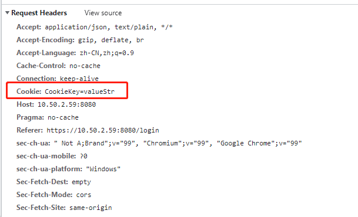

### Token

Token是服务端生成的一串字符串，是客户端进行请求的一个令牌。当第一次登录后，服务器生成一个token返回给客户端，以后客户端只需要带上这个token请求数据即可。

1. Token 完全由应用管理，所以它可以避开同源策略
2. Token 可以避免 CSRF 攻击
3. Token 可以是无状态的，可以在多个服务间共享

### 区别

Token 在用户登录成功之后返回给客户端，客户端主要有三种存储方式

1. 储存在 localStorage 中，每次调用接口时放在http请求头里面，长期有效
2. 储存在 sessionStorage 中，每次调用接口时放在http请求头里，浏览器关闭自动清除
3. 储存在 cookie 中，每次调用接口会自动发送，不过缺点是不能跨域

将 Token 存储在 webStorage(localStorage,sessionStorage) 中可以通过同域的js访问，这样导致很容易受到 xss 攻击，特别是项目中引入很多第三方js库的情况下，如果js脚本被盗用，攻击者就可以轻易访问你的网站。

将 Token 存储在 cookie 中，可以指定 httponly 来防止 js 被读取，也可以指定 secure 来保证 Token 只在 HTTPS 下传输，缺点是不符合 RestFul 最佳实践，容易受到 CSRF 攻击（可以在服务器端检查 Refer 和 Origin）。
