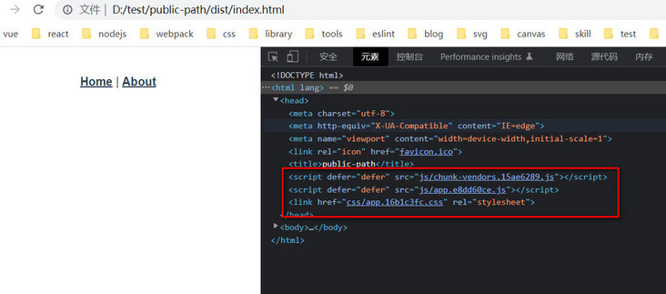

关于vue项目打包，部署时放置在二级目录下，可通过publicPath进行配置。


## 绝对路径与相对路径

绝对路径 '/' 和 相对路径 './'，这两个概念的区别就是以哪个目录作为起点，可以理解为绝对路径就是绝对错不了的路径，始终以一个固定的目录作为起点。而相对路径容易错，可以是任意一个目录节点作为起点。而在网站的访问中，可以认为如果静态资源使用了绝对路径，那么他始终以当前这个网站来作为访问的根节点。

在 vue.config.js 中，publicPath 既可配置成绝对路径 ，也可以配置成相对路径。

绝对路径:
```
publicPath: '/',
// 或带有二级路径的网站, 如访问地址为 http://my-app.com/sub/
publicPath: '/sub/'
```

相对路径:
```
publicPath: './',
// 或者
publicPath: '.',
// 或者
publicPath: ''
```

脚手架默认赋予的 publicPath 的值为 '/'，也就是说 @vue/cli 默认使用的是绝对路径。

## router 中的 base 参数

```
const router = new VueRouter({
  mode: 'history',
  base: process.env.BASE_URL,
  routes,
});
```
base 是应用的基路径，即当前应用的所有的路由地址，都会被自动拼接上这个基路径，一般应用在部署有二级目录的网站上。

## 打包配置说明

### publicPath: '/'，使用绝对路径，即默认配置

开发环境


生产环境


使用默认配置，无论是在开发阶段还是生产阶段，静态资源都会被挂上 '/'，这样静态资源就会以当前网站服务作为根节点，然后加载相应的静态资源。

本地静态访问

这样打出来的 dist/index.html 也是无法直接访问的，因为使用了绝对路径，当直接使用浏览器打开时，会直接去到根目录的盘符下作为访问的根路径，导致静态资源加载失败。当然生产包打出来一般都会使用服务器进行部署，因为大多数应用还有和后台接口的交互，必须要通过服务器启动后才能正常访问。

### publicPath: './'，使用相对路径

开发环境


生产环境


使用相对路径，可以看到只是比绝对路径在静态资源访问上少了 '/'，这样的优点就是可以让当前应用被部署在任意目录，而不必担心静态资源有丢失的情况。比如本地访问。

本地静态访问

可以看到使用相对路径进行打包后，直接本地访问 index.html，静态资源都是加载成功的，页面上显示了一部分东西，但是 home 页面的内容却丢失了。这其实是因为我们使用的路由模式是 history，虽然资源加载没有问题，但是因为地址栏路径与前端设置的访问路由不一致，导致前端路由不能正确加载，因此页面不能正确显示。


当修改了路由为 hash 模式后，再次进行打包，index.html 即便在本地也可以顺利的进行访问了，进行路由切换也毫无问题。

### publicPath: '/sub/'，采用二级路径 (也是绝对路径)

开发环境


生产环境


二级路径其实也是绝对路径，只不过在所有静态资源前统一拼接上了 '/sub/'。这种配置可以在同一个域下部署不同的项目，依靠二级路径来做到逻辑上的划分。

使用二级路径的nginx配置
```
location / {
    root    /root/aisort/sub;
    index  index.html index.htm;
}

location /sub {
    alias    /root/aisort/sub;
    index  index.html index.htm;
    try_files $uri $uri/ /sub/index.html;
}
```

## 总结以下几种配置模式

1. 傻瓜模式：路由采用 hash 模式，publicPath 采用相对路径 './' 模式，此种组合配置操作简单，可以部署到任意路径上，并且能支持二级目录，比较省心。即便是直接访问打包后的 index.html 也能看到效果，应用的场景可能如下：
   - 一个纯前端应用，不需要和后台的接口进行交互，支持本地静态展示。
   - 只是用来部署到 github gh-page 分支下的纯前端展示应用。
   - 如使用 vue 开发的 h5 项目，然后使用 hbuilder 进行打包的 hybird app。
   - 部署在带有二级路径的网站上。
2. 进阶模式：路由采用 history 模式，publicPath 采用绝对路径 '/' 模式，此这种模式需要服务器来对前端资源进行部署。同时，还需要在服务器上配置404重定向到 index.html。
3. 升级模式：路由采用 history 模式，publicPath 采用了 '/sub/' 二级路径，相应的 router base 参数也应该设置为 '/sub/' (通常使用脚手架默认提供的 process.env.BASE_URL 即可)。此种模式即在多个项目同时部署到一个域名和端口下时，采用不同的二级路径来对项目进行逻辑上的划分。与进阶模式的服务部署方式相同。
