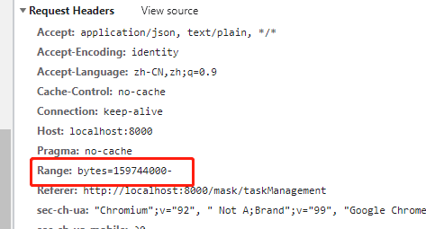

## 前言

最近项目里有大文件下载的需求，考虑到网络带宽的影响，就使用了文件分片断点下载。现在的下载工具基本都是支持断点下载的，这里就记录一下项目中的实现。

## HTTP中的Range

Range是一个HTTP请求头，告知服务器要返回文件的哪一部分，即：哪个区间范围(字节)的数据，在 Range 中，可以一次性请求多个部分，服务器会以 multipart 文件的形式将其返回。

如果服务器返回的是范围响应，需要使用 206 Partial Content 状态码。假如所请求的范围不合法，那么服务器会返回  416 Range Not Satisfiable 状态码，表示客户端错误。服务器允许忽略  Range  头，从而返回整个文件，状态码用 200 。

分片断点下载，即是根据Http中的Range头来做处理。

当你正在看大片时，网络断了，你需要继续看的时候，文件服务器不支持断点的话，则你需要重新等待下载这个大片，才能继续观看。而Range支持的话，客户端就会记录了之前已经看过的视频文件范围，网络恢复之后，则向服务器发送读取剩余Range的请求，服务端只需要发送客户端请求的那部分内容，而不用整个视频文件发送回客户端，以此节省网络带宽。

## Range规范

```
Range: <unit>=<range-start>-
Range: <unit>=<range-start>-<range-end>
Range: <unit>=<range-start>-<range-end>, <range-start>-<range-end>
Range: <unit>=<range-start>-<range-end>, <range-start>-<range-end>, <range-start>-<range-end>

// 例如
Range: bytes=1024-2048
```

- <unit>：范围所采用的单位，通常是字节（bytes）
- <range-start>：一个整数，表示在特定单位下，范围的起始值
- <range-end>：一个整数，表示在特定单位下，范围的结束值。这个值是可选的，如果不存在，表示此范围一直延伸到文档结束。



## js操作blob合并

我们请求二进制文件，一般会得到 Blob 或者 ArrayBuffer。

设置 responseType: 'blob'或者'arraybuffer'请求二进制文件，一般会得到Blob或者arraybuffer。'

```
var endByte = startByte + chunk;
let stepRange = `bytes=${startByte}-${endByte - 1}`;
const res = await this.$http.get('/large/file/download', {
  params,
  responseType: 'blob',
  responseRange: stepRange,
});
```

**切片和合并**

```
// 切片为三个blob
let blob1 = blob.slice(0, n);
let blob2 = blob.slice(n,m);
let blob3 = blob.slice(m,length);

// 合并
let merge = new Blob([blob1,blob2,blob3],{type:"image/png"});
```

## 分片下载前端实现

```
// file.js

export const getFileName = function(res) {
  let fileName = null;
  if (res && res.headers) {
    fileName = res.headers['content-disposition'];
    console.log('fileName: ', fileName);
  }
  if (fileName) {
    const temp = fileName.split('fileName=');
    if (temp && temp.length > 0) {
      try {
        fileName = decodeURIComponent(temp[1]);
      } catch (e) {
        console.error(e);
        fileName = temp[1];
      }
    } else {
      fileName = null;
    }
  }
  // console.log(fileName);
  if (!fileName) {
    fileName = 'unknown';
  }
  return fileName;
};

export const getFileLength = function(res) {
  let fileLength = 0;
  if (res && res.headers) {
    const contentRange = res.headers['content-range'];
    fileLength = contentRange.split('/')[1];
  }
  return Number(fileLength);
};

export const saveBlobFile = function(dataArr, fileName, type = 'text/xml') {
  const blobData = [];
  for (let i = 0; i < dataArr.length; i++) {
    blobData.push(dataArr[i].data);
  }
  const blob = new Blob(blobData, { type });
  if ('download' in document.createElement('a')) {
    // 非IE下载
    const elink = document.createElement('a');
    elink.download = fileName;
    elink.style.display = 'none';
    elink.href = window.URL.createObjectURL(blob);
    document.body.appendChild(elink);
    elink.click();
    URL.revokeObjectURL(elink.href); // 释放URL 对象
    document.body.removeChild(elink);
  } else {
    // IE10+下载
    navigator.msSaveBlob(blob, fileName);
  }
};
```

```
// 大文件分片下载
this.data_BlobArr = [];
this.data_BlobType = '';
this.data_BlobDowned = false;
this.data_BlobName = '';
await this.handleDownLarge(1 * 1000 * 4096); // 4M

    async handleDownLarge(chunk = 2048) {
      const res = await this.handleDownLargeFileBlob('bytes=0-128');

      this.data_BlobName = getFileName(res); // 文件名
      let fileLength = getFileLength(res); // 文件大小
      this.data_BlobType = res.data.type; // 文件类型

      // await this.handleDownLargeFile(0, chunk, fileLength);
      await this.handleDownLargeFile(this.data_BlobStart, chunk, fileLength);
    },
    async handleDownLargeFile(lastByte, chunk = 1024, fileLength) {
      let blobData = null;
      let blobDowned = false;
      let startByte = lastByte;

      let len = Math.ceil((fileLength - lastByte) / chunk); // 切片数量
      for (let i = 0; i < len; i++) {
        var endByte = startByte + chunk;
        let stepRange = `bytes=${startByte}-${endByte - 1}`; // 切片内容部分，格式为：[要下载的开始位置]-[结束位置]/[文件总大小]
        if (endByte >= fileLength - lastByte) {
          blobDowned = true;
          stepRange = `bytes=${startByte}-`;
        }
        blobData = await this.handleDownLargeFileBlob(stepRange);
        if (blobData?.data) {
          this.data_BlobArr.push({
            index: i, // 文件块索引
            data: blobData.data, // 范围请求对应的数据
          });
          this.data_BlobStart = endByte;
          this.data_BlobDowned = blobDowned;
        }
        startByte = endByte;
      }
    },
    async handleDownLargeFileBlob(stepRange) {
      const params = {
        id: this.data_Detail.outputSourceId,
        name: 'test.rar',
      };
      const res = await this.$http.get('/large/file/download', {
        params,
        responseType: 'blob',
        responseRange: stepRange,
      });
      return res;
    },
```

## 资料查阅

- https://developer.mozilla.org/zh-CN/docs/Web/API/Blob
- https://mp.weixin.qq.com/s?__biz=MzA5MzUwOTY4NQ==&mid=2247484537&idx=1&sn=557a97d9abddc30164a416c7af72fd56&chksm=905d8523a72a0c357bcb453d256fcd5ba14f842d4ac472ec35ebe1268bf778301b05fbbca284&token=1646810344&lang=zh_CN#rd