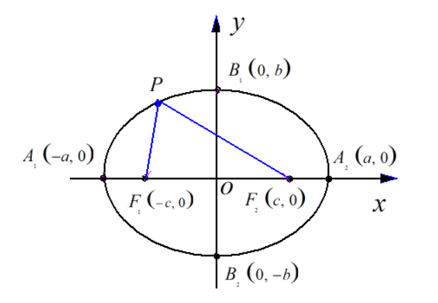

### 一、思考什么是动画

穷理者，欲知事物之所以然，与其所当然者而已。知其所以然，故志不惑；知其所当然，故行不谬。什么是动画呢，本质上它就是图像按照事先设定好的顺序在一定的时间内的**图像序列变化运动**。这种序列的变化运动在视觉上就会给我们一种正在运动的错觉，由此产生了动画效果。

动画的特性:

- 每一张图片的内容都是事先已经设定好的，它们按照一定的顺序规则不断变动
- 构成动画特效需要在单位时间内渲染一定量的图像，每张图像称之为帧(Frame)。通常电影只需要24FPS就足够流畅，而游戏则需要60FPS，我们设计动画时通常选用60FPS。

### 二、动画API

setInterval(function, delay):
当设定好间隔时间后，function会定期执行。

setTimeout(function, delay):
在设定好的时间之后执行函数。

requestAnimationFrame(callback):
我们可以在回调函数里修改图形的内容，然后这一API就会根据浏览器的刷新频率在一定的时间内调用callback;
然后，根据递归的思想，实现callback的反复调用，最终实现动画效果;

window.requestAnimationFrame()方法提供了更加平缓并更加有效率的方式来执行动画，当系统准备好了重绘条件的时候，才调用绘制动画帧。一般每秒钟回调函数执行60次，也有可能会被降低。

```
const drawFrame = () => {
    //some code for animation effect here
    window.requestAnimationFrame(drawFrame);
};

drawFrame();
```
上面的代码意思是立即执行drawFrame这个函数，发现  window.requestAnimationFrame(drawFrame)时，根据浏览器的刷新频率，在一定时间之后执行；
接下来执行你所编写的改变图像内容（图像的位置、宽高、颜色等等）的脚本，执行回调；
循环反复，形成动画效果。

基本步骤:

1. 清空 canvas
2. 保存 canvas 状态
3. 绘制动画图形（animated shapes）: 重绘动画帧
4. 恢复 canvas 状态

### 三、动画原理分析

医学上证明人类具有“视觉暂留”的特性，人的眼睛看到一幅画或一个物体后，在0.34秒内不会消失。利用这一原理，在一幅画还没有消失前播放下一幅画，就会给人造成一种流畅的视觉变化效果。

现在假设，如果我们能够在每16ms（1秒60帧，1000/60≈16.67）内渲染1张图像，并且每一张图像的内容发生微调，那么在1秒钟整个画面就会产生动画效果了。

内容的微调可以是图形的移动的距离、转动的方向以及缩放的比例等等，“捕获”这些数据的方法就是要借助解析几何的知识。接下来就介绍一下几种常见的运动形式。

### 四、简单的直线运动实例

#### 4.1 匀速直线运动

匀速直线运动就是物体朝特定方向的运动，运动过程中速度(大小和方向)不发生改变。

1. 物体的匀速运动可以通过改变其在坐标轴的值，**每次的改变量是不变的**，也就是单位时间内的移动距离是不变的，这样才符合匀速;
2. 通过向量的合成原理，我们可以在canvas画布上实现任意方向的匀速运动;

位移公式:
```math
x = v_{0}t
```

x轴方向上的匀速直线运动(到头改变运动方向):
```
<canvas id="canvas" width="750" height="400" style="border: 1px solid black;"></canvas>


    const canvas = document.getElementById('canvas');
    const ctx = canvas.getContext('2d');

    let x = 20;
    let speed = 3;

    function draw() {
        // 1.先把画布清空
        ctx.clearRect(0, 0, canvas.width, canvas.height);
        // 2. 画小球
        ctx.beginPath();
        // ctx.fillStyle = '#EA7F26';

        // 使用渐变色
        var gradient = ctx.createRadialGradient(x, 200, 5, x, 200, 20);
        gradient.addColorStop(0, '#FFF');
        gradient.addColorStop(1, '#EA7F26');
        ctx.fillStyle = gradient;

        ctx.arc(x, 200, 20, 0, 2 * Math.PI); // y 200 和上面保持一致
        ctx.fill();
        // 3. 移动x
        x += speed;
        if (x > canvas.width - 20 || x < 20) {
            speed = -speed;
        }

        window.requestAnimationFrame(draw);
    }
    draw();
```

#### 4.2 匀变速直线运动

变速运动，本质上是物体运动过程中速度在变化，即物体具有加速度。我们实现时只需要改变坐标轴的值，并且每次的改变是变化的。

速度公式:
```math
v = v_{0} + at
```

位移公式:
```math
x = v_{0}t + \frac{at^{2}}{2}
```

```
    const canvas = document.getElementById('canvas');
    const ctx = canvas.getContext('2d');

    let x = 100;
    let speed = 1;
    let ax = 0.03; //设置x轴上的每渲染1帧speed增加0.03;

    function draw() {
        // 1.先把画布清空
        ctx.clearRect(0, 0, canvas.width, canvas.height);
        // 2. 画小球
        ctx.beginPath();
        ctx.fillStyle = '#EA7F26';
        ctx.arc(x, 200, 20, 0, 2 * Math.PI);
        ctx.fill();
        // 3. 移动x
        x += speed;
        speed += ax;   // 使用加速度改变速度值
        if (x > canvas.width - 20 || x < 20) {
            speed = -speed;
        }

        window.requestAnimationFrame(draw);
    }
    draw();
```

### 五、简单的曲线运动

#### 5.1 匀速圆周运动

质点沿圆周运动，如果在任意相等的时间里通过的圆弧长度都相等，这种运动就叫做“匀速圆周运动”(uniform circular motion)。匀速圆周运动是圆周运动中，最常见和最简单的运动（因为速度是矢量，所以匀速圆周运动实际上是指匀速率圆周运动）。

本质上来说，匀速圆周运动的实现其实就是通过一个原点，然后在这个原点的基础之上对一个物体进行360度的旋转。

先来看一个公式:
```math
x^2 + y^2 = r^2
```
这是一原点为圆心，半径为r的圆。

可是咋一看，这个还是没法直接通过改变坐标(x, y)来画圆啊。别急，它还有一种极坐标的表达方式:
```math
x = rcosθ

y = rsinθ
```
这下是不是能看出来了，只要给我一个半径值和每次旋转的角度，我就能表示出(x, y)的值。

下面是完整的代码:
```
    const canvas = document.getElementById('canvas');
    const ctx = canvas.getContext('2d');

    let angle = 0;
    let radius = 200;   // 半径

    const draw = (axisX) => {
        ctx.clearRect(0, 0, canvas.width, canvas.height);

        ctx.fillStyle = "#EA7F26";
        ctx.beginPath();
        let x = canvas.width / 2 + Math.cos(angle) * radius;
        let y = canvas.height / 2 + Math.sin(angle) * radius;
        angle = angle + 0.02;

        ctx.moveTo(x, y);
        ctx.arc(x, y, 20, 0, 2 * Math.PI, false);
        ctx.fill();

        requestAnimationFrame(draw);
        ctx.closePath();

        ctx.beginPath();
        ctx.arc(canvas.width / 2, canvas.height / 2, 200, 0, 2 * Math.PI, false);
        ctx.stroke();
    }

    requestAnimationFrame(draw);
```

#### 5.2 椭圆运动

椭圆定义: 椭圆（Ellipse）是平面内到定点F1、F2的距离之和等于常数（大于|F1F2|）的动点P的轨迹，F1、F2称为椭圆的两个焦点。其数学表达式为：|PF1|+|PF2|=2a（2a>|F1F2|）。



椭圆运动类似圆周运动，数学表达式为:
```math
(x/a)^2 + (y/b)^2 = 1

// 极坐标
x = a*cosθ
y = b*sinθ
```

下面是两者的对比:
```
// 圆周运动
let angle = 0;
let radius = 200;   // 半径

let x = canvas.width / 2 + Math.cos(angle) * radius;
let y = canvas.height / 2 + Math.sin(angle) * radius;
angle = angle + 0.02;

// 椭圆运动
let angle = 0,scopeX = 150 , scopeY = 80;
let x = canvas.width / 2 + scopeX * Math.cos(angle)
let y = canvas.height / 2 + scopeY * Math.sin(angle)
angle += 0.02;
```

#### 5.3 波形运动

波形运动的轨迹就像三角函数一样。

- 匀速运动设置 x += x1，每频次图形的x轴右移x1；
- 设置 y = centerY + Math.sin(angle) * swing，由于正弦函数的值区间为[-1,1]，所以图形会永远在[centerY-swing,centerY+swing]上下移动；

```
    const canvas = document.getElementById('canvas');
    const ctx = canvas.getContext('2d');

    var angle = 0;  // 定义每次变化的角度
    var swing = 150;    // 振幅
    var x = 0;
    var y;

    const draw = (axisX) => {
        ctx.clearRect(0, 0, canvas.width, canvas.height);

        ctx.fillStyle = "#EA7F26";
        ctx.beginPath();

        x += 2;
        y = canvas.height / 2 + Math.sin(angle) * swing;
        angle = angle + 0.02;

        ctx.moveTo(x, y);
        ctx.arc(x, y, 20, 0, 2 * Math.PI, false);
        ctx.fill();

        requestAnimationFrame(draw);
        ctx.closePath();
    }

    requestAnimationFrame(draw);
```
