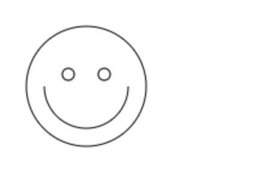
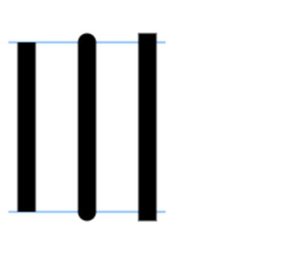
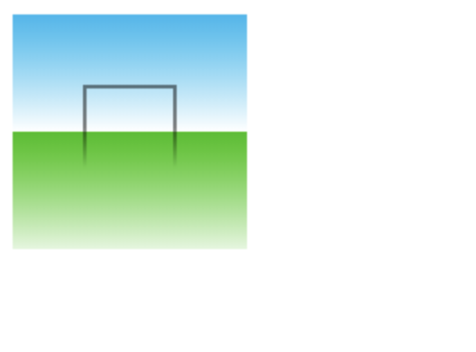
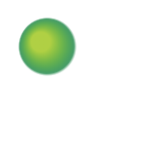
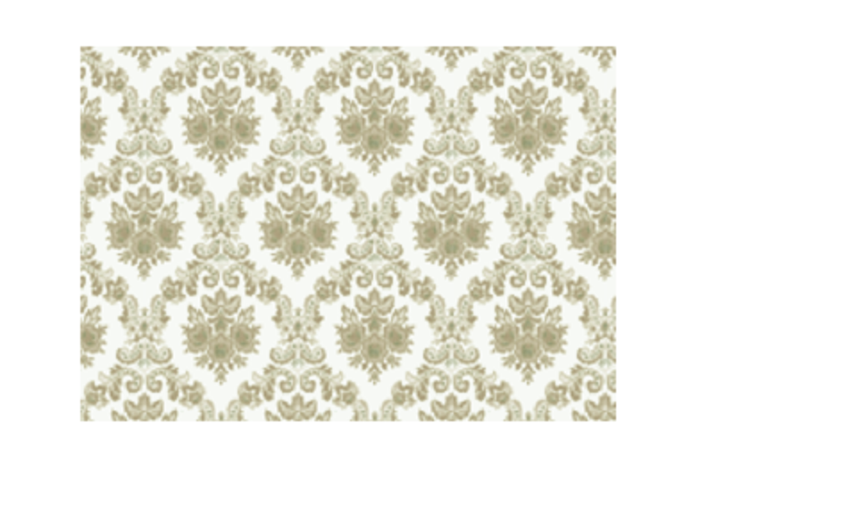

### 一、什么是Canvas

HTML5的 Canvas 元素使用 JavaScript 在网页中绘制图像。

画布是一个矩形区域，我们可以控制其中的每一像素。

Canvas拥有多种绘制路径、矩形、圆形、字符、图像以及动画的方法。

参考: [Canvas MDN](https://developer.mozilla.org/zh-CN/docs/Web/API/Canvas_API/Tutorial)

#### 1.1 canvas元素

canvas标签只有两个属性：width和height。当没有设置宽度和高度的时候，canvas会初始化宽度为300像素和高度为150像素。(也可以使用CSS来定义大小，但中绘制时图像会伸缩以适应它的框架尺寸：如果CSS的尺寸和初始画布的比例不一致，它会出现扭曲)

#### 1.2 渲染上下文

canvas元素创造了一个固定大小的画布，它公开了一个或多个渲染上下文(the rendering context)，用来绘制和处理要展示的内容。

```
<canvas id="myCanvas" width="500" height="400">
    你的浏览器不支持canvas!
</canvas>

const myCanvas = document.getElementById('myCanvas');   // 获取canvas容器
let ctx = myCanvas.getContext('2d');    // 访问绘画上下文

const canW = myCanvas.width;  // 获取宽度
const canH = myCanvas.height;  // 获取高度
```

#### 1.3 画布栅格


### 二、绘制形状

canvas只支持两种形式的图形绘制：矩形和路径(所有其他类型的图形都是通过一条或多条路径组合而成的)

#### 2.1 绘制矩形

```
fillRect(x, y, width, height)   // 绘制一个填充的矩形
strokeRect(x, y, width, height)     // 绘制一个边框矩形
clearRect(x, y, width, height)      // 清除指定矩形区域，让清除部分完全透明
```

不同于路径函数（path function），以上的三个函数绘制之后会马上显现在canvas上，即时生效。

#### 2.2 绘制路径

图形的基本元素是路径。路径是通过不同颜色和宽度的线段或曲线相连形成的不同形状的点的集合。一个路径，甚至一个子路径，都是闭合的。使用路径绘制图形需要一些额外的步骤。

1. 首先，你需要创建路径起始点。
2. 然后你使用画图命令去画出路径。
3. 之后你把路径封闭。
4. 一旦路径生成，你就能通过描边或填充路径区域来渲染图形。

```
beginPath()     // 新建一条路径，生成之后，图形绘制命令被指向到路径上生成路径

// 绘制图形的命令。。。

closePath()     // 闭合路径之后图形绘制命令又重新指向到上下文中，不是必须的，如果线的终点和起点一样，会自动闭合

stroke()    // 通过线条来绘制图形轮廓

fill()    // 通过填充路径的内容区域生成实心的图形
```

```
moveTo(x, y)    // 路径（线）的起点

lineTo(x, y)    // 线的终点

arc(x, y, r, start, end, true/false)    // 圆

arcTo(x1, y1, x2, y2, r)     // 弧线

quadraticCurveTo(cp1x, cp1y, x, y)      // 绘制二次贝塞尔曲线，cp1x,cp1y为一个控制点，x,y为结束点。

bezierCurveTo(cp1x, cp1y, cp2x, cp2y, x, y)     // 绘制三次贝塞尔曲线，cp1x,cp1y为控制点一，cp2x,cp2y为控制点二，x,y为结束点。
```

注意：

1. fill()和stroke() 函数表示绘图结束。继续绘制的话需要重新新建路径
2. 调用fill()函数时，所有没有闭合的形状都会自动闭合，所以你不需要调用closePath()函数。但是调用stroke()时不会自动闭合

例: 绘制一个笑脸
```
    ctx.beginPath();
    ctx.arc(75, 75, 50, 0, Math.PI * 2, true); // 绘制
    ctx.moveTo(110, 75);
    ctx.arc(75, 75, 35, 0, Math.PI, false); // 口(顺时针)
    ctx.moveTo(65, 65);
    ctx.arc(60, 65, 5, 0, Math.PI * 2, true); // 左眼
    ctx.moveTo(95, 65);
    ctx.arc(90, 65, 5, 0, Math.PI * 2, true); // 右眼
    ctx.stroke();
```


### 三、样式和颜色

#### 3.1 颜色

```
fillStyle = color   // 设置图形的填充颜色

strokeStyle = color   // 设置图形轮廓的颜色
```

#### 3.2 透明度

globalAlpha = transparencyValue ， 这个属性影响到 canvas 里所有图形的透明度，有效的值范围是 0.0 （完全透明）到 1.0（完全不透明），默认是 1.0。

globalAlpha 属性在需要绘制大量拥有相同透明度的图形时候相当高效。不过，习惯上我们用颜色值rgba来表示，可以分别设置轮廓和填充样式。

#### 3.3 线型

- lineWidth = value : 设置线条宽度
- lineCap = type : 设置线条末端样式，butt(默认)  round  square
- lineJoin = type : 设定线条与线条间接合处的样式, round(圆角), bevel(横线) 和 miter(默认)
- miterLimit = value : 限制当两条线相交时交接处最大长度；所谓交接处长度（斜接长度）是指线条交接处内角顶点到外角顶点的长度
- setLineDash(segments) : 设置当前虚线样式, setLineDash[4, 2], 第一个值为实线宽度，第二个值为空白的宽度
- getLineDash() : 返回一个包含当前虚线样式，长度为非负偶数的数组
- lineDashOffset = value : 设置虚线样式的起始偏移量


```
var lineCap = ['butt', 'round', 'square'];

// 创建路径
ctx.strokeStyle = '#09f';
ctx.beginPath();
ctx.moveTo(10, 40);
ctx.lineTo(140, 40);
ctx.moveTo(10, 180);
ctx.lineTo(140, 180);
ctx.stroke();

// 画线条
ctx.strokeStyle = 'black';
for (var i = 0; i < lineCap.length; i++) {
    ctx.lineWidth = 15;
    ctx.lineCap = lineCap[i];
    ctx.beginPath();
    ctx.moveTo(25 + i * 50, 40);
    ctx.lineTo(25 + i * 50, 180);
    ctx.stroke();
}
```


#### 3.4 渐变

我们可以用线性或者径向的渐变来填充或描边, 新建一个 canvasGradient 对象，并且赋给图形的 fillStyle 或 strokeStyle 属性

- createLinearGradient(x1, y1, x2, y2) : createLinearGradient 方法接受 4 个参数，表示渐变的起点 (x1,y1) 与终点 (x2,y2)。
- createRadialGradient(x1, y1, r1, x2, y2, r2) : createRadialGradient 方法接受 6 个参数，前三个定义一个以 (x1,y1) 为原点，半径为 r1 的圆，后三个参数则定义另一个以 (x2,y2) 为原点，半径为 r2 的圆

```
  // Create gradients
  var lingrad = ctx.createLinearGradient(0,0,0,150);
  lingrad.addColorStop(0, '#00ABEB');
  lingrad.addColorStop(0.5, '#fff');
  lingrad.addColorStop(0.5, '#26C000');
  lingrad.addColorStop(1, '#fff');

  var lingrad2 = ctx.createLinearGradient(0,50,0,95);
  lingrad2.addColorStop(0.5, '#000');
  lingrad2.addColorStop(1, 'rgba(0,0,0,0)');

  // assign gradients to fill and stroke styles
  ctx.fillStyle = lingrad;
  ctx.strokeStyle = lingrad2;
  
  // draw shapes
  ctx.fillRect(10,10,130,130);
  ctx.strokeRect(50,50,50,50);
```



```
// 创建渐变
var radgrad = ctx.createRadialGradient(45, 45, 10, 52, 50, 30);
radgrad.addColorStop(0, '#A7D30C');
radgrad.addColorStop(0.9, '#019F62');
radgrad.addColorStop(1, 'rgba(1,159,98,0)');

ctx.fillStyle = radgrad;
ctx.fillRect(0, 0, 150, 150);
```


#### 3.5 图案样式

createPattern(image, type) ：
该方法接受两个参数。Image 可以是一个 Image 对象的引用，或者另一个 canvas 对象。Type 必须是下面的字符串值之一：repeat，repeat-x，repeat-y 和 no-repeat。

与 drawImage 有点不同，你需要确认 image 对象已经装载完毕，否则图案可能效果不对的。

图案的应用跟渐变很类似的，创建出一个 pattern 之后，赋给 fillStyle 或 strokeStyle 属性即可。

```
// 创建新 image 对象，用作图案
var img = new Image();
img.src = 'https://mdn.mozillademos.org/files/222/Canvas_createpattern.png';
img.onload = function () {
    // 创建图案
    var ptrn = ctx.createPattern(img, 'repeat');
    ctx.fillStyle = ptrn;
    ctx.fillRect(50, 30, 300, 210);
}
```


#### 3.6 阴影

shadowOffsetX = float / shadowOffsetY = float : 
shadowOffsetX 和 shadowOffsetY 用来设定阴影在 X 和 Y 轴的延伸距离，它们是不受变换矩阵所影响的。负值表示阴影会往上或左延伸，正值则表示会往下或右延伸，它们默认都为 0。

shadowBlur = float :
shadowBlur 用于设定阴影的模糊程度，其数值并不跟像素数量挂钩，也不受变换矩阵的影响，默认为 0。

shadowColor = color : shadowColor 是标准的 CSS 颜色值，用于设定阴影颜色效果，默认是全透明的黑色。

### 四、文字

#### 4.1 绘制文本

canvas 提供了两种方法来渲染文本:

fillText(text, x, y [, maxWidth]) : 在指定的(x,y)位置填充指定的文本，绘制的最大宽度是可选的.

strokeText(text, x, y [, maxWidth]) : 在指定的(x,y)位置绘制文本边框，绘制的最大宽度是可选的.

#### 4.2 文本样式

- font = value : 当前我们用来绘制文本的样式. 这个字符串使用和 CSS font 属性相同的语法. 默认的字体是 10px sans-serif
- textAlign = value : 文本对齐选项. 可选的值包括：start, end, left, right or center. 默认值是 start
- textBaseline = value : 基线对齐选项. 可选的值包括：top, hanging, middle, alphabetic, ideographic, bottom。默认值是 alphabetic
- direction = value : 文本方向。可能的值包括：ltr, rtl, inherit。默认值是 inherit

#### 4.3 预测量文本宽度

measureText() : 将返回一个 TextMetrics对象的宽度、所在像素，这些体现文本特性的属性

```
ctx.shadowOffsetX = 5;     //  X轴阴影距离
ctx.shadowOffsetY = 2;     // Y轴阴影距离
ctx.shadowBlur = 2;     // 阴影的模糊程度
ctx.shadowColor = "rgba(0, 0, 0, 0.5)";    // 阴影颜色
ctx.font = "30px Times New Roman";    // 设置字体和字体大小
ctx.fillStyle = "Black";
ctx.fillText("Canvas font", 15, 30);    // 实体文字
ctx.strokeStyle = 'red';
ctx.strokeText('Hello world', 15, 100);    // 边框文字


var text = ctx.measureText("foo"); // TextMetrics object
text.width; // 16;
```

### 五、图像

canvas更有意思的一项特性就是图像操作能力。可以用于动态的图像合成或者作为图形的背景，以及游戏界面（Sprites）等等。

引入图像到canvas里需要以下两步基本操作：

1. 获得一个指向HTMLImageElement的对象或者另一个canvas元素的引用作为源，也可以通过提供一个URL的方式来使用图片
2. 使用 drawImage(image, x, y) 函数将图片绘制到画布上

```
var img = new Image();
img.src= './images/background.jpg';
ctx.drawImage(img, 0, 0);   //img为图像，(0, 0)为起始坐标
```

绘制图片的时候还可以对图片进行缩放，类似于css中的background-size : drawImage(image, x, y, width, height)

### 六、状态的保存和恢复

- save() : 保存画布(canvas)的所有状态
- restore() : save 和 restore 方法是用来保存和恢复 canvas 状态的，都没有参数。Canvas 的状态就是当前画面应用的所有样式和变形的一个快照。

Canvas状态存储在栈中，每当save()方法被调用后，当前的状态就被推送到栈中保存。一个绘画状态包括：

- 当前应用的变形（即移动，旋转和缩放，见下）
- strokeStyle, fillStyle, globalAlpha, lineWidth, lineCap, lineJoin, miterLimit, shadowOffsetX, shadowOffsetY, shadowBlur, shadowColor, globalCompositeOperation 的值
- 当前的裁切路径（clipping path）

你可以调用任意多次 save 方法。

每一次调用 restore 方法，上一个保存的状态就从栈中弹出，所有设定都恢复。

### 七、变形

#### 7.1 移动

translate(x, y) : translate 方法接受两个参数。x 是左右偏移量，y 是上下偏移量

#### 7.2 旋转

rotate(angle) : 这个方法只接受一个参数：旋转的角度(angle)，它是顺时针方向的，以弧度为单位的值

旋转的中心点始终是 canvas 的原点，如果要改变它，我们需要用到 translate 方法

#### 7.3 缩放

scale(x, y) : 
scale  方法可以缩放画布的水平和垂直的单位。两个参数都是实数，可以为负数，x 为水平缩放因子，y 为垂直缩放因子，如果比1小，会比缩放图形， 如果比1大会放大图形。默认值为1， 为实际大小。

#### 7.4 变形

transform(m11, m12, m21, m22, dx, dy) : 这个方法是将当前的变形矩阵乘上一个基于自身参数的矩阵

### 八、合并与裁剪

对合成的图形来说，绘制顺序会有限制。不过，我们可以利用 globalCompositeOperation 属性来改变这种状况。此外, clip属性允许我们隐藏不想看到的部分图形。

https://developer.mozilla.org/zh-CN/docs/Web/API/Canvas_API/Tutorial/Compositing

### 九、动画

绘制步骤:
1. 清空 canvas
2. 保存 canvas 状态
3. 绘制动画图形（animated shapes）
4. 恢复 canvas 状态

setInterval(function, delay) : 当设定好间隔时间后，function会定期执行。

setTimeout(function, delay) : 在设定好的时间之后执行函数

requestAnimationFrame(callback) :
告诉浏览器你希望执行一个动画，并在重绘之前，请求浏览器执行一个特定的函数来更新动画。

requestAnimationFrame 方法提供了更加平缓并更加有效率的方式来执行动画，当系统准备好了重绘条件的时候，才调用绘制动画帧。一般每秒钟回调函数执行60次，也有可能会被降低。

动画案例见下节。
