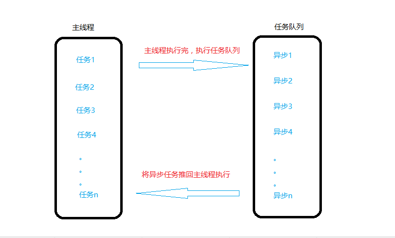
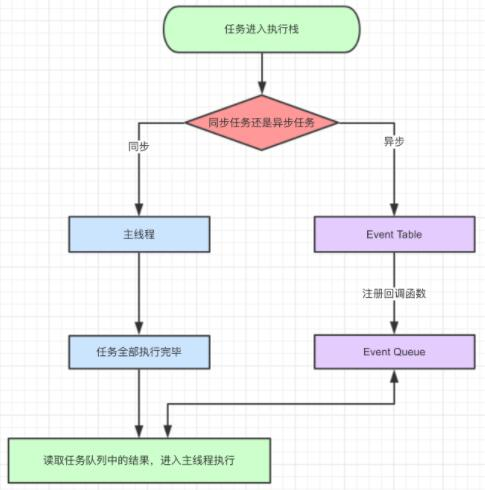

## 介绍

js 是单线程执行的，js中的任务按顺序一个一个的执行，但是一个任务耗时太长，那么后面的任务就需要等待，为了解决这种情况，将任务分为了同步任务和异步任务；
而异步任务又可以分为微任务和宏任务。

- 浏览器是多线程的，JS是单线程的（浏览器只分配一个线程来执行JS）
- 进程大线程小：一个进程中包含多个线程
- 同步任务: 在一个线程上（主栈/主任务队列）同一个时间只能做一件事情，当前事情完成才能进行下一个事情（先把一个任务进栈执行，执行完成，在把下一个任务进栈，上一个任务出栈...）
- 异步任务: 在主栈中执行一个任务，但是发现这个任务是一个异步的操作，我们会把它移除主栈，放到等待任务队列中（此时浏览器会分配其它线程监听异步任务是否到达指定的执行时间）,如果主栈执行完成，监听者会把到达时间的异步任务重新放到主栈中执行...

任务分类：

宏任务包括：
```
script(整体代码)
setTimeout
setInterval
I/O
UI交互事件
postMessage
MessageChannel
setImmediate(Node.js 环境)
```

微任务包括：
```
Promise.then、.catch、.finally
Object.observe
MutationObserver
process.nextTick(Node.js 环境)
```

## 事件循环

同步任务会立刻执行，进入到主线程当中，异步任务会被放到任务队列（Event Queue）当中。等待同步代码执行完毕后，返回来，再将异步中的任务放到主线程中执行,反复这样的循环，这就是事件循环。





```
console.log('script start');

setTimeout(function() {
  console.log('setTimeout');
}, 0);

Promise.resolve().then(function() {
  console.log('promise1');
}).then(function() {
  console.log('promise2');
});

console.log('script end');
```

输出结果:
```
script start
script end
promise1
promise2
setTimeout
```
