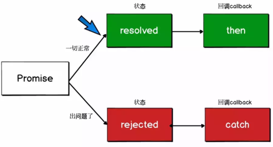

## 引言

JavaScript作为一门单线程语言，其异步编程的实现尤为关键。无论是处理网络请求、文件读写还是延时操作，都有助于提供更流畅的用户体验。

## Promise

Promise 代表了一个尚未完成但预期在将来完成的动作。使用Promise，可以避免所谓的"回掉地狱"。

```
let promise = new Promise(function(resolve, reject) {
  // 异步操作代码
  setTimeout(() => {
    resolve("操作成功");
  }, 1000);
});

promise.then((value) => {
  console.log(value); // 输出：操作成功
});
```

### Promise的状态

一个Promise有三种可能的状态：

- pending（待定） ：初始状态，既不是成功，也不是失败
- fulfilled（已实现） ：意味着操作成功完成
- rejected（已拒绝） ：意味着操作失败



```
let fulfilledPromise = Promise.resolve('成功');
let rejectedPromise = Promise.reject('失败');

fulfilledPromise.then(value => console.log(value)); // 输出：成功
rejectedPromise.catch(error => console.log(error)); // 输出：失败
```

Promise 是用来管理异步编程的，它本身不是异步的，new Promise的时候会立即把executor函数执行，只不过我们一般会在executor函数中处理一个异步操作
```
        let p1 = new Promise(() => {
            setTimeout(() => {
                console.log(1)
            }, 1000)
            console.log(2)
        })
        console.log(3) // 2 3 1
```

### 链式调用和错误处理

Promise的另一个优点是可以通过链式调用.then()和.catch()方法来处理复杂的异步流程

```
new Promise((resolve, reject) => {
    setTimeout(() => resolve(1), 1000);
})
.then(result => {
    console.log(result); // 输出 1
    return result * 2;
})
.then(result => {
    console.log(result); // 输出 2
    return result * 3;
})
.then(result => {
    console.log(result); // 输出 6
    return result * 4;
})
.catch(error => {
    console.log('捕获到错误：', error);
});
```

### 如何中断promise

通过返回一个状态一直为pending的promise即可

```
.catch((err) => {
    console.log('onRejected', err);
    // 中断promise链
    return new Promise(() => {})
})
```

## Async/Await

async和await是建立在Promise之上的高级抽象，使得异步代码的编写和阅读更加接近于同步代码的风格

### async 函数

通过在函数声明前加上async关键字，可以将任何函数转换为返回Promise的异步函数。这意味着你可以使用.then()和.catch()来处理它们的结果。

```
async function asyncFunction() {
  return "异步操作完成";
}

asyncFunction().then(value => console.log(value)); // 输出：异步操作完成
```

### await 关键字

await关键字只能在async函数内部使用。它可以暂停async函数的执行，等待Promise的解决（resolve），然后以Promise的值继续执行函数。

```
async function asyncFunction() {
  let promise = new Promise((resolve, reject) => {
    setTimeout(() => resolve("完成"), 1000)
  });

  let result = await promise; // 等待，直到promise解决 (resolve)
  console.log(result); // "完成"
}

asyncFunction();
```

### 错误处理

在async/await中，错误处理可以通过传统的try...catch语句实现，这使得异步代码的错误处理更加直观

```
async function asyncFunction() {
  try {
    let response = await fetch('http://example.com');
    let data = await response.json();
    // 处理数据
  } catch (error) {
    console.log('捕获到错误：', error);
  }
}

asyncFunction();
```

### 实践应用

在实际应用中，async和await使得处理复杂的异步逻辑更加简单，尤其是在涉及多个依次执行的异步操作时。
前几年的版本时，浏览器执行过程中await 会阻塞后续代码，将后续的代码放入微任务队列中，但是现在的浏览器执行代码时会给紧跟在await关键字后的代码开小灶，相当于紧随在await关键字后的代码变成同步代码，但是再往后的代码依旧会被推入微任务队列。

## Promise与Async/Await的比较

虽然async/await在很多情况下可以提供更清晰和简洁的代码，但Promise也有其独特的优势。例如，处理多个并行异步操作时，Promise.all()通常是更好的选择。
