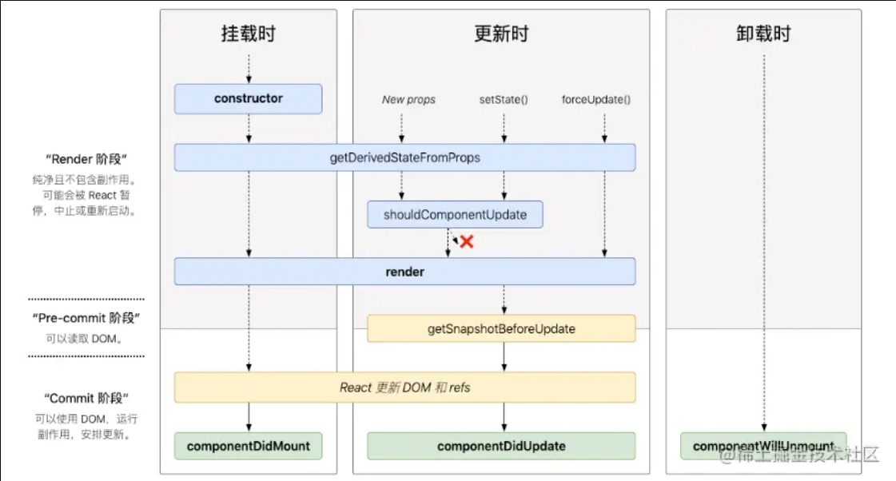

## React18 有哪些更新

- 并发模式
- 更新 render API
- 自动批处理
- Suspense 支持 SSR
- startTransition
- startTransition
- useDeferredValue
- useDeferredValue
- 提供给第三方库的hook

## JSX 是什么

JSX 是 JavaScript 语法的扩展，它允许编写类似于 HTML 的代码。它可以编译为常规的 JavaScript 函数调用，从而为创建组件标记提供了一种更好的方法。

```
<div className="sidebar">hello</div>


// 转换为
React.createElement(
  'div',
  {className: 'sidebar'},
  'hello'
)
```

## 简述 React 的生命周期

挂载阶段：组件被创建并插入到 DOM 中
更新阶段：组件的 props 或 state 发生变化时触发的组件更新
卸载阶段：组件被从 DOM 中移除



## 为什么虚拟 dom 会提高性能

虚拟 dom 相当于在 js 和真实 dom 中间加了一个缓存，利用 dom diff 算法避免了没有必要的 dom 操作，从而提高性能

## react diff 原理

它是基于三个策略：

tree diff web UI 中 dom 节点跨层级的移动操作特别少，可以忽略不计

component diff 拥有相同类的两个组件将会生成相似的树形结构，拥有不同类的两个组件会生成不同的树形结构

element diff 对于同一层级的一组子节点，他们可以通过唯一的 id 进行区分

## React为什么要搞一个Hooks

### 动机

Hook 解决了我们五年来编写和维护成千上万的组件时遇到的各种各样看起来不相关的问题。

### 在组件之间复用状态逻辑很难

React 没有提供将可复用性行为“附加”到组件的途径（例如，把组件连接到 store）。如果你使用过 React 一段时间，你也许会熟悉一些解决此类问题的方案，比如 render props 和 高阶组件。

使用 Hook 从组件中提取状态逻辑，使得这些逻辑可以单独测试并复用。Hook 使你在无需修改组件结构的情况下复用状态逻辑。 这使得在组件间或社区内共享 Hook 变得更便捷。

### 复杂组件变得难以理解

每个生命周期常常包含一些不相关的逻辑。例如，组件常常在 componentDidMount 和 componentDidUpdate 中获取数据。但是，同一个 componentDidMount 中可能也包含很多其它的逻辑，如设置事件监听，而之后需在 componentWillUnmount 中清除。如此很容易产生 bug，并且导致逻辑不一致。

Hook 将组件中相互关联的部分拆分成更小的函数（比如设置订阅或请求数据），而并非强制按照生命周期划分。你还可以使用 reducer 来管理组件的内部状态，使其更加可预测。

### 难以理解的 class

Hook 使你在非 class 的情况下可以使用更多的 React 特性。 从概念上讲，React 组件一直更像是函数。

## 怎么防止HTML被转义？

dangerouslySetInnerHTML

## 如何提高组件的渲染效率

### 是什么

react 基于虚拟 DOM 和高效 Diff算法的完美配合，实现了对 DOM最小粒度的更新。

### 怎么做

类组件：
    继承PureComponent
    使用shouldComponentUpdate优化

函数组件：
    memo模拟PureComponent
    使用useMemo缓存变量
    使用useCallback缓存函数
    循环添加key, key最好用数组项的唯一值，不推荐用 index

### 总结

建议将页面进行更小的颗粒化，如果一个过大，当状态发生修改的时候，就会导致整个大组件的渲染，而对组件进行拆分后，粒度变小了，也能够减少子组件不必要的渲染
