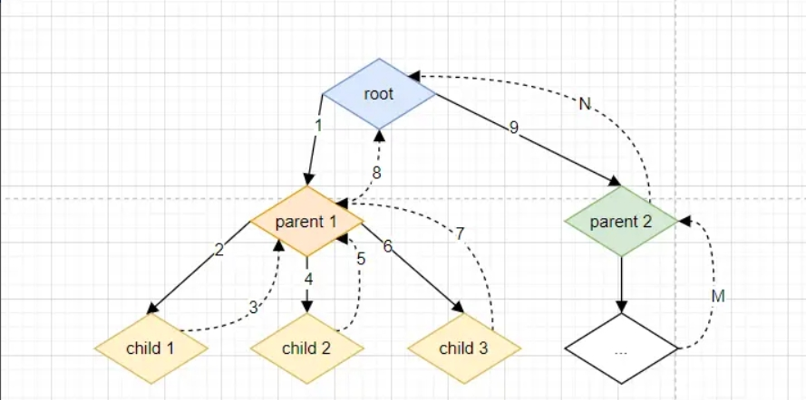

### 什么是Vue的响应式

首先Vue的响应式与要与Vue的双向绑定区分开，Vue的双向绑定指的是视图更新可以驱动数据更新，在使用中即是指v-model语法糖，而**Vue的响应式是指当数据发生变化时，相关的视图会自动更新**。

响应式原理改成了用proxy，解决了数组无法通过下标修改，无法监听到对象属性的新增和删除的问题。也提升了响应式的效率

Vue2.x中，如果想要监听对象增删属性，需要使用Vue的静态方法，Vue.set、Vue.delete。Vue2.x 中响应式数据是通过 data(){} 这个 Option 返回的。
Vue3 中响应式数据是在初始化时（setup 函数）通过 ref API 或者 reactive API 定义的，然后作为 setup 的返回值。

Object.defineProperty 只能劫持对象的属性， 所以在 Vue.js 2.x 中，对于一个深层属性嵌套的对象，要劫持它内部深层次的变化，就需要在Vue 实例初始化的时候递归遍历这个对象，执行 Object.defineProperty 把每一层对象数据都变成响应式的。

Proxy 是对象层的劫持，在 Vue.js 3.x 中，初始化一个响应式数据时不会直接进行深层递归调用，递归调用是发生在 getter 的时候，也就是说只有属性被使用了才会进一步的深层调用。这其实是一种延时定义子对象响应式的实现，在性能上会有一定的提升。

### vue3编译流程

vue3的编译分两部分：编译期和运行期。
编译期间，先通过vue-loader把单文件组件编译成符合原生JavaScript语法的模块；
运行期间，会通过内置的模板引擎对模板进行编译，生成render()函数，且按照先父组件后子组件的顺序对模板进行编译。

### script setup 的实现原理

script setup 本质是setup()函数的语法糖，vue-loader在编译期间会把 script setup 内的代码编译成setup()函数，把defineExpose()内指定的变量编译为setup()函数的返回值。

### 组件实例是什么？

每个单文件组件都有一个组件实例，组件实例是用来存放组件状态的，可以在setup()函数内，通过getCurrentInstance()获取组件实例。

### 启动程序的时候，vue3单文件组件的初始化流程？

单文件组件由组件实例、相应vnode、相应node三部分组成。
初始化的时候，先创建组件的实例；接着用父组件vnode初始化实例的props、attrs、slots成员；然后执行setup()函数；接着把模板编译成render()函数；接着创建vnode；如果当前组件有子组件，则切换到子组件，重复上面的步骤；子组件都初始化完成后，把vnode同步到node上。

### createApp()，mount()做了什么工作？

程序在初始化的时候会依次调用createApp()和mount()函数，createApp()负责执行平台相关的代码，mount()负责执行平台无关的代码。createApp()主要做了两件事，第一，创建一个渲染器，它可用于把vdom转化为平台相关的界面代码；第二，返回一个App实例。mount()的作用就是，创建组件实例、vdom、完成依赖收集、并通过渲染器把vdom渲染成平台相关的界面代码。

### 组件的生命周期？

单个组件的生命周期：初始化阶段，先执行setup函数初始化实例，接着执行onBeforeMount，最后执行onMounted；运行阶段，先执行onBeforeUpdate，再执行onUpdated；关闭阶段，先执行onBeforeUnmount，再执行onMounted。

父子组件的生命周期：初始化阶段，先执行父组件的onBeforeMount，然后执行子组件的onBeforeMount，接着执行子组件的onMounted，最后执行父组件的onMounted；运行阶段、关闭阶段同理可推。

### 什么是虚拟DOM？diff算法？

虚拟dom是用JavaScript语言描述的一个树形结构，用于缓存发生变化的响应式数据，当到达下次刷新周期的时候，一次性把所有发生变化的数据同步到实际dom上。diff算法是同步vdom和dom数据的算法，采用就地复用的策略实现高效同步。

### watch()，watchEffect()，computed()的区别？

三者都用于实现数据和监听函数的绑定。

原理上来说，三者的共同点是，都会在setup期间、即onBeforeMount之前，创建一个Effect对象，并执行依赖收集函数进行依赖收集。

区别是，第一，watchEffect、computed的依赖收集函数和监听函数是同一个函数，而watch的依赖收集函数和回调函数是两个函数，这就导致了watchEffect和computed参数中的监听函数会在程序初始化期间执行一次，而watch参数中的监听函数默认不会执行；
第二，computed参数中的监听函数在变量发生变化后立即执行，watchEffect、watch参数中的监听函数执行时机可由用户指定，可以立即执行，也可以异步执行。

### ref()和reactive()的区别？

两者都用于实现响应式变量，区别在于reactive()只可以封装引用类型，ref()可以封装任意类型；reactive()通过Proxy实现，ref()通过类封装，并重写get/set实现。就目前而言，要访问ref()封装的变量，需要通过value函数获取。

### ref()和ref(null)的区别？

ref()的作用是封装普通数据，实现响应式数据；ref(null)的作用是获取子组件实例。

### emit()的实现原理？

emit()是通过发布订阅模式实现的，子组件发送一个事件，父组件收到该事件会立即执行相应的函数。

### 单向数据流的原因？

单向数据流指的是在 vue中约定，父组件传递给子组件的数据只能单向流动。也就是说，当一个父组件将其数据传递给一个子组件时，子组件不能直接修改该数据，而是需要通过向父组件发送事件来请求更改该数据。这种单向数据流的方式可以确保应用程序的数据流向清晰明确，易于理解和维护。

### v-for为什么要加key？v-for为什么不能和v-if一起使用？

v-for要加key是因为，第一，vue的同步算法采用就地复用的策略，在没有key值的情况下，diff算法认为标签类型相同的元素可以进行复用；有key值的情况下，diff算法认为标签类型相同且key值相等的元素才可以复用。第二，vue只在v-model实现了数据双向绑定，其它地方实现的都是单向绑定，input 框内的文字发生变化，不会实时同步到数据上。

在vue3中，v-if的优先级高于v-for，导致v-if访问不了v-for中的变量，因此不能把 v-if 和 v-for 同时用在同一个元素上。

### hook是什么

hook是一种编程封装思想，通过闭包实现，早在ES6诞生之前，这种编程封装思想在JavaScript中应用广泛，只不过在React17出现后，React官方把这种思想命名为hook，vue3借鉴react命名，也把这种封装思想称作hook。

*在Vue2.x中，纯逻辑复用会采用mixin的方式，mixin是代码注入，所以与引用它的组件之间存在隐式依赖，可能产生命名冲突等*

*hook不是注入代码片段，类似一个独立的实例，不会与引入它的组件代码发生耦合或者覆盖，也不能更改组件传递给它的属性。多个hooks之间可以串联使用，也可以相互调用*

**与 react hooks的对比**

1. React Hooks 必须在顶层调用，不能在条件语句使用。Vue Hooks 的使用没有这些限制，只把它当成一个普通的函数用就可以
   1. React 的 Hook 底层是链表，每一个 Hook 的 next 是指向下一个 Hook 的，if 会导致顺序不正确，从而报错，所以 react 是不允许这样使用 Hook 的
2. React Hooks 有时需要手动使用 useCallback，useMemo 去优化，避免子组件无必要的重新渲染。Vue 是不需要开发人员去考虑这些手动优化的。
   1. Vue 的组件渲染是基于响应式的，内部做了细粒度的监听机制，不会产生无必要的子组件重新渲染。
3. React 会在每次渲染都执行一遍 Hooks ， 可能导致性能不佳。Vue Hooks 只在初始化执行
   1. React 我们定义的是渲染函数，Vue 我们定义的是组件，在 setup 中 使用 Hooks，setup 只会在初始化时执行一次，所以 Vue Hooks 每次渲染时都重复执行。

### vue3插件是什么？

vue3内的所谓的插件不是常规意义上的插件，而是指mount()前执行的初始化函数，vue插件通常用来为 vue 添加全局功能。vue3内通过use()函数引入插件，use()的作用就是执行参数对象内的install()函数。

### 什么是异步组件？

网页的渲染流程一般分两部，先从网络加载网页，然后渲染。异步组件指的是，首次加载和渲染网页的时候，不从网络上加载该组件对应的JavaScript文件，而是等到需要显示该组件的时候，再从网络上加载该组件并渲染显示出来。

### 更新性能

Vue 和 React 两者都具有数据驱动视图的思想，也都用到了 VDOM，对流程最简洁的概括： data->VDOM->DOM->view ，这个流程本质上就是 js 执行。

js 执行要考虑性能问题，因为 js 执行期间会一直占据着 CPU，如果时间过长，一则会导致用户触发的事件得不到响应， 二则会导致掉帧即阻塞浏览器渲染，用户的角度去感知就是卡顿。

#### 与react更新性能对比

**React 的思路：CPU 总运算量不变，利用时间切片的思想，做到快速响应用户，让用户觉得够快。**

React 走了类似 CPU 调度的逻辑，让 整个更新流程 可以中断。把 VDOM tree，设计成链表的结构，利用浏览器的空闲时间来做数据驱动视图更新的流程，如果有动画或者用户交互的任务，就把主进程控制权还给浏览器。这就像 CPU 调度进程一样，我们要让高优先级的进程或者短进程优先运行，不能让长进程长期霸占资源。

核心是应用了这个原生 API ：requestIdleCallback。链表数据结构 ：Fiber

链表结构的形成是基于树的深度优先遍历

**Vue3 的思路：优化每个任务，让它有多快就多快，达到挤压 CPU 总运算量的目的（废除了时间切片的思路）**
为什么移除时间切片呢？因为每个任务极致优化后，cpu 总运算量降低，已经不需要时间切片了。

React 和 Vue 虽然都有 data->VDOM->DOM->view 这样的转换思想，但具体的数据驱动的原理不同。

当数据改变时， React 会递归比对整个新旧 VirtualDOM 树，找出需要变动的节点，然后一气呵成的更新。所以对于 React 来说，js 执行时间长主要就在于新旧 VDOM tree 对比时间长，就算 diff 算法再快也避免不了这个过程长，所以 React 走了时间切片的思路。

Vue 与 React 不同的数据驱动更新机制让 Vue 有更多的优化空间:
1. 在组件级别采用的是响应式的机制，可以让更新精确地定位到具体的组件（不需要整棵树对比），响应式有一定的优化空间
2. 组件内部使用的是 VDOM diff，并且是边对比变更新，不是一气呵成。diff 算法可以进一步优化
3. 使用模板相比 JSX，易于静态分析(AOT)，也让它有更多优化的空间

React 也可以做组件树级别的优化(即防止不必要的子组件重新呈现)需要显式使用 usemo，但是用好 usemo 不是一件容易的事

#### template 预字符串化

通过 template 预字符串化使 VDOM 节点数量减少，DOM tree 结构变得简单，遍历时间缩短。
Vue3 模板编译的时候会去识别动/静比例，当遇到大量连续的静态内容时，会直接将他编译为一个普通的字符串节点。

#### 静态标记、静态提升与事件缓存

创建 VDOM 的时候会根据 VDOM 的内容是否可以变化，为其添加静态标记 PatchFlag，如果 patchFlag = -1 表示当前节点是静态的，永远不会用作 diff。应用静态标记，大大的减少了 diff 工作量，剪短 diff 算法运行的时间。

静态提升是指标记为静态的节点，会缓存在 render 函数之外，创建 VDOM 的时候直接引用，不需要重新创建。

与 VDOM 静态提升相似，事件的回调函数，通常都是不变的。这种情况下，函数会被缓存起来，不用追踪它的变化。事件响应时，直接从内存中取出函数执行。

#### diff 算法内部优化

React 的 DOM tree 是链表结构，注定只能从单边开始比较，原地复用、下标递增法移动复用。

Vue2 双端比较，比较时总共有五种情况（四种相等＋一种不相等），分别做不同的处理。相比 React，双端比较更能节约次数。

Vue3 先双端比较，原地复用。然后最长递增子序列移动复用。(最长递增子序列使用的是“贪心 + 二分查找”的算法)。比 Vue2 更快。
