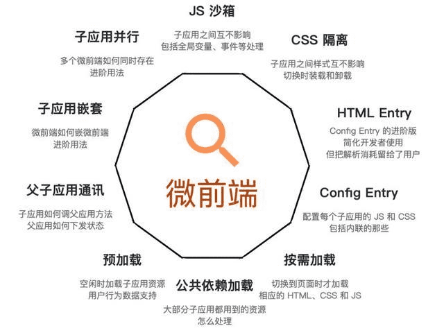

## 介绍

qiankun 是一个基于 single-spa 的微前端实现库，旨在帮助大家能更简单、无痛的构建一个生产可用微前端架构系统。



## 目的

1. js 沙箱：子应用之间互不影响
2. css 隔离：子应用之间样式互不影响，切换时加载与卸载
3. HTML Entry: Config Entry 的进阶版，简化开发者使用，但是把解析消耗留给了用户
4. Config Entry: 配置每个子应用的 js 和 css，包含内联的部分
5. 按需加载：切换页面才加载相应的 html、css、js
6. 公共依赖加载: 大部分公共的依赖加载
7. 预加载: 空闲时加载子应用资源，需要用户行为数据支持
8. 父子应用通讯: 子应用如何调用父应用方法，父应用如何下发状态
9. 子应用嵌套: 微前端如何嵌套微前端
10. 子应用并行: 多个微前端同时存在

## 核心

1. js 沙箱
2. css 样式隔离
3. 应用 html 入口接入
4. 应用通信
5. 应用路由

## 概览

先从src 下的 index.ts 目录，看看 qiankun 对外暴露了那些 API。

```
export { loadMicroApp, registerMicroApps, start } from './apis';
export { initGlobalState } from './globalState';
export { getCurrentRunningApp as __internalGetCurrentRunningApp } from './sandbox';
export * from './errorHandler';
export * from './effects';
export * from './interfaces';
export { prefetchImmediately as prefetchApps } from './prefetch';
```

loadMicroApp 用于手动加载微应用，registerMicroApps 用于注册微应用，start 用于启动应用。

initGlobalState 用于设置全局可见的 state。

getCurrentRunningApp 生成应用运行时沙箱。

errorHandler 错误处理。

effects 对外暴露了三个方法，setDefaultMountApp 设置默认加载的微应用，runDefaultMountEffects 是个不推荐使用的方法，内部直接使用 setDefaultMountApp。runAfterFirstMounted 是个对外暴露的生命周期方法，用于注册首个微应用加载之后的回调函数。

prefetchApps 用于应用预加载。

## 知识点

### 沙箱

沙箱分两个类型：

1. app 环境沙箱:
  app 环境沙箱是指应用初始化过之后，应用会在什么样的上下文环境运行。每个应用的环境沙箱只会初始化一次，因为子应用只会触发一次 bootstrap 。
  子应用在切换时，实际上切换的是 app 环境沙箱。
2. render 沙箱
  子应用在 app mount 开始前生成好的的沙箱。每次子应用切换过后，render 沙箱都会重现初始化。

这么设计的目的是为了保证每个子应用切换回来之后，还能运行在应用 bootstrap 之后的环境下。

### js沙箱

JS 沙箱简单点说就是，主应用有一套全局环境 window，子应用有一套私有的全局环境 fakeWindow，子应用所有操作都只在新的全局上下文中生效，这样的子应用好比被一个个箱子装起来与主应用隔离，因此主应用加载子应用便不会造成 JS 变量的相互污染、JS 副作用、CSS 样式被覆盖等，每个子应用的全局上下文都是独立的。

```
type FakeWindow = Window & Record<PropertyKey, any>;


...
function createFakeWindow(globalContext: Window) {
  // map always has the fastest performance in has check scenario
  // see https://jsperf.com/array-indexof-vs-set-has/23
  const propertiesWithGetter = new Map<PropertyKey, boolean>();
  const fakeWindow = {} as FakeWindow;
...
```

### 快照沙箱（snapshotSandbox）

快照沙箱就是在应用沙箱挂载和卸载的时候记录快照，在应用切换的时候依据快照恢复环境。

```
// 遍历对象 key 并将 key 传给回调函数执行
function iter(obj: typeof window, callbackFn: (prop: any) => void) {
  // eslint-disable-next-line guard-for-in, no-restricted-syntax
  for (const prop in obj) {
    // patch for clearInterval for compatible reason, see #1490
    if (obj.hasOwnProperty(prop) || prop === 'clearInterval') {
      callbackFn(prop);
    }
  }
}

/**
 * 基于 diff 方式实现的沙箱，用于不支持 Proxy 的低版本浏览器
 */
export default class SnapshotSandbox implements SandBox {
  proxy: WindowProxy;

  name: string;

  type: SandBoxType;

  sandboxRunning = true;

  private windowSnapshot!: Window;

  private modifyPropsMap: Record<any, any> = {};

  constructor(name: string) {
    this.name = name;
    this.proxy = window;
    this.type = SandBoxType.Snapshot;
  }

  // 挂载快照沙箱
  active() {
    // 记录当前快照
    this.windowSnapshot = {} as Window;
    iter(window, (prop) => {
      this.windowSnapshot[prop] = window[prop];
    });

    // 恢复之前的变更
    Object.keys(this.modifyPropsMap).forEach((p: any) => {
      window[p] = this.modifyPropsMap[p];
    });

    this.sandboxRunning = true;
  }

  // 卸载快照沙箱
  inactive() {
    // 记录当前快照上改动的属性
    this.modifyPropsMap = {};

    iter(window, (prop) => {
      if (window[prop] !== this.windowSnapshot[prop]) {
        // 记录变更，恢复环境
        this.modifyPropsMap[prop] = window[prop];
        window[prop] = this.windowSnapshot[prop];
      }
    });

    if (process.env.NODE_ENV === 'development') {
      console.info(`[qiankun:sandbox] ${this.name} origin window restore...`, Object.keys(this.modifyPropsMap));
    }

    this.sandboxRunning = false;
  }
}
```

**优点**
diff方式，兼容几乎所有浏览器

**缺点**
无法同时有多个运行时快照沙箱，否则在 window 上修改的记录会混乱，一个页面只能运行一个单实例微应用

### 代理沙箱（proxySandbox）

当有多个实例的时候，比如有 A、B 两个应用，A 应用就活在 A 应用的沙箱里面，B 应用就活在 B 应用的沙箱里面，A 和 B 无法互相干扰，这样的沙箱就是代理沙箱，这个沙箱的实现思路其实也是通过 ES6 的 proxy代理特性实现的。

```
/**
 * 基于 Proxy 实现的沙箱
 */
export default class ProxySandbox implements SandBox {
  /** window 值变更记录 */
  private updatedValueSet = new Set<PropertyKey>();

  name: string;

  type: SandBoxType;

  proxy: WindowProxy;

  globalContext: typeof window;

  sandboxRunning = true;

  latestSetProp: PropertyKey | null = null;

  private registerRunningApp(name: string, proxy: Window) {
    if (this.sandboxRunning) {
      setCurrentRunningApp({ name, window: proxy });
      // FIXME if you have any other good ideas
      // remove the mark in next tick, thus we can identify whether it in micro app or not
      // this approach is just a workaround, it could not cover all complex cases, such as the micro app runs in the same task context with master in some case
      nextTask(() => {
        setCurrentRunningApp(null);
      });
    }
  }

  active() {
    if (!this.sandboxRunning) activeSandboxCount++;
    this.sandboxRunning = true;
  }

  inactive() {
    if (process.env.NODE_ENV === 'development') {
      console.info(`[qiankun:sandbox] ${this.name} modified global properties restore...`, [
        ...this.updatedValueSet.keys(),
      ]);
    }

    if (--activeSandboxCount === 0) {
      variableWhiteList.forEach((p) => {
        if (this.proxy.hasOwnProperty(p)) {
          // @ts-ignore
          delete this.globalContext[p];
        }
      });
    }

    this.sandboxRunning = false;
  }

  constructor(name: string, globalContext = window) {
    this.name = name;
    this.globalContext = globalContext;
    this.type = SandBoxType.Proxy;
    const { updatedValueSet } = this;

    const { fakeWindow, propertiesWithGetter } = createFakeWindow(globalContext);

    const descriptorTargetMap = new Map<PropertyKey, SymbolTarget>();
    const hasOwnProperty = (key: PropertyKey) => fakeWindow.hasOwnProperty(key) || globalContext.hasOwnProperty(key);

    const proxy = new Proxy(fakeWindow, {
      set: (target: FakeWindow, p: PropertyKey, value: any): boolean => {
        if (this.sandboxRunning) {
          this.registerRunningApp(name, proxy);
          // We must kept its description while the property existed in globalContext before
          if (!target.hasOwnProperty(p) && globalContext.hasOwnProperty(p)) {
            const descriptor = Object.getOwnPropertyDescriptor(globalContext, p);
            const { writable, configurable, enumerable } = descriptor!;
            if (writable) {
              Object.defineProperty(target, p, {
                configurable,
                enumerable,
                writable,
                value,
              });
            }
          } else {
            // @ts-ignore
            target[p] = value;
          }

          if (variableWhiteList.indexOf(p) !== -1) {
            // @ts-ignore
            globalContext[p] = value;
          }

          updatedValueSet.add(p);

          this.latestSetProp = p;

          return true;
        }

        if (process.env.NODE_ENV === 'development') {
          console.warn(`[qiankun] Set window.${p.toString()} while sandbox destroyed or inactive in ${name}!`);
        }

        // 在 strict-mode 下，Proxy 的 handler.set 返回 false 会抛出 TypeError，在沙箱卸载的情况下应该忽略错误
        return true;
      },

      get: (target: FakeWindow, p: PropertyKey): any => {
        this.registerRunningApp(name, proxy);

        if (p === Symbol.unscopables) return unscopables;
        // avoid who using window.window or window.self to escape the sandbox environment to touch the really window
        // see https://github.com/eligrey/FileSaver.js/blob/master/src/FileSaver.js#L13
        if (p === 'window' || p === 'self') {
          return proxy;
        }

        // hijack globalWindow accessing with globalThis keyword
        if (p === 'globalThis') {
          return proxy;
        }

        if (
          p === 'top' ||
          p === 'parent' ||
          (process.env.NODE_ENV === 'test' && (p === 'mockTop' || p === 'mockSafariTop'))
        ) {
          // if your master app in an iframe context, allow these props escape the sandbox
          if (globalContext === globalContext.parent) {
            return proxy;
          }
          return (globalContext as any)[p];
        }

        // proxy.hasOwnProperty would invoke getter firstly, then its value represented as globalContext.hasOwnProperty
        if (p === 'hasOwnProperty') {
          return hasOwnProperty;
        }

        if (p === 'document') {
          return document;
        }

        if (p === 'eval') {
          return eval;
        }

        const value = propertiesWithGetter.has(p)
          ? (globalContext as any)[p]
          : p in target
          ? (target as any)[p]
          : (globalContext as any)[p];
        /* Some dom api must be bound to native window, otherwise it would cause exception like 'TypeError: Failed to execute 'fetch' on 'Window': Illegal invocation'
           See this code:
             const proxy = new Proxy(window, {});
             const proxyFetch = fetch.bind(proxy);
             proxyFetch('https://qiankun.com');
        */
        const boundTarget = useNativeWindowForBindingsProps.get(p) ? nativeGlobal : globalContext;
        return getTargetValue(boundTarget, value);
      },

      // trap in operator
      // see https://github.com/styled-components/styled-components/blob/master/packages/styled-components/src/constants.js#L12
      has(target: FakeWindow, p: string | number | symbol): boolean {
        return p in unscopables || p in target || p in globalContext;
      },

      getOwnPropertyDescriptor(target: FakeWindow, p: string | number | symbol): PropertyDescriptor | undefined {
        /*
         as the descriptor of top/self/window/mockTop in raw window are configurable but not in proxy target, we need to get it from target to avoid TypeError
         see https://developer.mozilla.org/en-US/docs/Web/JavaScript/Reference/Global_Objects/Proxy/handler/getOwnPropertyDescriptor
         > A property cannot be reported as non-configurable, if it does not exists as an own property of the target object or if it exists as a configurable own property of the target object.
         */
        if (target.hasOwnProperty(p)) {
          const descriptor = Object.getOwnPropertyDescriptor(target, p);
          descriptorTargetMap.set(p, 'target');
          return descriptor;
        }

        if (globalContext.hasOwnProperty(p)) {
          const descriptor = Object.getOwnPropertyDescriptor(globalContext, p);
          descriptorTargetMap.set(p, 'globalContext');
          // A property cannot be reported as non-configurable, if it does not exists as an own property of the target object
          if (descriptor && !descriptor.configurable) {
            descriptor.configurable = true;
          }
          return descriptor;
        }

        return undefined;
      },

      // trap to support iterator with sandbox
      ownKeys(target: FakeWindow): ArrayLike<string | symbol> {
        return uniq(Reflect.ownKeys(globalContext).concat(Reflect.ownKeys(target)));
      },

      defineProperty(target: Window, p: PropertyKey, attributes: PropertyDescriptor): boolean {
        const from = descriptorTargetMap.get(p);
        /*
         Descriptor must be defined to native window while it comes from native window via Object.getOwnPropertyDescriptor(window, p),
         otherwise it would cause a TypeError with illegal invocation.
         */
        switch (from) {
          case 'globalContext':
            return Reflect.defineProperty(globalContext, p, attributes);
          default:
            return Reflect.defineProperty(target, p, attributes);
        }
      },

      deleteProperty: (target: FakeWindow, p: string | number | symbol): boolean => {
        this.registerRunningApp(name, proxy);
        if (target.hasOwnProperty(p)) {
          // @ts-ignore
          delete target[p];
          updatedValueSet.delete(p);

          return true;
        }

        return true;
      },

      // makes sure `window instanceof Window` returns truthy in micro app
      getPrototypeOf() {
        return Reflect.getPrototypeOf(globalContext);
      },
    });

    this.proxy = proxy;

    activeSandboxCount++;
  }
}
```
**优点**

- 可同时运行多个沙箱
- 不会污染 window 环境

**缺点**

- 不兼容 ie
- 在全局作用域上通过 var 或 function 声明的变量和函数无法被代理沙箱劫持，因为代理对象 Proxy 只能识别在该对象上存在的属性，通过 var 或 function 声明声明的变量是开辟了新的地址，自然无法被 Proxy 劫持

一种解决方案是不用 var 和 function 声明全局变量和全局函数，比如
```
var a = 1; // 失效
a = 1; // 有效
window.a = 1; // 有效

function b() {} // 失效
b = () => {}; // 有效
window.b = () => {}; // 有效
```

### css 样式隔离

页面中有多个微应用时，要确保 A 应用的样式不会影响 B 应用的样式，就需要对应用的样式采取隔离。

#### 动态样式表（Dynamic Stylesheet）
对应的 style 标签样式表切换

#### 工程化手段（BEM、CSS Modules、CSS in JS）
通过一系列约束和编译时生成不同类名、JS 中处理 CSS 生成不同类名来解决隔离问题

#### Shadow DOM
Shadow DOM 允许将隐藏的 DOM 树附加到常规的 DOM 树中——它以 shadow root 节点为起始根节点，在这个根节点的下方，可以是任意元素，和普通的 DOM 元素一样，隐藏的 DOM 样式和其余 DOM 是完全隔离的，类似于 iframe 的样式隔离效果。

**优点**
完全隔离 CSS 样式

**缺点**
在使用一些弹窗组件的时候（弹窗很多情况下都是默认添加到了 document.body）这个时候它就跳过了阴影边界，跑到了主应用里面，样式就丢了

#### 运行时转换样式（runtime css transformer）

动态运行时地去改变 CSS，比如 A 应用的一个样式 p.title，转换后会变成 div[data-qiankun-A] p.title，div[data-qiankun-A] 是微应用最外层的容器节点，故保证 A 应用的样式只有在 div[data-qiankun-A] 下生效。

**优点**

- 支持大部分样式隔离需求
- 解决了 Shadow DOM 方案导致的丢失根节点问题

**缺点**
运行时重新加载样式，会有一定性能损耗

```
...
  if (scopedCSS) {
    const attr = appElement.getAttribute(css.QiankunCSSRewriteAttr);
    if (!attr) {
      appElement.setAttribute(css.QiankunCSSRewriteAttr, appName);
    }

    const styleNodes = appElement.querySelectorAll('style') || [];
    forEach(styleNodes, (stylesheetElement: HTMLStyleElement) => {
      css.process(appElement!, stylesheetElement, appName);
    });
  }
...
```

### HTML Entry

当我们配置子应用的 entry 后，qiankun 会通过 fetch 获取到子应用的 html 字符串（这就是为什么需要子应用资源允许跨域）

qiankun一大特点就是将html做为入口文件，规避了JavaScript为了支持缓存而根据文件内容动态生成文件名，造成入口文件无法锁定的问题。将html做为入口文件，其实就是将静态的html做为一个资源列表来使用了，这样也避免了一些潜在的问题。

这里用到了import-html-entry 库，import-html-entry的默认导出接口importHTML，返回值为一个promise对象。

接口返回promise<pending>，resolve参数为一个对象，拥有以下属性。

- template: 被处理后的html模板字符串，外联的样式文件被替换为内联样式
- assetPublicPath: 静态资源的baseURL
- getExternalScripts: 将模板中所有script标签按照出现的先后顺序，提取出内容，组成一个数组
- getExternalStyleSheets: 将模板中所有link和style标签按照出现的先后顺序，提取出内容，组成一个数组
- execScripts: 执行所有的script中的代码，并返回为html模板入口脚本链接entry指向的模块导出对象。

### 清除 js 副作用

子应用在沙箱中使用 window.addEventListener、setInterval 这些需异步监听的全局 api 时，要确保子应用在移除时也要移除对应的监听事件，否则会对其他应用造成副作用。

## 参考

https://zhuanlan.zhihu.com/p/143728194