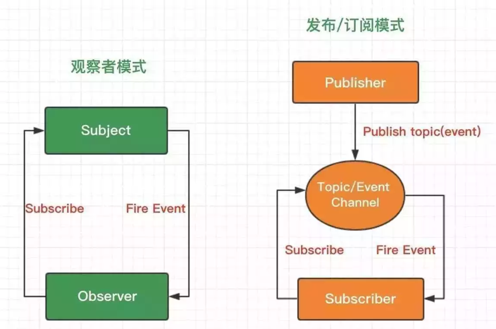
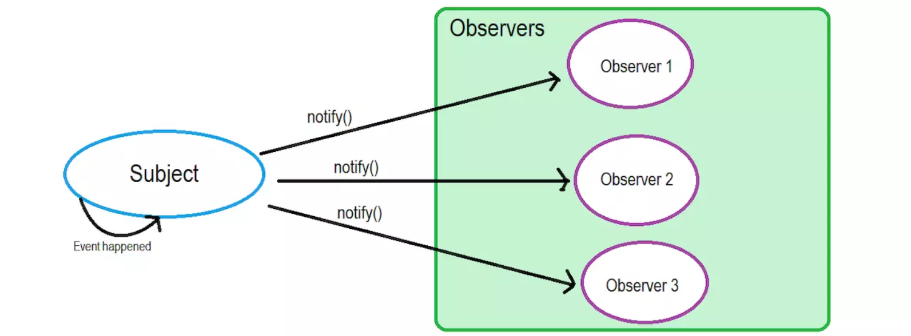
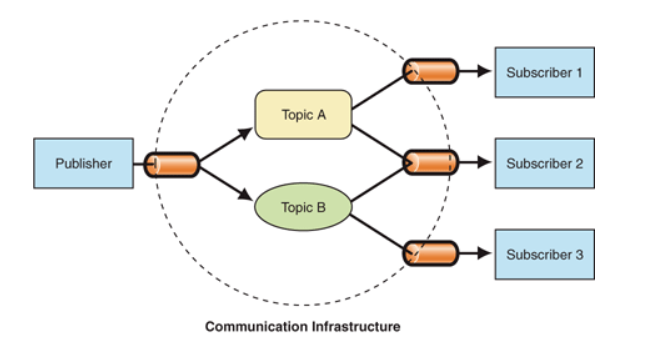

### 一、概要

观察者(Observer)模式和发布(Publish)-订阅(Subscribe)模式本质上的区别是: 调度的方式不同，观察者模式由具体目标调度，发布订阅模式统一由调度中心调度。



- 在观察者模式中，观察者是知道 Subject 的，Subject 一直保持对观察者进行记录。然而，在发布订阅模式中，发布者和订阅者不知道对方的存在。它们只有通过消息代理进行通信。
- 在发布订阅模式中，组件是松散耦合的，正好和观察者模式相反。
- 观察者模式大多数时候是同步的，比如当事件触发，Subject 就会去调用观察者的方法。而发布-订阅模式大多数时候是异步的（使用消息队列）。
- 观察者模式需要在单个应用程序地址空间中实现，而发布-订阅更像交叉应用模式。

### 二、观察者模式

观察者模式: 在软件设计中是一个对象，维护一个依赖列表，当任何状态发生改变时会以一种同步通信的手段自动通知它们。

观察者模式中，目标和观察者是基类，目标提供维护观察者的一系列方法，观察者提供更新接口。具体观察者和具体目标继承各自的基类，然后具体观察者把自己注册到具体目标里，在具体目标发生变化的时候，调度观察者的更新方法。

举个例子，假如 a 看上了一套房子，到了售楼处被告知房子卖完了。售楼MM告诉a，以后还会推出新楼盘，留下了a的联系电话并告诉他有新的楼盘会联系他。同样的还有 b 和 c。

在这个例子中，售楼MM就是 Subject ，用来维护 Observers(购房者)，为某些 event(比如新楼盘出售) 来 通知(notify) 观察者。



简单实现:
```
        // 目标者类
        class Subject {
            constructor() {
                this.observers = []; // 观察者列表
            }
            // 添加
            add(observer) {
                this.observers.push(observer);
            }
            // 删除
            remove(observer) {
                let idx = this.observers.findIndex(item => item === observer);
                console.log('remove: ', idx);
                // 若找到该观察者，则删除掉它
                idx > -1 && this.observers.splice(idx, 1);
            }
            // 通知
            notify() {
                for (let observer of this.observers) {
                    observer.update();
                }
            }
        }

        // 观察者类
        class Observer {
            constructor(name) {
                this.name = name;
            }
            // 目标对象更新时触发的回调
            update() {
                console.log(`目标者通知我更新了，我是：${this.name}`);
            }
        }

        // 实例化目标者
        let subject = new Subject();

        // 实例化两个观察者
        let obs1 = new Observer('观察者1');
        let obs2 = new Observer('观察者2');
        let obs3 = new Observer('观察者3');

        // 向目标者添加观察者
        subject.add(obs1);
        subject.add(obs2);
        subject.add(obs3);

        subject.remove(obs2);

        // 目标者通知更新
        subject.notify();
        // 输出：
        // 目标者通知我更新了，我是观察者1
        // remove: 1    // 表示找到了观察者2，并删除
        // 目标者通知我更新了，我是观察者3
```

优点: 降低耦合，两者都专注于自身功能;

缺点: 所有观察者都能收到通知，无法过滤筛选;

### 三、发布-订阅模式

发布订阅模式中(具体观察者可认为是订阅者，具体目标可认为是发布者)，订阅者把自己想订阅的事件注册到调度中心，当该事件触发时，发布者发布该事件到调度中心(携带上下文)，由调度中心统一调度订阅者注册到调度中心的处理代码。



代码实现:
```
        class EventEmitter {
            constructor() {
                this.list = {}; // 缓存列表，存放 eventType 及 fn
            }
            // 订阅
            subscribe(eventType, fn) {
                // 如果对象中没有对应的 eventType 值，也就是说明没有订阅过，就给 eventType 创建个缓存列表
                // 如有对象中有相应的 eventType 值，把 fn 添加到对应 eventType 的缓存列表里
                (this.list[eventType] || (this.list[eventType] = [])).push(fn);
            }
            // 监听一次
            once(eventType, fn) {
                // 先绑定，调用后删除
                function on() {
                    this.unsubscribe(eventType, on);
                    fn.apply(this, arguments);
                }
                on.fn = fn;
                this.subscribe(eventType, on);
            }
            // 取消订阅
            unsubscribe(eventType, fn) {
                let fns = this.list[eventType];
                // 如果缓存列表中没有相应的 fn，返回false
                if (!fns) return false;
                if (!fn) {
                    // 如果没有传 fn 的话，就会将 eventType 值对应缓存列表中的 fn 都清空
                    fns && (fns.length = 0);
                } else {
                    // 若有 fn，遍历缓存列表，看看传入的 fn 与哪个函数相同，如果相同就直接从缓存列表中删掉即可
                    let cb;
                    for (let i = 0, cbLen = fns.length; i < cbLen; i++) {
                        cb = fns[i];
                        if (cb === fn || cb.fn === fn) {
                            fns.splice(i, 1);
                            break
                        }
                    }
                }
            }
            // 发布
            publish() {
                // 第一个参数是对应的 eventType 值，直接用数组的 shift 方法取出
                let eventType = [].shift.call(arguments),
                    fns = this.list[eventType];
                // 如果缓存列表里没有 fn 就返回 false
                if (!fns || fns.length === 0) {
                    return false;
                }
                // 遍历 eventType 值对应的缓存列表，依次执行 fn
                fns.forEach(fn => {
                    fn.apply(this, arguments);
                });
            }
        }


        let eventEmitter = new EventEmitter();

        function user1(content) {
            console.log('用户1订阅了:', content);
        }

        function user2(content) {
            console.log('用户2订阅了:', content);
        }

        function user3(content) {
            console.log('用户3订阅了:', content);
        }

        function user4(content) {
            console.log('用户4订阅了:', content);
        }

        // 订阅
        eventEmitter.subscribe('buyNewspapers1', user1);
        eventEmitter.subscribe('buyNewspapers1', user2);
        eventEmitter.subscribe('buyNewspapers1', user3);

        // 取消user2方法的订阅
        eventEmitter.unsubscribe('buyNewspapers1', user2);

        eventEmitter.once('buyNewspapers2', user4)

        // 发布
        eventEmitter.publish('buyNewspapers1', 'Javascript 发布-订阅模式');
        eventEmitter.publish('buyNewspapers2', 'Javascript 观察者模式');
        eventEmitter.publish('buyNewspapers1', 'Javascript 发布-订阅模式');
        eventEmitter.publish('buyNewspapers2', 'Javascript 观察者模式');

        /*
            用户1订阅了: Javascript 发布-订阅模式
            用户3订阅了: Javascript 发布-订阅模式
            用户4订阅了: Javascript 观察者模式
            用户1订阅了: Javascript 发布-订阅模式
            用户3订阅了: Javascript 发布-订阅模式
        */
```

优点: 解耦更好，细粒度更容易掌控

缺点: 不易阅读，额外对象创建，消耗时间和内存（很多设计模式的通病）
