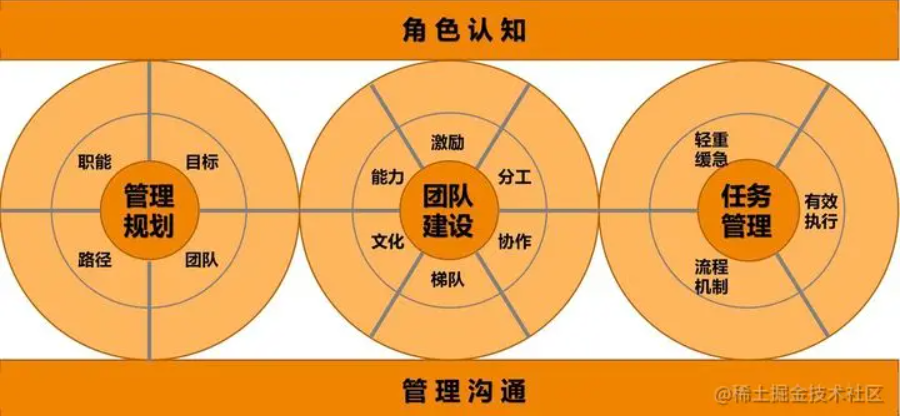
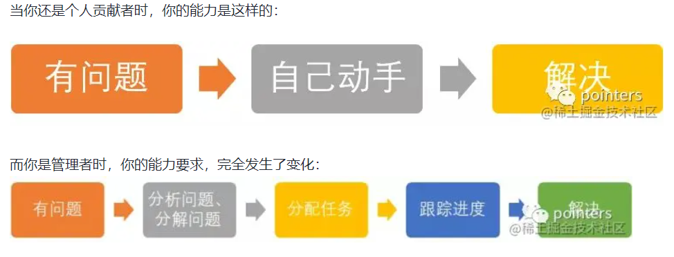
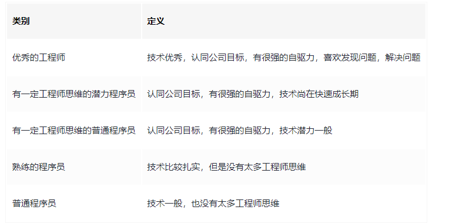
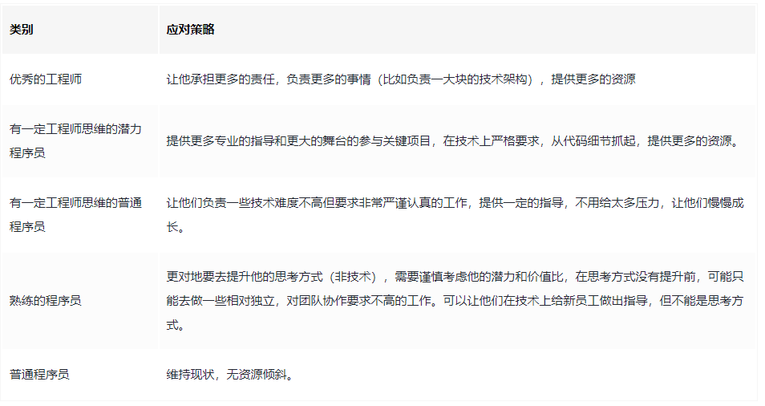

我认为要管理好前端团队：

- 本质上：让团队少走弯路，并引领团队走在正确的道路上。
- 理念上：让团队高效工作、快乐工作。
- 实施上：要想尽办法给团队、给成员赋能。

### 一、个人角度

角色转变，开发人员 -> 技术管理者

需要对团队的产出结果负责，对团队成员的成长负责。

帮助团队成员成长，发现团队的问题，修正团队的方向，才是技术管理者最核心要做的事情，最重要的转变是思维的转变。

1. 作为一名开发人员，对代码逻辑，细节斤斤计较，对代码严苛，对结果负责，这是非常优秀的品质。
2. 但是转换到技术管理者，真正的技术开发工作只是自己工作的一小部分，因为即使你的技术能力再优秀，也不可能完成所有的事情的，相反，自己有更多更重要的事情要去完成。当你专注于代码的细节，逻辑的细节，很容易会陷入一种思维死胡同，失去对大局的把控。

重心转变，靠自己 -> 靠他人

保持自我成长，提升综合能力

1. 技术能力：这是技术管理者的立身之本，肯定需要不断精进，如果技不如人，是无法服众的。
2. 业务能力：对业务有正确的理解，能理解到业务的本质需求，才能让技术实现价值。
3. 规划能力：技术管理者需要明确团队目标，并以结果为导向，做出合理的规划，如：
   1. 技术体系规划：项目技术选型，技术文档沉淀等等。
   2. 任务规划：根据任务难易程度分配不同开发人员，任务时间安排等等。
   3. 人员安排规划：根据组员的实际情况和特点，安排合适的事情给合适的人做，使团队利益最大化。
4. 沟通协作能力：技术管理者不仅在项目团队内，可能还需要跨组甚至跨部门进行沟通协作，技术管理者需要转达上级战略，战术和任务，不仅需要跟开发人员沟通清楚你需要什么，还要沟通清楚你为什么要这么做。
5. 判断能力：技术管理者需要全局把控项目，并且有底气在项目当中对于事项进行判断和决策。如：
   1. 风险判断：业务实现方向有问题，任务排期超时等等。
   2. 决策判断：某个时间段，应该做哪些内容，哪些做不了等。
   3. 技术判断：实现成本，实现方向，针对业务评审的具体实现判断等。
6. 领导力：技术管理者需要有责任，有担当，团队有问题，必然反映到团队负责人身上有问题。
7. 架构能力：治理好系统复杂度才是最务实的。

严格要求自己，以身作则

### 二、团队角度

1. 建立良好的团队氛围和价值感

**良好的团队氛围**

- 鼓励知识创作，知识分享，技术沉淀，这样可以促进团队成员的个人成长和业务上的开发能力。
- 加强团队的沟通合作，可以是定期的复盘会，代码评审会，技术问题的讨论，提升团队的沟通氛围。
- 营造学习进步氛围，可以自上而下的提供一些学习知识和分享（告诉大家先进的、流行的是什么样子，开阔视野）。
- 周期性的一对一沟通和指导。作为技术管理者很重要的一点在于为团队内的其他成员服务，了解他们的诉求，分析他们阶段性的问题，了解他们的职业规划，并帮助他们去解决和落实，所以周期性的一对一沟通是很有必要的，将你看到成员问题及时反馈出来，并且给出指导建议，对于团队成员的成长是非常有利的。

**增强组员的个人价值感**

- 组织和引导组员做技术分享，技术预研，新技术的学习等，让组员有展现自己的机会。
- 鼓励组员分享他们的成果，并且给出合理的评价，让组员感受到自己的工作成果是受到关注的并且有价值的。
- 让成员参与讨论和决策，并适当对组员表示肯定和表达期望，让组员更加有动力和自我价值感。

2. 团队基础建设

目标：提高团队效率，规范性明显增强，代码复用率提高，项目稳定性增强等等。

本质：更好的解决业务问题，帮助业务更好的活在未来，拒绝做脱离实际业务的事情。

关键点：提效，体验，稳定。

可以从开发规范，研发流程，基础资产，工程管理，性能优化，安全监控，质量保障等方向去完善，基于此目标，我们可以：

- 落实公司内制定的前端开发规范，发掘目前还欠缺的地方，确认可行后去落地并推广。
- 规范＆文档：规范意味着标准，是整个团队的共识。而文档可用来记录团队的技术沉淀，达到信息共享的目的。
- 完善前端监控和告警系统，保持项目线上稳定运行，出现问题易于追踪。
- 代码code review，发现并解决潜在的问题，带领团队成员攻克难点并持续把控代码质量。
- 对于可抽象可复用的逻辑或组件，可以提取出来作为团队的基础资产，并可共享出来，让公司内其他需要的项目组也可以用。
- ...

3. 合理的人员分配

简单来说，所谓的用人策略就是：如何定义人的角色，如何安排事务，如何安排资源的综合计划，尽量把每个人的潜力和价值最大化。

4. 创造更大价值

- 从商业的角度来写项目，充分发挥项目价值以及发现拓展方向。
- 带好团队成员，发掘他们的优点和潜能，并发挥他们的优势。
