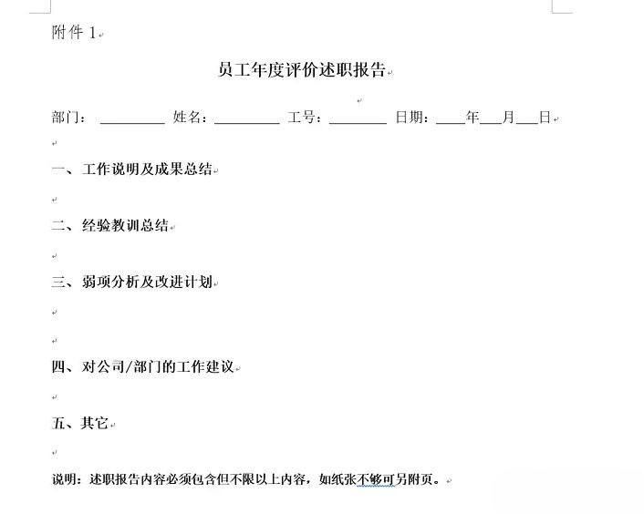
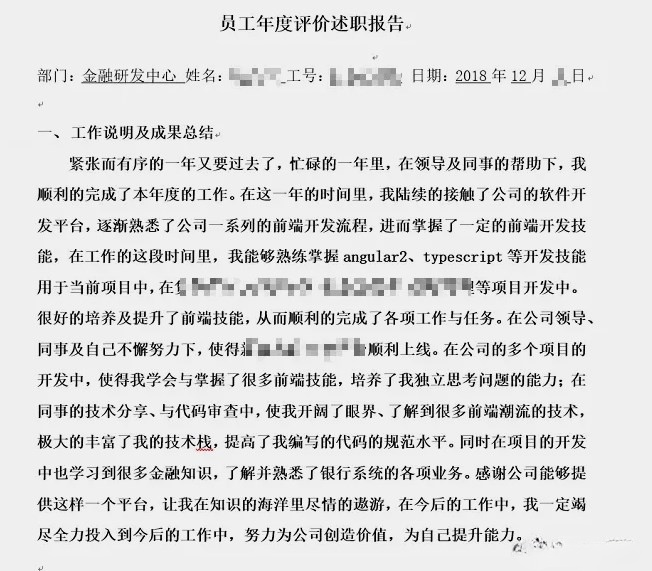
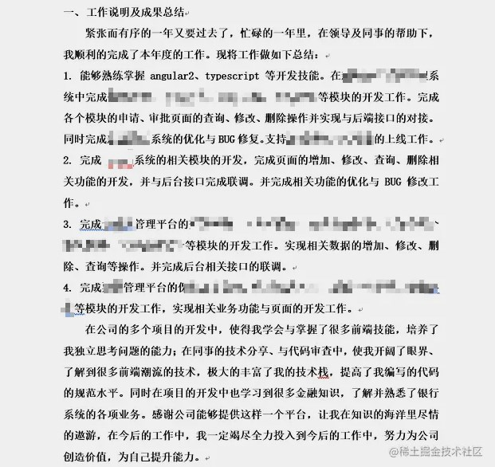
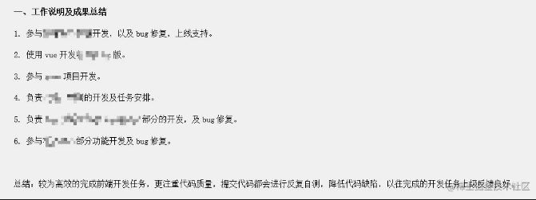
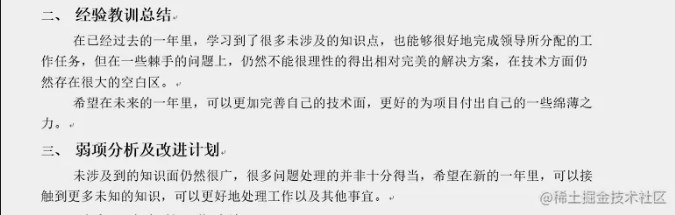
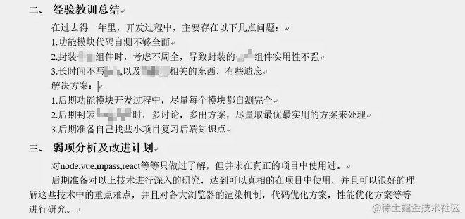
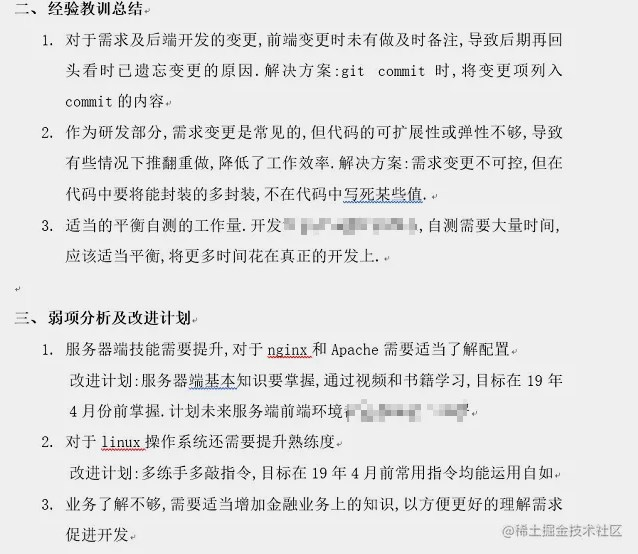
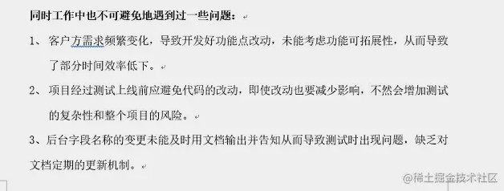
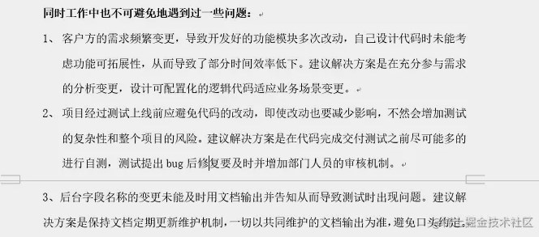
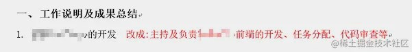

年终的述职报告是很多公司都要求的一项工作.好的述职报告不能作为考量的所有,但是坏的述职报告却能导致对于接触过少的领导产生很大影响,毕竟很多时候述职报告并不只是自己的直接上级看,更高级的领导仅能从述职报告上来评判你的工作.

述职报告有2个重要意义:

1. 向领导提炼总结一年工作内容,作为表现自己的形式
2. 作为年终个人总结前的部分铺垫,完成个人总结中工作的部分

下面以公司述职报告模板为例,说明6个原则:

#### 一. 逻辑性最重要,用序号标识,不要一长段文字

bad: 紧凑,逻辑不清晰,一眼望去不知道做了什么具体工作,空泛大

better: 序列化后,逻辑较为清晰,但不够简洁

best: 清晰、简洁明了

#### 二. 不要写空大泛的话,要具体化、量化

bad: 没有具体点,只有大话套话

better:

best: 落实到真正的点上!

#### 三. 不要有错别字

#### 四. 不要光写问题,解决方案才是重点

bad: 只有问题,不写解决方案

better: 解决方案才是想要的东西

#### 五. 不要夸大,但也不要遗落自己的成果

#### 六. 述职报告应关注自己为核心

