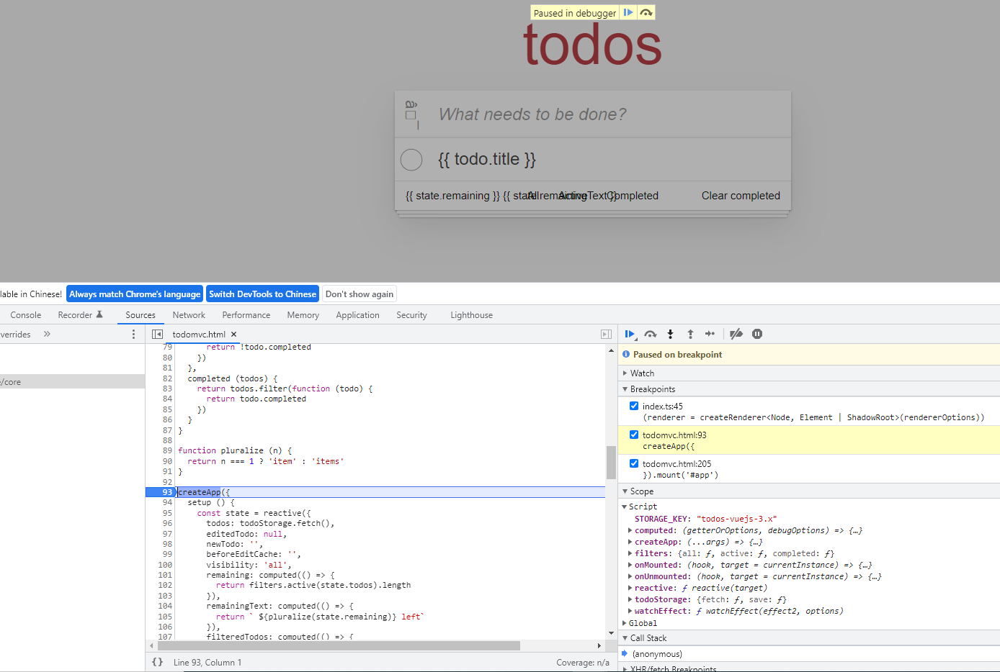
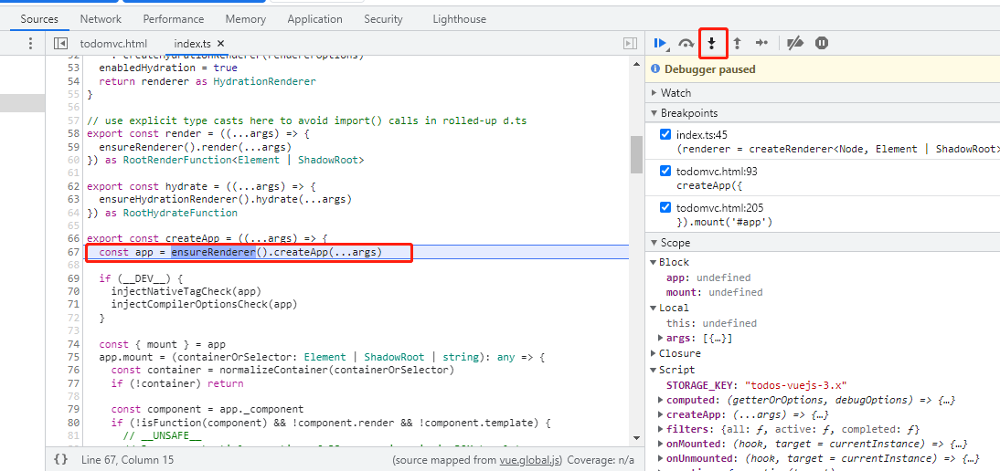
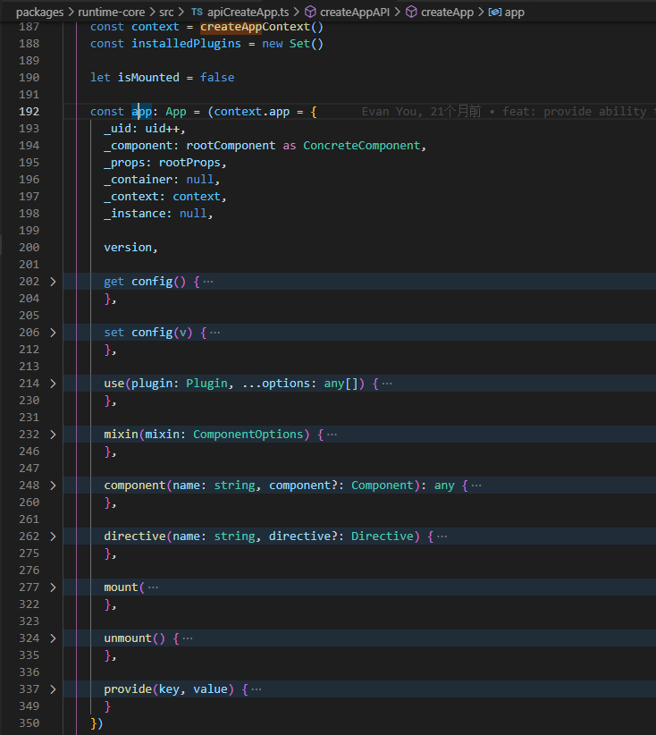
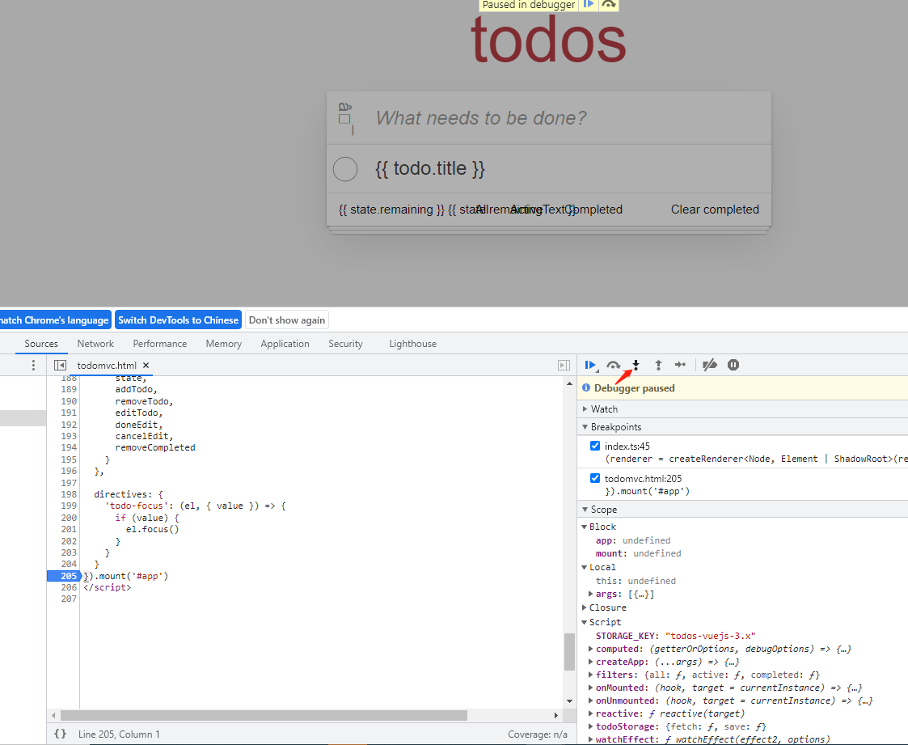
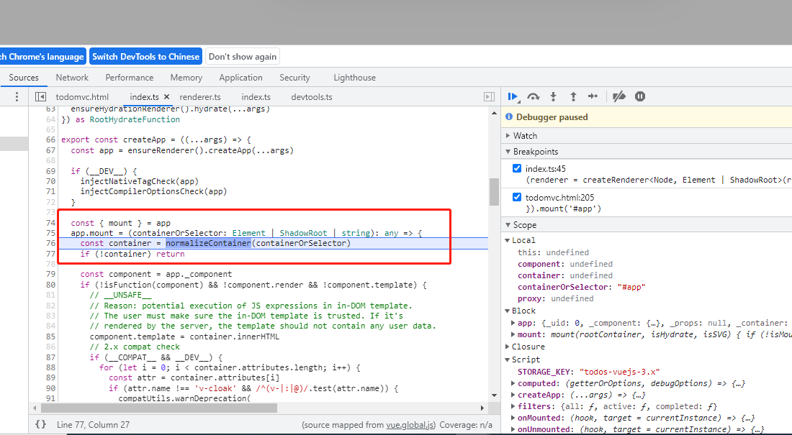
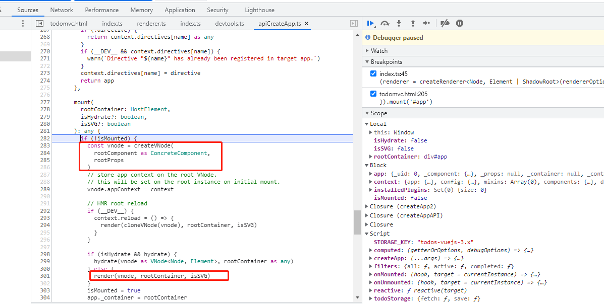

# 代码结构

- reactivity: 数据响应式系统
- rumtime: 组件和生命周期的实现
- compiler: 编译优化

## rumtime

- runtime-dom 目录: 针对浏览器的 runtime。其功能包括处理原生 DOM API、DOM 事件和 DOM 属性等。
- runtime-core 目录：与平台无关的运行时。其实现的功能有虚拟 DOM 渲染器、Vue 组件和 Vue 的各种API

# Vue打包简单分析

## 2.1 分析dev.js

我们在执行```pnpm dev```时，执行的命令是```node scripts/dev.js```

```
const { build } = require('esbuild') // 使用 esbuild 进行打包，好处是打包速度比较快
const nodePolyfills = require('@esbuild-plugins/node-modules-polyfill')
const { resolve, relative } = require('path')
const args = require('minimist')(process.argv.slice(2))

const target = args._[0] || 'vue' // 要访问的packages中的包, 在这里为'vue'
const format = args.f || 'global' // 导出的文件引用系统的格式，在这里为 'global'
const inlineDeps = args.i || args.inline
const pkg = require(resolve(__dirname, `../packages/${target}/package.json`))

// resolve output
const outputFormat = format.startsWith('global')
  ? 'iife' // 我们打包结果是 'iife'格式
  : format === 'cjs'
  ? 'cjs'
  : 'esm'

const postfix = format.endsWith('-runtime')
  ? `runtime.${format.replace(/-runtime$/, '')}`
  : format

const outfile = resolve(
  __dirname,
  `../packages/${target}/dist/${target}.${postfix}.js`  // 我们的输出文件在 packages/vue/dist/vue.global.js
)
const relativeOutfile = relative(process.cwd(), outfile)

// resolve externals
// TODO this logic is largely duplicated from rollup.config.js
...

// 下面为esbuild build的配置
build({
  entryPoints: [resolve(__dirname, `../packages/${target}/src/index.ts`)],  // 入口文件，为 packages/vue/src/index.ts
  outfile,
  bundle: true,
  external,
  sourcemap: true,  // 开启sourcemap
  format: outputFormat,
  globalName: pkg.buildOptions?.name,
  platform: format === 'cjs' ? 'node' : 'browser',
  plugins:
    format === 'cjs' || pkg.buildOptions?.enableNonBrowserBranches
      ? [nodePolyfills.default()]
      : undefined,
  ...
  },
  watch: {
    onRebuild(error) {
      if (!error) console.log(`rebuilt: ${relativeOutfile}`)  // rebuild时，会在控制台输出生成文件的相对路径
    }
  }
}).then(() => {
  console.log(`watching: ${relativeOutfile}`)
})
```

再来简单的看一下入口文件(packages/vue/src/index.ts)都做了什么
```
import { initDev } from './dev'
import { compile, CompilerOptions, CompilerError } from '@vue/compiler-dom'
import { registerRuntimeCompiler, RenderFunction, warn } from '@vue/runtime-dom'
import * as runtimeDom from '@vue/runtime-dom'
import { isString, NOOP, generateCodeFrame, extend } from '@vue/shared'
import { InternalRenderFunction } from 'packages/runtime-core/src/component'

if (__DEV__) {
  initDev()
}

const compileCache: Record<string, RenderFunction> = Object.create(null)

// 接收模板字符串 然后返回对应的render函数
function compileToFunction(
  template: string | HTMLElement,
  options?: CompilerOptions
): RenderFunction {
  // ...
}

registerRuntimeCompiler(compileToFunction)

export { compileToFunction as compile }
export * from '@vue/runtime-dom'
```
入口文件主要声明了一个compileToFunction函数，并把它在RuntimeCompiler进行注册，同时以compile的名称引用出去，并把@vue/runtime-dom中的所有对外暴露的内容都引用出去。

# 初始化流程

## 3.1 前言

一般我们的初始化流程：
```
const { createApp } = Vue
const app = createApp({})
app.mount('#app')
```

在初始化的过程中，我们一般经历了两大步骤:

1. createApp，进行Vue实例的创建
2. app.mount, 进行组件的挂载操作

## 3.2 主线

### 实例创建过程(createApp)

我们首先把断点放到todomvc.html中的createApp看都是执行了哪些内容


经过断点追踪，我们发现createApp其实是调用了ensureRenderer().createApp(...args)。其返回值就是我们的 app实例


我们在packages/runtime-dom/src/index.ts这个文件中找到了ensureRenderer这个方法，发现它是同文件下createRenderer的封装，进而我们寻找createRenderer,发现它是定义在runtime-core/src/renderer.ts的方法，而这个方法竟也是对同文件下 baseCreateRenderer函数的封装。

baseCreateRenderer函数就是调用ensureRenderer()时真正的执行函数，我们可以看到，这个函数有2000+行的代码其返回了一个含有三个属性的对象。
```
function baseCreateRenderer(
  options: RendererOptions,
  createHydrationFns?: typeof createHydrationFunctions
): any {
  // ...
  return {
    render, // 把虚拟dom转换成真实dom
    hydrate,
    createApp: createAppAPI(render, hydrate) // 创建实例方法
  }
}
```
我们简单观察可以发现第一个属性render是把vnode转化为真实dom的方法。第三个属性createApp就是我们ensureRenderer().createApp(...args) 调用的createApp方法，它是同级目录下apiCreateApp.ts中createAppAPI定义的函数，该函数返回了一个名为createApp的内部函数。在这个函数内部顶一个名为app的实例对象。

*为啥要封装一个createAppAPI方法来做createApp的事情？*
因为想对render方法进行扩展，使用createAppAPI 可以通过参数的方式直接调用render而不用关心render的细节，同时让createAppAPI内部的代码变得通用。


在实例对象上我们可以看到：

- 有```_uid, _component, _props, _container, _context```等属性，这些很明显是作者声明的内部属性，不希望使用者进行访问。
- 同时我们也观察到```use, mixin, component,directive,mount, unmount, provide```等方法，这些都是我们比较熟悉的api

通过调试分析Vue实例创建的过程:

Vue3的createApp函数，是通过调用内部的baseCreateRenderer().createApp()进行创建实例的，返回的实例是一个内部有use, mixin, mount等方法的对象。

```
createApp --> ensureRenderer(渲染器创建实例) --> createRenderer(/packages/runtime-core/src/renderer.ts) --> baseCreateRenderer(创建渲染器)
```

### 挂载过程(mount)

我们把断点放到mount处，看都是执行了哪些内容


我们顺着断点执行，发现调用的mount方法，已经不仅仅是原来在createApp时的实例方法，该方法在packages/runtime-dom/src/index.ts文件中进行了重写，该方法是对createApp中原方法的enhancement，最终还是会调用 createApp中的mount方法进行处理。



我们发现此处的mount方法，除去一些附加的内容（我们暂时不关心），其核心仍然是执行了createApp内部的mount方法



而createApp内部的mount方法主要做了两件事:

- 调用createVNode方法，创建vnode
- 调用render(vnode, rootContainer, isSVG)方法，把vnode转化为真实dom,然后绑定到rootContainer上

挂载基本上就是让传入的组件数据和状态转化为真实的dom,并追加到宿主元素上。

## 3.3 学习方法

### 单步调试

```
createApp --> ensureRenderer(渲染器创建实例) --> createRenderer(/packages/runtime-core/src/renderer.ts) --> baseCreateRenderer(创建渲染器)
```

### 提出问题

**渲染器是什么**

对象，提供三个方法

```
return {
  render, // 把接收到的vnode转换成dom，追加到宿主元素
  hydrate, // 服务端渲染
  createApp: createAppAPI(render, hydrate) // 创建app实例
}
```

作用: 首次渲染、获取应用程序实例

**挂载做了什么**

1. 组件实例创建
2. 初始化组件实例
3. 获取vnode(创建一个组件更新函数(render获取vnode、path(oldvnode, vnode))、创建更新机制)

只执行一次
